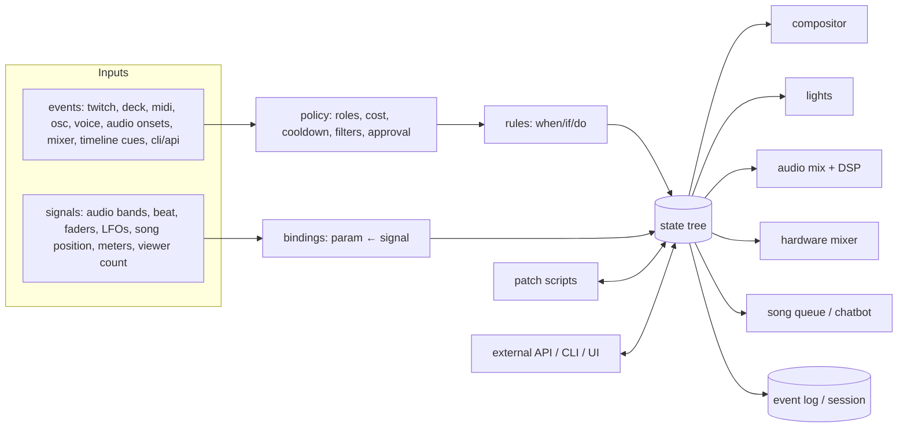
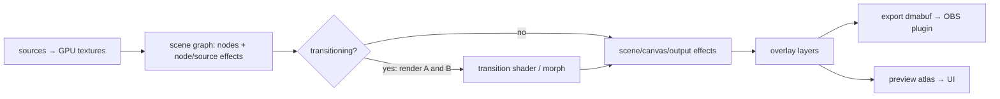
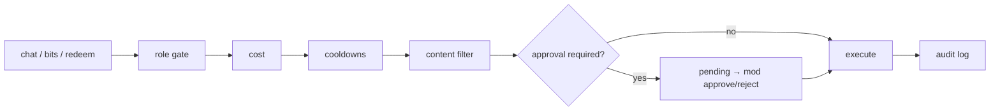

# stream-engine: Master Plan

Handoff document for building a custom, all-in-one live-stream production engine on a single Linux (Omarchy) machine. It replaces StreamElements, TouchDesigner, Stream Deck software, UC Surface-style mixer control, and lighting software with **one application, written by us, with one UI**. OBS remains, **only** as the encoder/uplink.

"stream-engine" is a working name; rename freely.

---

## 0. Ground rules (non-negotiable)

1. **One machine.** All hardware is attached to this machine; the verified inventory is in §28.1:
   - RTX 3070, two ultrawide monitors
   - AVMatrix 4× HDMI capture, a USB camera, and a USB HDMI capture
   - PreSonus Studio 24c
   - ENTTEC DMX USB PRO
   - Stream Deck, X-TOUCH MINI, Line 6 FBV Express

   The StudioLive 16R is part of the design but was not detected on USB or the LAN (§8.7, §28.3).
2. **One application, one UI.** Everything lives in this app:
   - compositing, overlays, and effects
   - lights, the audio mix, and hardware mixer control
   - song requests, the chatbot, chat interaction, and moderation

   Stream Deck, MIDI, voice, and chat are *inputs* to it, not separate UIs.
3. **We write every application in the chain.** No third-party apps (no TouchDesigner, QLC+, Companion, StreamElements, Streamer.bot, Node-RED, UC Surface, etc.).
   Libraries are fine where they wrap a standard, the OS, or hard math: GPU API, codecs, browser engine, TLS, speech model inference, async runtime, serialization.
4. **OBS is only the output.** It receives our finished frames and audio, encodes with **NVENC**, streams to Twitch/TikTok, and records. No compositing, no scenes (except one fallback scene), no overlays in OBS. Stream keys and destination setup are the streamer's business, not ours.
5. **Performance from day one.**
   - Frames never leave the GPU on the output path.
   - No per-frame allocation.
   - Shaders are compiled at load, never on trigger.
   - The render thread never waits on the core, network, or disk.
6. **Built to be hacked.** Anything on screen, in the room, or in the mix can be driven by anything that happens. New ideas are added by dropping in a folder (a *patch*), with hot reload and no restart, and a broken patch must never take down the show.
7. **Clean architecture over features.** Everything is built from a small set of generic primitives (§2). No hardcoded "sub alert feature"; a sub alert is a rule + a patch.
8. **The show never stops.**
   - The engine runs independently of the UI window: closing or crashing the UI does not affect the stream.
   - The engine auto-recovers from crashes and restores its exact state.
   - OBS holds a fallback during any gap.

---

## 1. Glossary

| Term | Meaning |
|---|---|
| **Engine** | The headless process that does all the work: core, render, audio, lights, adapters. Runs as a systemd user service. |
| **UI** | The window process: a client of the engine. Same binary, separate process (§3.1). |
| **Address** | Dot path to any parameter or state value: `scene.duo.node.cam_desk.fx.rgb_split.amount`, `lights.par_left.dimmer`, `mixer.16r.ch.3.fader`. |
| **State tree** | The single source of truth: every addressable value, plus metadata (type, range, default, unit). |
| **Event** | Discrete, timestamped occurrence: `twitch.sub`, `deck.key`, `audio.kick`, `timeline.cue`, `queue.song_ended`. |
| **Signal** | Continuous value sampled over time: `music.bass`, `mic.level`, `beat.phase`, `midi.fader.3`, `lfo.slow`. |
| **Rule** | `when <event> if <condition> do <actions>`. |
| **Binding** | A parameter driven by a signal: `param ← signal`, with shaping (gain, gate, attack/release, curve, range, auto-normalize) and a scope. |
| **Timeline** | Timed cues bound to a media item (YouTube video ID, song ISRC, local file): "at 1:12.4 fire `preset.chorus_blast`". |
| **Preset** | Named bundle of actions: scene change, transition, effects, light cue, mix changes, sound, patch trigger, durations. |
| **Mode** | Global show state (`offline`, `preshow`, `live`, `brb`, `ad_break`, `outro`, `rehearsal`) that gates rules. |
| **Source** | Something that produces pixels (and possibly audio): camera, web page, media file, patch, network stream. |
| **Canvas** | An output frame. Two by default: `wide` (1920×1080@60) and `tall` (1080×1920@60). |
| **Node** | One placement of a source in one scene on one canvas: transform, crop, mask/corner radius, opacity, z-order, effect chain. |
| **Scene** | A named arrangement of nodes per canvas, plus optional default effects and light cue. |
| **Transition** | How scene A becomes scene B: morph (animate nodes), shader (blend two renders), or both. |
| **Effect** | A shader pass (video) or DSP unit (audio) with parameters, attached at a defined point, optionally conditional. |
| **Patch** | A hackable, hot-reloaded folder defining a source, overlay, effect, or DSP unit in WGSL, Lua, web tech, or WebAssembly (§6). |
| **Session** | One stream run. Ties together the recording, event log, signal history, and markers. |

---

## 2. Core model

Everything is expressed with six primitives: **addresses/state, events, signals, rules, bindings, timelines**. Presets, patches, scenes, the chatbot, and policies are all built on them.



### 2.1 Addresses and the state tree
- Every value has an address and metadata: `type` (float, int, bool, color, enum, string, vec2, texture-ref), `range`, `default`, `unit`, and `description`.
- **The UI is generated from the metadata.** A new patch parameter gets a control automatically.
- Wildcards are allowed in bindings and rules: `scene.*.node.cam_face.offset_y`.
- Parameter value resolution per frame, in order:
  1. base value (project file)
  2. scene override
  3. modulation from bindings (add/multiply)
  4. overrides from presets, animations, and manual actions, resolved by **priority**: manual (300) > preset/macro (200) > chat (100)
  5. safety clamps (flash limiter, brightness caps, mixer level caps)
- **Provenance:** the resolver records which layers contributed to each value, for the UI's "why is it like this" view (§15.5).

### 2.2 Command API (the only way to mutate state)
- Every mutation is a command: `{id, ts, actor, origin, op, address, value, …}`.
  - `op` includes `set`, `animate`, `trigger`, `release`, `scene.go`, `scene.take`, `preset.fire`, `mode.set`, `queue.*`, `mod.*`, `bot.*`.
  - `origin` is one of `ui | rule | binding | patch | cli | api | deck | midi | voice | chat | mixer`.
- The UI, rules, patches, CLI, external API, Stream Deck, MIDI, and chat all go through the same commands, which gives:
  - parity: anything clickable is scriptable
  - an audit log
  - undo/redo for editing commands
  - replay
- **External API:**
  - the engine's local Unix socket (binary framing; used by the UI and CLI)
  - a WebSocket (JSON) and OSC (UDP) endpoint

  All expose the full address space, event subscription, and command submission. Security in §19.

### 2.3 Events
- Schema: `{id, ts, type, origin, actor?: {platform, id, name, roles[]}, payload}`.
- `ts` comes from the **master clock** (§3.2).
- Everything is appended to the session event log.
- Every event carries a **causal id**, so the chain event → rule → commands → state changes can be traced (§15.5).

### 2.4 Signals
- A registry maps names to typed values (f32, or small vectors for band arrays).
- Each signal has a short history ring for UI scopes, and is downsampled (e.g. 20 Hz) into the session history.
- **Built-in signals:**
  - audio analysis outputs (§8.3)
  - `beat.phase`, `beat.bpm`
  - LFOs (sine/tri/saw/random, rate in Hz or beats)
  - MIDI CC/faders
  - hardware mixer meters (§8.7)
  - `time.*`
  - `queue.position`, `song.position`
  - chat rate
  - viewer count

### 2.5 Rules
- `when` (event pattern) + `if` (expression over state, event payload, and mode) + `do` (a list of commands, with optional delays).
- Rules have scopes: `modes`, `scenes`, and an enable flag. Cooldowns are per rule, per actor, and global.
- The expression language is small and safe (comparisons, boolean logic, `in`, arithmetic on payload fields). Anything bigger goes in a Lua patch.

### 2.6 Bindings
- `target` (address, wildcard OK) ← `signal`.
- Shaping: `gain`, `offset`, `gate` (threshold), `attack`/`release` (ms), `curve` (linear/exp/log/smoothstep/`fader_taper`), `range` [min, max], `auto_normalize` (adaptive gain over a window, so bindings feel the same on quiet and loud songs), and `mode` (add | multiply | replace).
- `takeover` (for physical controls): `jump | pickup | scale` (§10.2).
- `scope`: always, a scene, a preset while active, a mode, or an expression.

### 2.7 Timelines
- Keyed by media identity: `yt:<videoId>`, `isrc:<code>`, `file:<hash>`.
- Cues: `{at, do}` where `do` is any command list. Cue timing uses `song.position`:
  - For the YouTube player: reported time, smoothed and interpolated.
  - For local files: exact.
- **Record mode:** play the song, tap a key at the moments you want, and taps become cues. Edit them in the UI afterwards.
- For library songs with offline analysis (§8.4), cues can snap to the beat grid.

### 2.8 Presets and modes
- A preset is a named list of commands with timing (`hold`, `release`), a conflict policy for when it's already active (`stack | replace | queue | reject`), and a priority.
- Modes gate rules and chat effects. Mode changes are events, so they can fire presets (e.g. entering `brb` pulls the mic sends).
- **Panic:** stops all effects and chat-triggered activity, sets lights to a safe look, and recalls the safe mix.
- **Clean:** clears chat-originated overrides only.

---

## 3. Application architecture

### 3.1 Processes and threads

**Two processes, one binary** (`stream-engine`):

| Process | What | Why |
|---|---|---|
| **Engine** (`stream-engine daemon`) | Core, render, audio, lights, all adapters, OBS link, API | systemd user service with `Restart=always` + watchdog. Keeps running when the UI is closed or crashes. |
| **UI** (`stream-engine ui`) | The window (§15) | Pure client of the engine API. Previews are GPU textures shared from the engine as dmabufs (the same mechanism as the OBS output, §4.5), so there are still no copies. |
| CEF children | Chromium renderer processes | CEF's own process model; a web patch crash is isolated. |

**Engine threads:**

| Part | Responsibility | Timing |
|---|---|---|
| **Core** | State tree, command processing, rules, bindings evaluation, timelines, policy, presets, chatbot | Fixed tick (start at 240 Hz), deterministic |
| **Render** | Sources → scenes → transitions → effects → overlays → canvases → OBS; preview atlas for the UI | 60 fps; reads the latest double-buffered state snapshot (e.g. via `arc-swap`); never blocks |
| **Audio** | PipeWire capture/playback, **DSP graph** (audio effects, mix, ducking) | Real-time thread (quantum 64–256 frames @ 48 kHz), no allocations, no locks; params arrive via lock-free rings (e.g. `rtrb`) and are smoothed |
| **Analysis** | FFT, onsets, beat tracking, voice activity detection | Own thread, fed by audio rings |
| **Lights** | DMX frame build + output | Fixed ~44 Hz |
| **IO** | Twitch, HTTP, WebSocket API, OSC, HID, MIDI, UCNET (mixer), CEF IPC, file watching | Async runtime (`tokio`) |
| **Scripts** | Lua patch VMs | Sandboxed per patch; logic on the core tick, draw callbacks feeding the render thread |

- Communication uses channels and lock-free rings only. Render and audio never hold a lock that IO or scripts can hold.

### 3.2 Master clock and time mapping
- One monotonic master clock (CLOCK_MONOTONIC, ns). **Everything** is timestamped with it: events, signals, commands, frames, audio blocks.
- Maintained mappings to:
  - wall clock
  - OBS stream and recording time (reported by our OBS plugin, §5)
  - Twitch stream delay (measured), so chat timestamps can be shifted back to the moment on screen
  - the audio device clock (the 16R is the graph driver, §8.1)

### 3.3 Persistence
- **Project directory** (plain text, lives in git):

  ```
  project/
    project.toml        # schema version, canvases, modes, global settings
    scenes/*.toml
    transitions/*.toml
    presets/*.toml
    rules/*.toml
    bindings/*.toml
    timelines/*.toml
    commands/*.toml     # chatbot commands, timers (§14.3)
    alerts/*.toml       # alert routing, variations, queue policy (§14.2)
    mixes/*.toml        # hardware mixer snapshots (§8.7)
    controllers/*.toml  # MIDI/deck mappings, pages (§10)
    fixtures/*.toml     # DMX fixture profiles
    rig.toml            # patched fixtures, universes, outputs
    rewards/*.toml      # channel point rewards we own
    layouts/*.toml      # UI layouts (§15.3)
    patches/<id>/       # §6
    assets/             # images, sounds, LUTs, fonts
  ```

- **Two-way editing:** hand edits and UI edits coexist.
  - The engine writes files with `toml_edit`, preserving comments, ordering, and formatting.
  - Writes are atomic (write temp + rename).
  - The file watcher ignores the engine's own writes.
- **Schema versioning:** `project.toml` has `schema = N`; on load, migrations upgrade older projects (with a git-friendly diff and a backup).
- **Runtime DB** (SQLite, WAL) holds:
  - the song queue and song library/cache
  - users/roles cache
  - chatbot counters and quotes
  - goals and stats
  - policy settings edited in the UI
  - the audit log and API quota ledger
  - device identities
  - **live runtime state** (current scene, mode, active toggles/effects, queue position) for crash recovery (§17.3)
- **Sessions:** `sessions/<id>/`
  - `events.jsonl.zst`
  - `signals.bin` (downsampled)
  - `markers.json`
  - `meta.toml` (OBS recording file paths, clock mappings)
- **Secrets:** OAuth refresh tokens and API keys go in the system keyring (Secret Service), never in project files.

### 3.4 Hot reload and isolation
- Every project file and patch is watched (`notify`). Reload applies atomically; on failure the **last good version stays live** and the error shows in the UI.
- Lua VMs: one per patch, sandboxed (no `os`/`io`), with a per-tick instruction and time budget. Over budget → suspended and flagged.
- Shader compile failure → keep the old pipeline.
- **GPU device loss** (e.g. a runaway user shader) → automatic recovery: recreate the device, reload resources, resume output. The OBS plugin shows the last frame or the fallback until then.

### 3.5 Device registry
- Hotplug watch through udev for:
  - V4L2 cameras and capture cards
  - PipeWire audio nodes (Studio 24c today; 16R USB channels when connected)
  - ALSA MIDI
  - hidraw (Stream Deck)
  - serial/USB DMX
  - network devices (16R via UCNET discovery, DMX nodes)
- **Stable identity** per device (USB serial, port path, or network MAC), so config survives reboots and replugging.
- Cameras list all supported format/resolution/fps modes, and new devices appear immediately with a live thumbnail.
- Each project declares **expected devices**; missing ones show in preflight (§17.1) and as badges in the UI.

---

## 4. Compositor

### 4.1 Pipeline (per canvas, per frame)



- **GPU API:** `wgpu` (Vulkan backend). WGSL shaders.
- **Render graph:**
  - pooled transient textures
  - invisible nodes (zero opacity or off-canvas) are culled, and unused sources are not decoded
  - blur-class effects run at reduced resolution
  - adjacent simple effects are fused where possible
- **Pipeline cache:** all pipelines are built at load and on hot reload, never on first trigger.
- **One source can feed multiple nodes and canvases**: one decode or render, many placements.
- **Overlay layers** draw above effects by default (so alerts stay readable). Per-layer opt-in to effects.
- **Preview:** the engine renders `preview` (the next scene, for Take, §15.4) as a third canvas only while the UI is showing it.
- **Preview atlas:** multiview thumbnails are rendered into one downscaled atlas, exported once to the UI (cheap: one texture, not N).

### 4.2 Sources

| Type | Implementation | Notes |
|---|---|---|
| Camera / capture card | V4L2 mmap; YUYV uploaded and converted to RGB in a shader; MJPEG decoded on the CPU with `turbojpeg` (the 12-core 7900X has ample headroom for one MJPEG source), then uploaded | Upload once per frame. On this machine: 4 × 1080p60 YUYV from the AVMatrix VC42 (≈1 GB/s total upload, fine on PCIe 4.0 x16), 1080p30 MJPEG from the USB camera |
| Web | CEF off-screen rendering. **On NVIDIA today: the CPU paint path (`OnPaint`)** at the node's actual size, uploaded once per frame. Shared-texture OSR (`OnAcceleratedPaint` dmabufs) is broken on NVIDIA until CEF ships chromiumembedded/cef PR #4238 (expected around M156); switch when a CEF build with it lands (requires `--use-angle=gl-egl`). | Used by the YouTube player and web patches. A 640×360 player costs ≈55 MB/s of upload at 60 fps; negligible |
| Media file | Hardware decode (FFmpeg libs with NVDEC, or Vulkan Video) | Loops, stingers, BRB videos |
| Patch | §6 | Generators, overlays, effects |
| Screen/window | PipeWire screencast | Future, if needed |
| Network | NDI/SRT receive | Future, only if a remote feed is ever needed |

- **Camera controls:** V4L2 controls (exposure, gain, white balance, focus, zoom) are addressable parameters, so scenes/presets can set them and the UI shows them in the inspector. Auto modes can be locked per scene.
- **Color:** per-source color correction and 3D LUTs (`.cube` in `assets/`) to match cameras to each other.

### 4.3 Scenes, nodes, and effects
- Node properties: `rect` (normalized), `crop`, `radius`/`mask` (SDF or texture), `opacity`, `z`, `blend`, `fx[]`, `when` (expression; the node is hidden when false).
- **Effect attachment points:** source (all placements) · node (one source in one scene) · scene · canvas · output. Each attachment can have `when` (e.g. `mode == 'chill'`, `scene in [duo, wide]`).
- **Effect groups** are exclusive (e.g. only one `grade` at a time).
- **Conflict policy** on trigger: `stack | replace | queue | reject` (for chat: reject + refund).

### 4.4 Transitions
- **Morph:** nodes whose source appears in both scenes animate `rect`, `crop`, `radius`, and `opacity` with easing curves. Entering and leaving nodes use enter/exit styles (fade, scale, slide, custom).
- **Shader:** render outgoing and incoming scenes to textures and blend with a WGSL transition shader (`progress` uniform). Port from gl-transitions.com (check the license per shader).
- **Combined:** a morph with a shader overlay (e.g. a glitch burst during the move).
- **Selection:**
  - explicit
  - a weighted random pool per scene or scene pair, with `avoid_repeat = N` and a duration range
  - chat vote

### 4.5 Output to OBS (and to the UI)
- Each canvas is exported as a **dmabuf** (Vulkan external memory) with explicit sync.
  - **Verified on this machine:** the RTX 3070 (driver 610.57, Vulkan 1.4) exposes `VK_KHR_external_memory_fd`, `VK_EXT_external_memory_dma_buf`, `VK_EXT_image_drm_format_modifier`, `VK_KHR_external_semaphore_fd`, and `VK_EXT_queue_family_foreign`.
  - **Import:** `wgpu-hal` provides `vulkan::Device::texture_from_dmabuf_fd()` (single-plane) and `texture_from_raw()` with a `DropCallback` (used by the UI).
  - **Export:** not in wgpu. The engine creates the canvas `VkImage` itself through `ash` with exportable dmabuf memory and a DRM modifier, exports the fd, and wraps the image into wgpu with `texture_from_raw()`. This is implementation work in M2, not an open question.
  - **OBS side:** OBS 32.2.2 headers on this machine export `gs_texture_create_from_dmabuf`.
  - Fallback for debugging: a shared-memory CPU path.
- Frames are paced by our own 60 fps clock; OBS samples the latest.
- If frames stop arriving for longer than N ms, the plugin reports stale, and OBS shows the last frame or switches to the fallback scene.

---

## 5. OBS plugin (C)

A small native OBS module; our only code inside OBS.

- **Video sources:** `stream-engine: wide` and `stream-engine: tall`. They import our dmabufs (`gs_texture_create_from_dmabuf`) and wait on sync fences. Zero copy, so NVENC encodes straight from GPU memory.
- **Control channel** (Unix socket to the engine):
  - reports stream/record start and stop, and output health (bitrate, dropped frames, encoder lag)
  - reports OBS timestamps for clock mapping, and recording file paths
  - accepts `stream.start` / `stream.stop` / `record.start` / `record.stop` through the OBS frontend API, so "Go live" in our UI starts OBS (optional; stream keys stay in OBS)
- **Fallback:** a "technical difficulties" scene the plugin (or OBS) switches to if our feed goes stale.
- **Audio into OBS:**
  - **Day one:** our engine publishes separate PipeWire nodes (`se-mic`, `se-drums`, `se-game`, `se-music`, `se-sfx`, `se-program`); OBS captures them, the program mix feeds the stream, and the separate tracks go to the recording.
  - **Later option:** the plugin exposes audio sources fed from our rings with shared timestamps, for tighter A/V sync.
- **Recording** (configured in OBS): wide and tall canvases plus multitrack audio.
  - **Verified:** 10 concurrent 1080p60 `h264_nvenc` encodes ran successfully on this RTX 3070 / driver 610.57, so the 4 needed (2 streams + 2 recordings) fit.
  - The 3070 (Ampere) NVENC encodes H.264 and HEVC; **no AV1 encode**.
- **OBS setup on this machine:**
  - OBS 32.2.2 with the Aitum Stream Suite plugin, which already defines a **"Vertical" canvas (1080×1920)** with a vertical stream output.
  - The main canvas is 1920×1080@60 NV12, streaming to Twitch with NVENC.
  - `stream-engine: wide` goes in the main scene; `stream-engine: tall` goes in the Aitum Vertical canvas scene.
- **License:** the plugin links libobs (GPLv2), so **the plugin's source must be GPL-compatible**. The engine talks to it only over a socket and can be licensed separately.

---

## 6. Patches (the hackability layer)

A patch is a folder in `project/patches/<id>/` with a `patch.toml` and an entry file. It hot-loads, appears in the UI library, and all its params are addressable (`patch.<id>.<param>`) and triggerable (`patch.<id>.trigger`).

### 6.1 Kinds

| Kind | Entry | Use |
|---|---|---|
| `shader` | `main.wgsl` (fragment or compute) | Generative visuals, backgrounds, reactive effects, transitions |
| `particles` | `sim.wgsl` + `draw.wgsl` | Thousands of particles: confetti, meteors, swarms |
| `script` | `main.lua` (LuaJIT via `mlua`) | Logic + 2D drawing (Processing/p5 style); draw lists rendered by `vello` |
| `web` | `index.html` | HTML/CSS/Canvas/Three.js layers; StreamElements-style widgets; loaded in CEF, served by the engine |
| `dsp` | `main.wasm` (compiled from Rust, C, or Zig) | Custom real-time audio effects and generators; runs in the audio graph (§8.6) |

**Layers:**
- `source`: placeable in scenes
- `overlay`: global layer above the scene
- `effect`: takes an input texture
- `transition`: takes A, B, and `progress`
- `audio-effect`: an insert on an audio bus or input (`dsp` only)
- `audio-source`: generates audio into a bus (`dsp` only)

**Templates:** the UI's "New patch" action creates a folder from a template for each kind and opens it in the user's editor (§16).

### 6.2 Manifest

```toml
# patches/sub_meteors/patch.toml
kind    = "script"
entry   = "main.lua"
layer   = "overlay"
params.count = { type = "int",   default = 40,  range = [1, 400] }
params.speed = { type = "float", default = 1.0, range = [0.1, 4.0] }
trigger = { attack = "100ms", hold = "4s", release = "1s", retrigger = "stack" }
budget  = { cpu_ms = 1.0 }
```

### 6.3 Inputs every patch receives (same contract for all kinds)
- `time`, `dt`, `frame`
- `env`: trigger envelope, 0–1
- `trigger`: payload of the event that fired it (user, amount, tier, message, …)
- `params.*`
- `signals.*`: all registered signals
- `palette.*`: shared stream palette (§16.2)
- `resolution`, and the input texture(s) for effect/transition layers

For shaders these arrive as a uniform/storage buffer with a generated WGSL header. For web patches they arrive over WebSocket through a small `engine.js` client.

### 6.4 Lua API sketch

```lua
on(event_pattern, fn)        -- subscribe; "trigger" = this patch was triggered
function frame(dt, s) end    -- per render frame; s = signals snapshot
params, palette, env         -- live tables
get(address) / set(address, value) / animate(address, to, ms, ease)
emit(event_type, payload)    -- fire events into the core (e.g. "lights.flash")
draw.clear() draw.rect() draw.circle() draw.path() draw.text() draw.image()
log.info() log.warn()
```

```lua
-- patches/sub_meteors/main.lua
local rocks = {}
on("trigger", function(e)
  for _ = 1, params.count * (e.tier or 1) do
    rocks[#rocks + 1] = { x = math.random(), y = -0.1, v = 0.3 + math.random() * params.speed }
  end
  emit("lights.flash", { color = palette.accent, ms = 400 })
end)
function frame(dt, s)
  draw.clear()
  for i = #rocks, 1, -1 do
    local r = rocks[i]
    r.y = r.y + r.v * dt * (1 + s.music.bass)
    if r.y > 1.1 then table.remove(rocks, i)
    else draw.circle(r.x, r.y, 0.006, palette.accent, env) end
  end
end
```

### 6.5 Workflow: "I want X to happen when Y"
1. Create a patch (UI "New patch" or `patches/x/`) and save. It appears in the library.
2. Route it to the preview canvas or test output; fire Y from the simulator.
3. Add a rule `on Y do patch.x.trigger`, and/or bind params to signals.
4. It's live. No rebuild, no restart. If it breaks, the last good version keeps running.

---

## 7. Configuration examples

```toml
# scenes/duo.toml
[canvas.wide]
nodes = [
  { src = "cam_face", rect = [0.02, 0.05, 0.47, 0.90], radius = 24 },
  { src = "cam_desk", rect = [0.51, 0.05, 0.47, 0.90], radius = 24, fx = [{ name = "vhs", when = "mode == 'chill'" }] },
  { src = "youtube",  rect = [0.70, 0.70, 0.28, 0.25], when = "queue.playing" },
]
[canvas.tall]
nodes = [
  { src = "cam_face", rect = [0.0, 0.0, 1.0, 0.55] },
  { src = "cam_desk", rect = [0.0, 0.55, 1.0, 0.45] },
]
[transitions]
pool = [{ name = "morph", w = 3 }, { name = "morph+glitch", w = 1 }, { name = "zoomblur", w = 1 }]
avoid_repeat = 2
ms = [500, 900]
lights = { cue = "warm_duo" }
```

```toml
# bindings/kick_shake.toml
target = "scene.*.node.cam_face.offset_y"
signal = "music.kick"
range  = [0, 12]
attack = "5ms"
release = "120ms"
scope  = "preset.hype"
```

```toml
# controllers/faders.toml   (MIDI → hardware mixer)
[[binding]]
target   = "mixer.16r.ch.3.fader"
signal   = "midi.xtouch.fader.3"      # 14-bit (Mackie Control pitch-bend fader)
curve    = "fader_taper"
takeover = "pickup"
feedback = true                        # motor fader follows mixer changes
```

```toml
# rules/subs.toml
[[rule]]
when  = "twitch.sub"
if    = "event.tier >= 2 && mode == 'live'"
do    = ["preset.fire sub_big"]
cooldown = { global = "10s" }
```

```toml
# presets/hype.toml
fx     = [{ name = "rgb_split", hold = "8s" }, { name = "patch.confetti" }]
lights = { cue = "chase_fast", hold = "8s" }
sound  = "airhorn"
conflict = "replace"
```

```toml
# rewards/hype.toml   (created on Twitch by our app; we own it)
title = "HYPE"
cost = 2000
cooldown = "5m"
max_per_user_per_stream = 3
fires = "preset.hype"
on_reject = "refund"
```

```toml
# commands/socials.toml   (chatbot)
[[command]]
name = "!discord"
reply = "Join the Discord: https://discord.gg/xxxx"
cooldown = { global = "30s" }

[[timer]]
every = "20m"
min_chat_lines = 10
reply = "Song requests are open: !sr <song or link>"
```

```toml
# timelines/nightly_song.toml
media = "yt:VIDEO_ID"
cues = [
  { at = "1:12.400", do = ["preset.fire chorus_blast"] },
  { at = "1:43.000", do = ["lights.cue blackout"] },
]
```

---

## 8. Audio

### 8.1 Graph (PipeWire, our own nodes)
- **Inputs:**
  - **Studio 24c** (today's interface: 2 in / 2 out, 24-bit up to 192 kHz, plus 5-pin MIDI in/out): mic and one more input
  - **16R USB channels** when connected (USB class-compliant 18×18): drum mics and more
  - e-drum MIDI (if used)
  - game/desktop
  - the YouTube player (CEF audio handler → our node)
  - media files, sound effects, TTS
- **Buses:** `mic`, `drums`, `game`, `music`, `sfx`, `tts` → `program` mix. Each bus is published to OBS (§5). Every input and bus has an **effect chain** (§8.5).
- **Mixing:** per-bus gain, mute, and limiter. **Ducking:** `music` ducks under `mic.talking` (and under `tts`), with configurable depth/attack/release.
- **Clocking:** the main audio interface (Studio 24c now; the 16R if it becomes the interface) is the PipeWire graph driver; other devices (USB camera mic, MSI capture audio) are resampled by PipeWire. Graph rate 48 kHz (PipeWire 1.6.8 here is already fixed to 48000).
- **A/V alignment:** delay audio to match compositor video latency (camera and CEF paths); per-source offsets are adjustable in the UI.

### 8.2 Real-time constraints
- The audio callback runs the DSP graph (inputs → effect chains → buses → mix) and copies blocks into lock-free rings for analysis. No analysis, allocation, locks, or I/O in the callback.
- Parameter changes from the core arrive through lock-free rings and are smoothed per sample or per block (no zipper noise). Bypass and enable use short crossfades (no clicks).

### 8.3 Live analysis (analysis thread; per tapped bus)

| Measurement | Method | Output |
|---|---|---|
| Level | RMS, peak, short-term LUFS | signals |
| Bands | FFT (`rustfft`) → bass/mid/high and 1/3-octave | signals |
| Brightness | Spectral centroid | signal |
| Onsets | Band-limited spectral flux → `kick`, `snare`, `hat` | events + envelope signals |
| Beat | Onset-strength autocorrelation for tempo + phase-locked beat; tap-tempo override | `beat` event, `beat.phase`, `beat.bpm` |
| Drops/sections | Energy/novelty jumps | events |
| Voice activity | Small voice-detection model on the mic | `mic.talking` |
| Mic hype | Level vs rolling baseline; later a laughter/yell classifier | signal + events |

Target: within one render frame of analysis latency.

### 8.4 Offline analysis (library/local songs)
- Beat grid, sections, and chorus candidates, stored in the song library.
- Enables beat-snapped timeline cues and suggested chorus cues.
- YouTube audio can't be pre-analyzed, so it gets live analysis only.

### 8.5 Audio effects
- **Insert points:** any input (e.g. a single drum mic), any bus (`music` for the YouTube audio, `drums`, `mic`), and the `program` mix. Chains are ordered; each effect has `wet`/`dry`, `bypass`, and optional `when` (same expressions as video effects).
- **Everything is addressable** like video effects: `audio.bus.music.fx.tape_stop.trigger`, `audio.input.snare.fx.delay.feedback`. That means audio effects can be:
  - fired by rules and presets (e.g. sub → beat-repeat on the music for 2 bars)
  - driven by bindings (e.g. a filter cutoff ← `music.bass` or a MIDI fader)
  - triggered by chat or channel points through the policy layer
- **Trigger envelopes:** one-shot effects use the same `attack`/`hold`/`release` envelope as patches, applied to `wet`.
- **Tempo sync:** delays, stutters, gates, and LFOs lock to the beat clock (`beat.bpm`, `beat.phase`).
- **Built-in effect library (our DSP code, `se-dsp`):**

  | Group | Effects |
  |---|---|
  | Filters/EQ | State-variable LP/HP/BP (sweepable), parametric EQ, DJ-style filter |
  | Dynamics | Compressor, limiter, gate, transient shaper, sidechain (any bus as key) |
  | Drive | Saturation, distortion, bitcrush/sample-rate reduction |
  | Time | Delay (tempo-synced, ping-pong), reverb, chorus/flanger/phaser |
  | Pitch | Pitch shift (granular) |
  | Performance | Stutter/beat-repeat, tape stop, vinyl brake, reverse buffer, gate chopper |
  | Sampler | One-shot/multi-sample player (sound effects, drum layering/replacement) |

- **Latency reporting:** every effect reports its latency (e.g. lookahead limiters, pitch shift). The graph compensates between parallel paths, and A/V alignment (§8.1) accounts for it.

### 8.6 Live drums (optional capability; M12)
- **Two paths:**
  - **Stream path:** processed drums → `drums` bus → program. Latency only needs to be aligned with video (cameras are usually slower than audio).
  - **Monitor path** (only if the drummer hears the processed sound in headphones): round trip ≤ ~10 ms. Requires:
    - PipeWire quantum 64 @ 48 kHz
    - real-time scheduling. **Verified missing today:** PipeWire's data loop runs `SCHED_OTHER` because RTKit isn't installed (`mod.rt: RTKit error: ServiceUnknown`) and `ulimit -r` is 0. Fix: install `realtime-privileges` and add the user to the `realtime` group (§28.4). Also needed for glitch-free audio at any quantum during a stream.
    - kernel preemption: **verified** already full (`CONFIG_PREEMPT=y`, `PREEMPT_DYNAMIC`, 1000 Hz); no boot parameter needed.

    The monitor chain may be lighter than the stream chain.
- **Per-drum triggers:** onset detection on close mics (kick, snare, toms) with per-channel threshold, retrigger time, and bleed rejection → `drums.kick`, `drums.snare`, … events with velocity.
  - They fire visuals, lights, audio effects, and sampler hits like any other event.
  - E-drum MIDI notes give exact hits and velocity with no detection needed.
- **Examples:** snare hit → camera shake + light flash; kick → sampler layer; channel point redeem → 8 bars of delay throws on the snare only.
- **Custom DSP:** `dsp` patches (§6.1) are WebAssembly modules:
  - compiled ahead of time on load (`wasmtime`)
  - run on the audio thread with a fixed block ABI (`process(in, out, frames, params)`)
  - no allocation after init, and a per-block time budget
  - over budget → auto-bypass with a crossfade and a flag in the UI
  - hot reload swaps the module at a block boundary with a crossfade

  Lua is not used for DSP (garbage-collection pauses break real-time audio).

### 8.7 Hardware mixer: PreSonus StudioLive 16R

**Status on this machine:** not detected. No 16R on USB (the PreSonus device present is a Studio 24c). No UCNET discovery broadcasts on UDP 47809 in a 7 s listen, and no host on 10.0.0.0/24 answering on UCNET TCP 53000. Everything below applies once it's connected (§28.3).

- **Control over Ethernet** with PreSonus's UCNET protocol:
  - UDP broadcast discovery
  - TCP control
  - UDP meters

  The protocol is undocumented; port the MIT-licensed reverse-engineered reference [featherbear/presonus-studiolive-api](https://github.com/featherbear/presonus-studiolive-api) (tested on the 16R) to Rust as `se-mixer`.
- **Addresses:**
  - `mixer.16r.ch.N.fader|mute|pan`
  - `mixer.16r.aux.N.ch.M.send`
  - `mixer.16r.fx.N.*`
  - `mixer.16r.main.fader`

  Meters become signals (`mixer.16r.meter.ch.N`).
- **Two-way:** changes made on the mixer or in UC Surface (iPad) update our state and emit `mixer.*` events. Our changes are sent latest-value-wins at ≤ 50 Hz per control so the link never floods.
- **Mix snapshots** (`mixes/*.toml`): named sets of mixer values that presets can recall or crossfade over time (e.g. `brb` pulls the mic sends, raises the music). These are independent of the mixer's own scene recall.
- **Safety:**
  - mixer control is manual/preset priority only; **chat can never touch it**
  - level caps on main/monitor outputs
  - Panic recalls a safe mix
- **Coverage:** measured on connection. Faders, mutes, and meters are covered by the reference implementation; EQ/dynamics/scene recall may need more reverse-engineering (capture UC Surface traffic). The adapter reports its supported address set, and the UI only shows those.
- **Firmware updates** can change the protocol: pin the firmware, and treat an update as a test event.

---

## 9. Lights (DMX)

- **Engine:** universes (512 bytes each), patched fixtures, and fixture profiles (our TOML format: channels, types, ranges, color mixing).
- **Cues:** static states plus dynamics (fades, chases, pulses, beat-synced), all using the shared **palette** and **beat clock**, so lights and visuals move together.
- **Bindings:** any fixture parameter can be driven by a signal (e.g. dimmer ← `music.bass`).
- **Outputs** (ours):
  - sACN / E1.31 (UDP multicast)
  - Art-Net (UDP)
  - Enttec DMX USB Pro serial framing (label 6 = send DMX)

  **On this machine:** ENTTEC DMX USB PRO (FTDI 0403:6001) at `/dev/ttyUSB0`, group `uucp`; the user is already in `uucp`. This is the day-one output. sACN/Art-Net stay available for future network nodes.
- **Fixture discovery:** attempt RDM discovery through the DMX USB PRO in M7; fixtures that don't answer RDM are patched manually from the owner's fixture list (§28.3).
- **Safety limiter at the output stage** (after all logic):
  - maximum flash/strobe rate (≈3 flashes/s cap by default; photosensitivity guideline)
  - brightness caps
  - chat-origin intensity caps
- Panic sets the safe look.

---

## 10. Inputs and control surfaces

### 10.1 Overview

| Input | Implementation | Emits |
|---|---|---|
| Stream Deck | hidraw; **Stream Deck Original V2** (0fd9:006d; 15 keys, 72×72 JPEG key images, same protocol as the MK.2). `/dev/hidraw8` already has a user ACL; we still ship a udev rule | `deck.key` events; feedback from state |
| MIDI | ALSA raw MIDI/sequencer (§10.2). On this machine: **Behringer X-TOUCH MINI** (MC mode: 8 endless encoders with LED rings, 16 + 2 buttons with LEDs, one **non-motorized** 60 mm fader), **Line 6 FBV Express Mk II** (foot controller: footswitches + expression pedal, USB MIDI; hands-free control while drumming), **Studio 24c MIDI DIN** in/out (for an e-drum module or other MIDI gear) | note events, CC signals; feedback out |
| OSC | UDP server | events and signals; also part of the external API |
| Voice | Push-to-talk (deck key) → Whisper via `candle` or `whisper-rs` → fixed command grammar; confirmation for risky commands | `voice.intent` events |
| Keyboard | In-app shortcuts (§15.6) + global Hyprland keybinds calling the `stream` CLI (§16) | commands |
| CLI / external API | §2.2 | commands, events |

**Controller pages** (`controllers/*.toml`): the Stream Deck and MIDI controllers have pages/banks (e.g. "show", "mix", "fx", "songs"). The UI's preset pad grid mirrors the current deck page, so the screen and the deck always match.

### 10.2 MIDI in depth (including control of the 16R)
- **Learn mode:** select any control in the UI, move the physical control, and the binding is created.
- **Resolution:** 7-bit CC, 14-bit CC pairs, NRPN, and pitch-bend faders (Mackie Control). Use 14-bit for mixer faders; 128 steps is audibly steppy on a vocal.
- **Takeover modes for non-motorized controls:**
  - `pickup`: no effect until the control passes the current value (default for mixer faders)
  - `jump`
  - `scale`
- **Feedback:** state changes (from the mixer, UC Surface, presets, or the UI) are sent back as MIDI: motor faders move, LED rings and button lights update.
- **Mackie Control (MCU) / HUI:** implemented by us for controllers that support it:
  - fader banks
  - motor faders with **touch sensing** (while touched, incoming mixer updates for that fader are ignored)
  - scribble-strip names
  - meters
  - V-pots
- **Rate:** incoming CC streams are coalesced; downstream targets get latest-value-wins at their own rate (e.g. ≤ 50 Hz for the 16R).
- **Priority:** MIDI is `manual` (300).
- **Device identity:** multiple identical controllers are told apart by USB port/serial.

---

## 11. Twitch

- **App:** registered at dev.twitch.tv/console (the account needs 2FA). Free, no approval.
- **Auth:** device code flow. Refresh tokens in the keyring, with automatic refresh; expiring or invalid tokens show in preflight.
- **EventSub over WebSocket:**
  - chat messages, message deletes, bans/timeouts (so overlays can remove messages)
  - cheers; subs/resubs/gifts; follows; raids
  - channel point redemptions
  - AutoMod holds
  - polls, predictions, hype trains
  - **ad breaks**
  - stream online/offline
- **Helix calls:**
  - send chat
  - create/manage **our own** channel point rewards and fulfill/refund redemptions (only possible on rewards our client ID created, so the app creates them from `rewards/*.toml`)
  - polls, predictions, shoutouts, outgoing raids
  - moderation: ban, timeout, delete message, AutoMod approve/deny, blocked terms
  - follower lookup (for follow age); viewer count (polled → signal)
  - chat badges and emotes
  - ad schedule/snooze
  - **stream markers**
- **Scopes (confirm exact names against current docs):**
  - chat: `user:read:chat`, `user:write:chat`
  - events: `bits:read`, `channel:read:subscriptions`, `channel:read:hype_train`
  - rewards: `channel:read:redemptions`, `channel:manage:redemptions`
  - polls and predictions: `channel:manage:polls`, `channel:manage:predictions`
  - broadcast: `channel:manage:broadcast` (markers), `channel:manage:raids`
  - ads: `channel:read:ads`, `channel:manage:ads`
  - followers and shoutouts: `moderator:read:followers`, `moderator:manage:shoutouts`
  - moderation: `moderator:manage:banned_users`, `moderator:manage:chat_messages`, `moderator:manage:automod`, `moderator:manage:blocked_terms`
- **Ad breaks:** an `ad_break` event switches mode to `ad_break` (scene with a countdown, music up, chat effects paused), and it returns automatically. A warning shows in the UI ahead of scheduled ads.
- **Measure stream delay** for chat time alignment (§3.2).
- **Third-party emotes:** 7TV, BTTV, and FFZ public APIs for chat overlays (cached; animated formats decoded to GPU textures).
- **TikTok live events:** there is no official API; a best-effort reverse-engineered client comes late (M11), isolated so breakage doesn't affect anything else.

---

## 12. Policy layer and moderation

### 12.1 Pipeline (every chat-, bits-, or points-originated action)



- **Roles:** everyone < follower (with min follow age) < sub < VIP < mod < owner. Roles come from chat message badges; follow age is cached.
- **Content filter:** word blocklist, length caps, Unicode normalization (homoglyphs, zalgo), and only showing messages AutoMod didn't hold.
- **Veto window:** large alerts with user text wait ~3 s in the UI so a mod can kill them before they render.
- **Chat effects:**
  - only in `live` mode
  - priority 100 (below manual and presets)
  - auto-expire
  - `clean` clears them
  - rejected paid actions are **refunded**
- **Deletion sync:** when a message is deleted or a user is banned/timed out, their content is removed from overlays (chat box, TTS queue, alert queue).

### 12.2 Chat moderation
- Twitch's native tools stay the authority (bans, timeouts, AutoMod, blocked terms, Shield Mode). We integrate:
  - actions from our UI and rules
  - the AutoMod hold queue in our UI
  - everything logged

### 12.3 Mod interfaces
- **Day one:** chat commands (`!skip`, `!remove`, `!approve`, `!srban`, `!queue open|close`, …).
- **Later:** remote access to the control UI for mods, with Twitch login verified against the channel's mod list (§19).

---

## 13. Song requests

### 13.1 Lookup
- **API:** YouTube Data API v3 with an API key.
- **Quota:** 10,000 units/day. `videos.list` = 1 unit; `search.list` = 100 units (≈100 text searches/day, accepted).
- **Cache:** normalized query → videoId, and videoId → metadata. The song library grows over time and repeats cost 0.
- **Quota ledger** in the DB (resets at midnight Pacific). When exhausted, the queue goes links/library only and says so in chat and the UI.
- **Check at request time:** `status.embeddable`, duration, region restrictions, age restriction. Reject in chat immediately.

### 13.2 Queue policy (UI-editable, persisted)

| Group | Settings |
|---|---|
| Access | open/closed, roles allowed, min follow age, cost (bits/points) |
| Limits | max queue length, max pending per user, per-user cooldown, max duration, no-repeat window |
| Content | blocklists (video, channel, artist, keyword), explicit filter, library-only mode |
| Flow | mod approval (all or by role), paid skip-the-line, vote-skip threshold |
| Actions | approve, reject, remove, reorder, skip, ban user from requests, ban song, pause |

### 13.3 Playback
- **Player page:** our own HTML page with the **official YouTube IFrame Player API**, loaded in a CEF web source inside the compositor (the same approach StreamElements uses inside OBS's browser source).
- **No extraction.** No yt-dlp, no stream decoding.
- **Control over WebSocket** in both directions:
  - engine → page: `load(id)`, `play`, `pause`, `seek`, `volume`
  - page → engine: `ended`, `error(code)`, `progress(t)`
- **Errors:** errors 101/150 (embedding disabled) → auto-skip, log, and notify in chat.
- **Gapless:** a second hidden player preloads the next song; the compositor transitions between them.
- **Audio:** CEF audio → `music` bus (ducking, analysis, effects). `song.position` feeds timelines.
- **YouTube player terms:**
  - don't obscure the player
  - put the "now playing" overlay beside it, not on top
  - **Ads (verified behavior):** embeds carry the same ads as youtube.com, and YouTube increased embed ad frequency in Aug 2024. Premium removes them only when the viewer is signed in with YouTube cookies available. So the CEF profile is **persistent and signed into the owner's YouTube account**, with cookies for youtube.com/google.com allowed in the player context. Ad-free if that account has Premium; otherwise ads play in the player (the queue treats ad time as buffering and doesn't skip).

---

## 14. Stream features (StreamElements parity and beyond)

Every feature below is built from the core primitives (rules + patches + state), not as a special subsystem. The project ships with **templates** for each, so day one looks finished and every piece stays hackable.

### 14.1 Parity map

| StreamElements feature | Ours |
|---|---|
| Alerts (follow, sub, gift, cheer, raid, tip) | Alert routing + alert queue (§14.2) → alert patches; variations by amount/tier via rule conditions |
| Media share / song requests | §13 |
| Goals (subs, followers, bits, tips) | Goal state in the DB (persists across streams) + goal overlay patch |
| Recent/top labels (latest follower, top cheerer, …) | `stats.*` state + label overlay patch |
| Event list | UI events feed (§15.4) + optional overlay patch |
| Chat box overlay | Chat overlay patch: badges, Twitch + 7TV/BTTV/FFZ emotes, policy-filtered, deletion-synced |
| Chatbot: commands, timers, counters, quotes, variables | `se-bot` (§14.3) |
| Loyalty points / store | Twitch channel points (native) + our rewards; no separate currency |
| TTS on tips/cheers | Local TTS (§14.4) on the `tts` bus, policy-filtered |
| Tips/donations | Ko-fi webhooks through our Cloudflare relay (§14.5, §14.6). Twitch itself has no tips, only Bits and subs |
| Polls/predictions | Twitch native via API + overlay patches |
| Giveaways | Chat-entry giveaway with weighted entries and a draw UI (M11) |
| Countdown / starting soon | Countdown patch + `preshow` mode |
| Credits roll | End-of-stream patch listing session events (subs, cheers, raids, top chatters) |

### 14.2 Alert queue
- Alert-worthy events enter a **queue** with priorities, minimum spacing, and a maximum on-screen duration, so alerts never overlap or pile up during a gift bomb.
- **Combining:** gift bombs are combined ("X gifted 50 subs") instead of 50 alerts.
- **Interrupting:** big alerts can interrupt small ones (configurable).
- **Veto:** the veto window (§12.1) applies to alerts containing user text.
- **Pausing:** the queue pauses in `ad_break`/`brb` (configurable) and replays afterwards.

### 14.3 Chatbot (`se-bot`)
- **Commands** (`commands/*.toml`):
  - templated replies: `{user}`, `{count}`, `{uptime}`, `{song}`, `{args}`, `{random:a|b|c}`
  - role gates and cooldowns (through the policy layer)
  - can also run commands (e.g. `!hype` fires a preset for VIPs)
- **Mod-editable from chat** (`!addcom`, `!editcom`, `!delcom`); these write back to project files via the command API.
- **Timers:** interval + minimum chat activity + mode scope.
- **Counters and quotes** in the DB.
- **Replies:** sent as the broadcaster or a bot account (configurable), respecting Twitch chat rate limits.

### 14.4 TTS
- **Engine:** **Kokoro-82M** (Apache-2.0 weights) run in-process with ONNX Runtime (`ort` crate) on the CPU; output goes to the `tts` bus (ducks music).
- **Phonemes:** `espeak-ng --ipa` run as a **separate process** (espeak-ng is GPL; not linked, so it doesn't affect the engine's license).
- **Not Piper:** its maintained upstream (OHF-Voice/piper1-gpl) is GPL-3.0 and per-voice licenses vary.
- **Rules:** policy-filtered text only (after the veto window), max length, voice per tier/amount, and skippable by mods.

### 14.5 Tips/donations
- **Twitch has no native tips** (only Bits and subs), so an outside payment provider is required.
- **Provider: Ko-fi.**
  - Ko-fi takes a 0% platform fee on tips (PayPal/Stripe processing fees still apply).
  - It handles payments and compliance.
  - It sends a webhook per payment: `application/x-www-form-urlencoded` with one `data` field holding JSON (`verification_token`, `message_id`, `type` = Donation/Subscription/Shop Order/Commission, `from_name`, `message`, `amount`, `currency`, `is_public`, `kofi_transaction_id`, …).
- **Flow:**
  1. Ko-fi calls `https://<domain>/hooks/kofi` on our relay (§14.6).
  2. The relay checks `verification_token` and dedupes on `message_id`.
  3. It forwards the payment to the engine.
  4. The engine emits a `tip` event with the same alert, goal, and TTS handling as cheers (respecting `is_public` for names/messages).

### 14.6 Hosted relay (Cloudflare)
One small service on the owner's domain; the only code we run off this machine.
- **Platform:** Cloudflare Worker + one **Durable Object** (SQLite-backed, on the Workers Free plan; WebSocket Hibernation, so idle connections cost nothing). Written in TypeScript, Cloudflare's first-class Worker language.
- **Engine link:** the engine keeps **one outbound** WebSocket to the Durable Object, authenticated with a shared secret. Nothing on this machine listens publicly. If the link drops, the relay buffers webhooks (bounded) until the engine reconnects.
- **Routes:**
  - `/queue`: **public song-queue page** (now playing, upcoming, requester, position). It updates live over WebSocket from the Durable Object's latest snapshot, and shows "offline" when the engine isn't connected. The chatbot's `!queue` replies with this link.
  - `/hooks/kofi`: Ko-fi webhook (§14.5).
  - Later: `/mod` for remote mod access (Twitch OAuth login, verified against the channel's mod list; restricted command set, §19).
- **Deploy:** `wrangler deploy` from `relay/`; the route is attached to the owner's domain in Cloudflare.

---

## 15. UI and UX

### 15.1 Principles
1. **Show mode vs Build mode.** Show mode is for operating a live stream: fixed layout, big targets, nothing editable by accident. Build mode is for making things. Toggle with `Tab`; the current mode is always visible.
2. **Nothing reaches program without intent.**
   - Scene changes go to **Preview** and are sent to **Program** with **Take** (`Enter`), unless "direct" is toggled on.
   - Edits in Build mode apply to the preview/test output.
   - Parameter edits that affect program are marked live (red edge).
3. **Keyboard-first**, matching Omarchy:
   - a command palette for every command and address
   - number keys for scenes, `Enter` = Take, `Esc` = cancel
   - every action has a rebindable shortcut, and shortcuts are shown in tooltips and the palette
4. **Everything is explainable.** Selecting any value shows its provenance (base → bindings → overrides → clamps). Selecting any change shows its cause chain (event → rule → command) (§15.5).
5. **Never modal during a show.**
   - Errors become toasts and badges, never dialogs.
   - Destructive actions in Show mode need a hold-to-confirm, not a popup.
   - Everything has undo.
6. **One visual language.**
   - Every "thing" (scene, preset, patch, effect, rule) is a card with a kind icon, a color, and state LEDs (idle / armed / active / error).
   - Tally colors are fixed:
     - **red** = on program
     - **amber** = on preview/armed
     - **green** = healthy
     - **magenta** = modulated by a binding
   - Color is never the only signal: icons and text too.
7. **The UI never costs the stream.**
   - Previews come from the engine's shared textures (§4.1).
   - Multiview thumbnails update at 30 fps; hidden panels stop rendering.
   - If the GPU is tight, the UI degrades first.
8. **Native to Omarchy.** Theme colors and font follow the active Omarchy theme live (§16.2), and windows are Hyprland-friendly (§16.3).

### 15.2 Toolkit
- `egui` on `wgpu` (via `egui-wgpu`), with docking (`egui_dock` or equivalent), plus our own design-system crate `se-ui-kit`. The kit contains:
  - theme tokens mapped from Omarchy colors
  - spacing/typography scale
  - custom widgets: meters, faders, pads, scene thumbnails, canvas editor handles, signal scopes, timeline, curve editor, cards
- egui's default look is not shipped; everything goes through `se-ui-kit`.

### 15.3 Windows, docking, layouts
- One main window with dockable panels. **Any panel can pop out** into its own window (separate Wayland toplevel with app-id `stream-engine.<panel>`), so Hyprland can tile it on another monitor or workspace.
- **Named layouts** (`layouts/*.toml`), e.g. `show-1mon`, `show-2mon`, `build`. Switch with the palette or a keybind.
- **Confidence monitor:** a borderless fullscreen `stream-engine.program` window (wide, tall, or both side by side) for a TV or second screen, so the streamer sees exactly what goes out.
- **Scaling:** follows Hyprland monitor scale, plus an in-app zoom.

### 15.4 Show mode layout (DP-1: MSI MAG341CQ, 3440×1440 @ 100 Hz, scale 1.25 → 2752×1152 logical)

```
┌──────────────────────────────────────────────────────────────────────────────────────────────┐
│ ● LIVE 02:14:33 │ Twitch 6.0Mb/s 0 drop │ TikTok 4.5Mb/s │ REC │ mode: LIVE ▾ │ GPU 5.1ms │ ⚠ 1 │ CLEAN  PANIC │
├───────────────────────────────┬───────────────────────────────┬──────────────┬───────────────┤
│ PREVIEW (wide)        [amber] │ PROGRAM (wide)          [red] │ PROGRAM tall │ EVENTS │ CHAT │
│                               │                               │              │ QUEUE  │ MOD  │
│                               │                               │              │───────────────│
├───────────────────────────────┴───────────────────────────────┤              │ • raid from X │
│ SCENES  [1 duo] [2 wide] [3 face] [4 desk] [5 drums] [6 brb]   │              │ • 500 bits Y  │
│ TRANSITION  random: morph ×3 · glitch · zoomblur   700ms  [TAKE ⏎]            │ • sub Z (T2)  │
├──────────────────────────────────────────────┬────────────────┴──────────────┤ PENDING (2)   │
│ PRESETS (= Stream Deck page "show")          │ ACTIVE                        │ ▸ !sr song A  │
│ [HYPE] [CHILL] [CONFETTI] [BLACKOUT] [DROP]  │ rgb_split  ▮▮▮▯  4s   ✕       │   ✓ approve   │
│ [SUB BIG] [CHORUS] [STROBE*] [CREDITS]       │ vhs (chat) ▮▯▯▯  12s  ✕       │ NOW PLAYING   │
├──────────────────────────────────────────────┴───────────────────────────────┤ song B 1:12   │
│ MULTIVIEW  cam_face │ cam_desk │ cam_drums │ youtube │ patch:aurora                          │
├───────────────────────────────────────────────────────────────────────────────┴───────────────┤
│ MIX  mic ▮▮▮▯  drums ▮▮▯  music ▮▯ (ducked)  game ▯  sfx ▯  tts ▯ │ 16R ch1…16 faders+meters │
└──────────────────────────────────────────────────────────────────────────────────────────────┘
```

- **Status bar** (always visible, both modes): live state + uptime, per-output health, recording, mode picker, GPU frame time, warnings count (opens the warnings list), Clean, Panic (hold).
- **Scenes:** thumbnails, number keys, click = to preview, double-click = direct take.
- **Presets:** pad grid mirroring the current Stream Deck page. Pads show state (armed/active/cooldown ring). `*` = chat-disabled or needs confirm.
- **Active:** everything currently running (effects, presets, chat effects, light cues), with remaining time, intensity, and kill buttons.
- **Right rail tabs:**
  - Events (with the veto window countdown)
  - Chat (with inline mod actions)
  - Queue (now playing, upcoming, pending approvals)
  - Mod (AutoMod holds, audit log)
- **Mix:** our buses plus the 16R channels with meters. Faders follow MIDI and the mixer in real time.

### 15.5 Build mode layout

```
┌──────────────────────────────────────────── status bar ──────────────────────────────────────────┐
├──────────────┬────────────────────────────────────────────────────────────┬──────────────────────┤
│ LIBRARY      │ CANVAS EDITOR   [wide | tall | both]   grid/snap  safe-area │ INSPECTOR            │
│ ▸ Sources    │                                                            │ node: cam_desk       │
│ ▸ Scenes     │   drag / resize / crop / radius handles                    │ rect  crop  radius   │
│ ▸ Patches    │   (edits apply to preview, never program)                  │ camera: exposure …   │
│ ▸ Effects    │                                                            │ fx chain  [+]        │
│ ▸ Presets    │                                                            │ ▾ rgb_split.amount   │
│ ▸ Rules      │                                                            │   0.31 = base 0.20   │
│ ▸ Bindings   │                                                            │        + ~music.bass │
│ ▸ Timelines  │                                                            │        (hype, 200)   │
│ ▸ Lights     │                                                            │   [Modulate] [MIDI]  │
│ ▸ Mixes      │                                                            │                      │
│ ▸ Controllers│                                                            │                      │
│ ▸ Chatbot    │                                                            │                      │
├──────────────┴────────────────────────────────────────────────────────────┴──────────────────────┤
│ DOCK: Rules (when/if/do) │ Timeline │ Signal scopes │ Trace │ Simulator │ Console                 │
└──────────────────────────────────────────────────────────────────────────────────────────────────┘
```

- **Library:** everything in the project, searchable, with drag-and-drop into scenes, presets, and rules. "New …" for each kind creates from a template.
- **Canvas editor:** both canvases side by side or one at a time, with snapping, safe areas (TikTok UI overlay guides on `tall`), and alignment tools.
- **Inspector:** auto-generated from metadata for any selected thing.
  - Every parameter row shows its **provenance** and has **Modulate** (pick a signal, shape it with a live curve preview) and **MIDI learn**.
- **Rules editor:** when/if/do blocks with autocomplete for events, addresses, and payload fields, plus a "test" button that fires the event through the simulator.
- **Timeline:** per media item; waveform, beat grid, cues; record mode.
- **Signal scopes:** plot any signal live (and its shaped output) to tune bindings.
- **Trace:** select any state change and see the event → rule → command chain; select any event and see everything it caused.
- **Simulator:** fire any event with realistic payloads (presets like "gift bomb 50", "raid 300", "1000 bits with message").
- **Console:** logs, patch errors (click to open the file at the line).

### 15.6 Other views
- **Devices:** registry, expected vs present, formats, camera controls, stable identities, 16R status.
- **Lights:** fixture patch, cue list, palette, DMX output monitor.
- **Controllers:** deck page editor (drag presets onto keys, live key preview), MIDI mappings, MCU banks.
- **Mixer:** full 16R channel/aux view, snapshots (store, recall, crossfade), MIDI mapping.
- **Chatbot:** commands, timers, counters, quotes.
- **Alerts:** routing, variations, queue policy, test buttons.
- **Session review:** past sessions, markers, clip review queue (§18).
- **Performance:** per-pass GPU timings, per-thread budgets, dropped/late frames, audio xruns, OBS encoder health.
- **Settings:** accounts (Twitch/YouTube connect), API/security, shortcuts.

### 15.7 Default shortcuts (all rebindable)

| Key | Action |
|---|---|
| `Ctrl+K` | Command palette (commands, addresses, scenes, presets, patches) |
| `Tab` | Toggle Show/Build |
| `1`–`9` | Scene → preview |
| `Enter` | Take (preview → program) |
| `Shift+1`–`9` | Scene direct to program |
| `F1`–`F12` | Presets on the current pad page |
| `Ctrl+Z` / `Ctrl+Shift+Z` | Undo / redo |
| `Ctrl+.` | Clean (clear chat effects) |
| hold `Ctrl+Esc` | Panic |
| `Ctrl+L` | Switch layout |
| `Ctrl+F` | Search library / chat |

Global (works when the UI isn't focused) through Hyprland binds → `stream` CLI (§16.3): Take, Panic, Clean, next scene, BRB toggle.

### 15.8 Key flows
- **Go live:**
  1. Preflight panel (§17.1) all green (or acknowledged).
  2. `preshow` (countdown scene, music).
  3. "Go live" starts OBS through the plugin.
  4. Mode → `live`.
- **End:**
  1. `outro` → credits patch.
  2. Stop OBS.
  3. The session closes and the clip job is queued.
- **New scene:** duplicate an existing scene → drag sources → lay out `tall` → pick the transition pool → save (writes `scenes/<name>.toml`).
- **New interactive thing:** New patch (template) → edit in `$EDITOR` → test on preview with the simulator → rule or reward → done.
- **Map a controller:** click a fader/pad in the UI → move the hardware → pick takeover/feedback → done.

### 15.9 First run
A setup wizard walks through:
- devices (name the cameras, confirm the 16R, DMX, deck, MIDI)
- accounts (Twitch device code, YouTube key)
- OBS plugin check

It then creates a starter project from `project-example` with working templates for scenes, alerts, the chat box, goals, the song queue, and the chatbot.

---

## 16. Omarchy integration

### 16.1 Packaging and services
- **PKGBUILD** (Arch) installs:
  - the binary and CLI
  - the CEF runtime and the OBS plugin
  - a `stream-engine.service` systemd user unit (engine, `Restart=always`, `WatchdogSec`)
  - a `.desktop` entry (UI)
  - udev rules (Stream Deck hidraw, DMX serial)
- The engine is enabled as a user service; the UI is launched on demand.

### 16.2 Theme and font
- **UI theme:** read the active theme palette from `~/.local/state/omarchy/current/theme/colors.toml` and watch it, so theme changes apply live.
  - Keys used: `mode`, `accent`, `selection`, `muted`, the `background` and `foreground` variants, `red`/`yellow`/`green`/`cyan`/`blue`/`magenta` + brights.
  - Mapping:
    - surfaces ← background variants
    - text ← foreground variants
    - focus/selection ← `accent`/`selection`
    - tally/live ← `red`
    - armed/warn ← `yellow`
    - healthy ← `green`
    - modulation ← `magenta`
  - Light themes (`mode = "light"`) are supported.
- **Font:** use the Omarchy font (`omarchy font current`; currently a Nerd Font) for the whole UI. Nerd Font glyphs provide the icon set, so no separate icon pack is needed. React to `font-set` changes (hook in `~/.config/omarchy/hooks/font-set.d/`).
- **Stream palette** (what viewers see) is **separate** from the UI theme. Per project it can be `follow_theme` (tracks the Omarchy theme; lights follow too) or fixed, so changing the desktop theme never changes the stream unless chosen.

### 16.3 Desktop integration
- **Keybinds:** add to `~/.config/hypr/bindings.lua` with `o.bind(...)` calling the `stream` CLI (Take, Panic, Clean, BRB, open UI). Check existing binds first (`omarchy menu keybindings --print`) and `hl.unbind` any conflicts.
- **Window rules:** app-ids `stream-engine` (main) and `stream-engine.<panel>` / `stream-engine.program` get rules via Omarchy's `o.window(match, rules)` helper, which wraps Hyprland 0.56.2's Lua `hl.window_rule`.
  - Omarchy's own rules already use the fields we need: `workspace`, `fullscreen`, `float`, `idle_inhibit`.
  - Default placement: main window on **DP-1**; confidence/program window fullscreen on **DP-2** (WEH 3440×1440 @ 60 Hz).
- **Menu:** entries in `~/.config/omarchy/extensions/omarchy-menu.jsonc` (open UI, go live, switch layout, run preflight).
- **Bar widget:** an Omarchy shell (Quickshell) plugin in `~/.config/omarchy/plugins/<id>/` showing live state, uptime, health, and pending approvals; click opens the UI.
- **Notifications:** freedesktop notifications (the Omarchy shell is the daemon) for background problems when the UI isn't focused: feed stale, device unplugged, token expiring, disk low. Never for routine events.
- **Idle/lock (verified mechanism):** the Omarchy shell's idle monitor sets `respectInhibitors: true`, and Omarchy ships `omarchy toggle idle stay-awake|allow-idle|status` (state file `~/.local/state/omarchy/indicators/stay-awake`).
  - On entering `preshow`, the engine records `omarchy toggle idle status` and runs `omarchy toggle idle stay-awake`.
  - On `offline`, it restores the previous state.
  - The confidence window also carries an `idle_inhibit = "always"` window rule as a second layer.
- **Night light:** warn in preflight if hyprsunset is active on the monitor used for color work (it doesn't affect the stream, only the preview's look).

---

## 17. Show operations and reliability

### 17.1 Preflight
A checklist panel (and `stream preflight` in the CLI) with pass/warn/fail for:
- expected devices present: the 4 AVMatrix HDMI inputs with signal, USB camera, Studio 24c (and 16R once connected), DMX USB PRO, Stream Deck, X-TOUCH MINI, FBV Express
- OBS plugin connected and receiving frames on both canvases
- Twitch token valid and EventSub connected; YouTube key valid and quota remaining
- disk space for recording
- GPU temperature/VRAM headroom
- mic signal present
- idle inhibitor active
- audio xruns in the last minute

### 17.2 Modes flow
`offline → preshow → live ⇄ brb / ad_break → outro → offline`. Each transition is an event (presets can hook it). `rehearsal` runs everything with the simulator and test outputs, with Twitch actions dry-run.

### 17.3 Crash recovery
- **Watchdog:** the engine heartbeats from the core and render threads to systemd (`sd_notify` watchdog). If either stalls, systemd restarts the engine.
- **Restore:** on start, the engine restores the live runtime state from SQLite (scene, mode, active toggles, queue, mix snapshot) and resumes output. Target: output back within ~3 s; OBS shows the last frame/fallback meanwhile.
- **UI reconnects** automatically; a UI crash has no effect on output.
- **Adapters** (Twitch, UCNET, MIDI, DMX) reconnect with backoff and surface their status in the status bar.

### 17.4 Backups and retention
- **Project:** in git.
- **Runtime DB:** backed up daily.
- **Sessions:** logs kept (configurable retention). Recordings are managed by disk budget with a warning before deletion.

---

## 18. Recording, markers, clips (later milestone; foundations are day one)

- **Day-one requirements:** master clock (§3.2), sessions (§3.3), persistent event log + signal history, separate audio buses recorded as OBS tracks, OBS plugin time mapping.
- **Hype detector patch:** combines signals into a hype score:
  - chat rate vs baseline, emote spam
  - bits/subs/raids
  - mic spikes/laughter
  - music drops
  - a "clip that" deck key
  - chat `!clip` votes

  Above a threshold → marker `{start, peak, end, score, reasons}` + a Twitch stream marker.
- **Pre-roll:** shift chat-based signals back by the measured stream delay; windows start 10–30 s before the peak.
- **Post-stream job:**
  1. Whisper transcript of the mic track (with word timestamps).
  2. An AI pass ranks markers and picks in/out points on sentence boundaries.
  3. Cut with NVENC (FFmpeg libs), wide + tall, burned-in captions, music track dropped by default.
  4. Clips go to the review queue in the UI; optional upload.

---

## 19. Security

- **Local API:**
  - The Unix socket (UI, CLI) is user-only (0600).
  - The WebSocket/OSC endpoints bind to localhost by default and require a token (kept in the keyring; the CLI reads it).
  - LAN exposure (phone/tablet controllers) is opt-in, with per-device pairing tokens and read/write scopes.
- **Patches:** web patches get a scoped token (read signals/events; write only their own `patch.<id>.*` namespace unless granted more). Lua and wasm are sandboxed (§3.4, §8.6).
- **Remote mod access** (later): Twitch login, verified against the channel's mod list; mods get a restricted command set (queue, moderation, alerts), never mixer/lights/scenes.
- **Inbound webhooks** (Ko-fi): only via the Cloudflare relay (§14.6); `verification_token` checked, `message_id` deduped; nothing listens publicly on this machine. The relay ↔ engine link is an outbound WebSocket authenticated with a shared secret kept in the keyring and as a Worker secret.
- **Chat text** is data only: never executed, templated with escaping, and length-capped everywhere.
- **Secrets** live only in the keyring.

---

## 20. Repository layout (Cargo workspace)

```
stream-engine/
  crates/
    se-proto/       # addresses, value types, events, commands, wire formats (serde)
    se-clock/       # master clock, time mappings
    se-core/        # state tree, provenance, command processing, rules, bindings, timelines, presets, modes, policy
    se-expr/        # small safe expression language for rules/when-clauses
    se-store/       # project loading + hot reload + toml_edit writes + schema migrations, SQLite, sessions, keyring
    se-devices/     # udev hotplug registry, stable identities, expected-device checks
    se-render/      # wgpu render graph, sources, scenes, transitions, effects, overlays, canvases, dmabuf export, preview atlas
    se-video-in/    # V4L2 capture + controls, MJPEG decode, media file decode, LUTs
    se-web/         # CEF integration: off-screen rendering, audio, JS bridge
    se-patch/       # patch loader, Lua runtime (mlua/LuaJIT), vello draw lists, WGSL header generation, wasm DSP host (wasmtime)
    se-audio/       # PipeWire graph, buses, mix, ducking, clocking
    se-analysis/    # FFT, onsets, beat tracking, voice activity detection, offline song analysis
    se-dsp/         # audio effect library, sampler, effect chains, latency compensation, drum onset triggers
    se-mixer/       # PreSonus UCNET client (StudioLive 16R): discovery, control, meters, snapshots
    se-dmx/         # fixtures, cues, effects engine, limiter, sACN/Art-Net/serial outputs
    se-input/       # Stream Deck (hidraw), MIDI (ALSA, 14-bit, MCU/HUI, feedback), OSC, voice
    se-twitch/      # OAuth device flow, EventSub, Helix client, emotes (incl. 7TV/BTTV/FFZ)
    se-bot/         # chatbot: commands, templating, timers, counters, quotes
    se-alerts/      # alert routing, queue, combining, TTS integration
    se-songs/       # YouTube lookup, cache/library, queue, policy, player control
    se-api/         # Unix socket + WebSocket JSON + OSC API, auth, HTTP server for web patches/player page
    se-obs/         # engine side of the OBS plugin link (health, timestamps, start/stop)
    se-ui-kit/      # design system: Omarchy theme tokens, typography, custom widgets
    se-ui/          # egui application (Show/Build modes, panels, layouts)
    se-app/         # main binary: `daemon` and `ui` subcommands
    se-cli/         # `stream` CLI (API client)
  obs-plugin/       # C OBS module (CMake), GPL-compatible license
  relay/            # Cloudflare Worker + Durable Object (TypeScript): public queue page, Ko-fi webhook, engine link
  web/              # player page, engine.js client for web patches
  packaging/        # PKGBUILD, systemd unit, .desktop, udev rules
  omarchy/          # bar widget plugin, menu entries, example Hyprland binds/rules
  project-example/  # starter project: scenes, alerts, chat box, goals, song queue, chatbot, patches
  docs/             # patch authoring guide, API reference, operator guide
```

Suggested libraries (verify versions at start): `tokio`, `wgpu` (+ `ash` for dmabuf export/import), `vello`, `parley` or `cosmic-text`, `egui`/`egui-wgpu`/`egui_dock`, `mlua` (LuaJIT), `wasmtime`, `rustfft`, `pipewire` (pipewire-rs), `rtrb`, `arc-swap`, `crossbeam`, `rusqlite`, `serde`/`toml`/`toml_edit`, `notify`, `udev`, `v4l` or raw ioctls, `turbojpeg`, `image` (animated emotes), `tokio-tungstenite`, `reqwest`, `rosc`, `alsa`, `serialport` (DMX USB PRO), `hidapi` or raw hidraw, `secret-service`, `sd-notify`, `cef` (Rust CEF bindings), `ort` (ONNX Runtime, TTS), `candle` or `whisper-rs`, `ffmpeg-next` (clip pipeline and media sources).

---

## 21. Performance requirements

- **Frame rate:** 60 fps steady on both canvases with all 4 HDMI cameras + the USB camera, the YouTube source, 3 effects, and 2 overlay patches active. Frame time budget ≤ 8 ms GPU (leaving headroom for NVENC, CEF, and the UI).
- **VRAM:** the RTX 3070 has 8 GB, shared with OBS (2 canvases + 4 NVENC sessions), CEF, and the desktop. Engine budget ≤ 3 GB, shown live in the perf panel.
- **Capture bandwidth:** 4 × 1080p60 YUYV ≈ 1 GB/s host→GPU; uploads use staging buffers reused per frame (no per-frame allocation).
- **Output path zero-copy:** no CPU readback of canvas frames; UI previews are shared textures.
- No shader/pipeline compilation outside load or hot reload.
- **No per-frame heap allocation** on the render, audio, and DMX threads (enforced in debug builds with an allocation counter).
- **Latency targets:**
  - input event → first rendered frame reflecting it: ≤ 2 frames
  - audio analysis → visual reaction: ≤ 1 frame beyond block size
  - MIDI fader → 16R: ≤ 20 ms
  - DMX output jitter: < 2 ms
  - zero audio xruns in a 4 h soak at the chosen quantum
- **Always-on instrumentation:** GPU timestamp queries per pass, per-thread timing, dropped/late frames, audio xruns, OBS encoder health. Visible in the UI.

---

## 22. Safety

- **Flash/strobe limiter** on **both** DMX output and video output (luminance flash-rate detection on the output canvas; clamp effect intensity when exceeded).
- **Panic** (all automation off, safe lights, safe mix) and **Clean** (chat overrides cleared) are always one key away (deck + global keybind + UI).
- **Chat** priority is always the lowest; chat effects auto-expire; chat can never touch the mixer.
- **Mixer level caps** on main/monitor outputs.
- **OBS fallback scene** triggers on a stale feed.
- **Secrets** live only in the keyring.

---

## 23. Testing strategy

- **Core:** deterministic tick.
  - Unit and property tests for rules, bindings, the priority/provenance resolver, policy, and cooldowns.
  - **Replay tests:** recorded event logs → expected state snapshots.
- **Render:** golden-image tests (tolerance-based) on synthetic sources, headless wgpu; transition and effect correctness at fixed times.
- **DSP:** offline render tests (impulse, sweep, null tests), a no-allocation assertion in the audio path, and per-block time benchmarks.
- **Protocol adapters:** recorded fixtures:
  - EventSub payloads
  - UCNET packet captures from his 16R
  - MIDI/MCU streams
  - Stream Deck HID reports
  - sACN/Art-Net output compared byte-for-byte
- **Project files:** load → write → load round-trip preserves comments and formatting; migration tests per schema version.
- **Soak:** an 8 h run with the simulator firing events at high rate; memory, frame drops, xruns, and restore-after-kill checked.
- **Hardware smoke** at the end of every milestone (§25).

---

## 24. Development environment, licensing

- **Toolchain:**
  - Rust stable
  - CMake + OBS development headers (plugin)
  - the CEF binary distribution (fetched by the build script)
  - LuaJIT, PipeWire, libudev, libturbojpeg, FFmpeg development packages
  - Vulkan SDK/validation layers for development
  - Node + `wrangler` for the relay (`node` is already installed via mise)
- **Dev run:** `stream-engine daemon --project ./project-example --dev` (verbose tracing, validation layers, simulator enabled) + `stream-engine ui`.
- **Licenses to respect:**

  | Component | License / obligation |
  |---|---|
  | OBS plugin | Must be GPL-compatible (links libobs) |
  | CEF | BSD |
  | FFmpeg | LGPL build, linked dynamically, no GPL components |
  | gl-transitions ports | License per shader |
  | featherbear UCNET reference | MIT, attribution |
  | TTS | Kokoro-82M weights Apache-2.0; ONNX Runtime MIT; espeak-ng GPL-3.0, run as a separate process, not linked |
  | Ko-fi | Webhook terms; no SDK used |
  | Third-party emote APIs | Their terms of use |

  The engine's own license is the owner's choice.

---

## 25. Milestones

Each milestone ends with a **live smoke run**: the actual app, real devices, output visible in OBS where relevant. The UI grows every milestone: each ships the UI for what it adds, built on `se-ui-kit` from the start.

| # | Milestone | Scope | Acceptance |
|---|---|---|---|
| **M0** | Skeleton | Workspace, CI (fmt, clippy, tests), `tracing`, master clock, engine/UI process split, Unix-socket API skeleton, systemd unit with watchdog, project loader + hot reload + `toml_edit` writes + schema versioning, keyring | Engine runs as a user service; UI connects, disconnects, and reconnects; project hot-reloads; killing the engine restarts it |
| **M1** | Core foundation | State tree + metadata + provenance, command API, events (causal ids), signals (LFOs), rules + expr, bindings, presets, modes, runtime-state persistence/restore, event log + sessions, simulator, WebSocket/OSC API with auth, `stream` CLI | `stream fire twitch.cheer bits=1000` → rule fires preset → param changes, observable over the API with a trace; `kill -9` the engine → state restored; session replay reproduces it |
| **M2** | Video path + UI v0 | Device registry, V4L2 + MJPEG sources + camera controls, render graph, scenes/nodes, 2 canvases + preview, Take, morph + one shader transition, one effect at each attachment point incl. conditional, dmabuf export + UI import spike, **OBS plugin** (sources, health, fallback, start/stop), idle inhibitor, `se-ui-kit` with Omarchy theme/font, Show mode (status bar, preview/program, scenes, multiview), perf panel, confidence window | 2+ cameras in OBS at steady 60 fps on both canvases; Take with random transitions works; zero CPU readback on output and previews; UI follows `omarchy theme set` live; fallback scene on stale feed |
| **M3** | Patches + Build mode | Loader, the four visual kinds (`shader`, `particles`, `script`, `web`; `dsp` comes in M12), input contract, Lua sandbox + budgets, WGSL header gen, CEF web source, templates + "New patch", preview/test routing, last-good-version reload, GPU device-loss recovery; Build mode (library, canvas editor, inspector with provenance, rules editor, trace, simulator, console) | Drop or create a patch → it appears and triggers; broken shader/script keeps the old version live; over-budget script suspended; web patch crash doesn't affect output; a scene built in the canvas editor round-trips to TOML with comments intact |
| **M4** | Audio | PipeWire graph (Studio 24c as driver; realtime scheduling set up), buses → OBS nodes, ducking, effect chains + built-in DSP library, live analysis → signals/events, binding shaping incl. auto-normalize, signal scopes, Mix strip | Bass drives an effect param with the same feel across quiet/loud songs; kick events fire rules; music ducks under the mic; a preset fires a tempo-synced stutter on the music bus with no clicks; PipeWire data loop confirmed `SCHED_FIFO`; no xruns in a 4 h soak |
| **M5** | Twitch + policy + alerts + bot | OAuth device flow, EventSub, chat send, rewards from files, fulfill/refund, policy pipeline, moderation actions, AutoMod queue, veto window, deletion sync, alert queue + alert/goal/label/chat-box templates with emotes, chatbot (commands, timers, counters, quotes), ad-break mode, preflight panel, right-rail tabs | A real cheer/sub/redeem fires presets with correct gating; a rejected redeem is refunded; a 50-gift bomb produces one combined alert; deleted messages vanish from the chat box; an ad break switches mode and back |
| **M6** | Song requests + relay | YouTube lookup + cache + quota ledger, queue + policy UI, player page + web source (CPU paint path), audio routing, gapless preload, chat commands, **Cloudflare relay** (public `/queue` page, engine link), **Ko-fi tips** → `tip` events | `!sr <link or text>` → validated, queued, plays in the scene with audio on the music bus; the public queue page updates live; a Ko-fi test payment fires a tip alert; errors auto-skip; quota exhaustion degrades gracefully |
| **M7** | Lights | Fixture profiles, rig patch, RDM discovery attempt, cues, dynamics, palette + beat sync, bindings, limiter, Enttec DMX USB PRO output (sACN/Art-Net kept), Lights view | Preset drives lights and visuals in sync to the beat; limiter provably caps flash rate |
| **M8** | Control surfaces + mixer | Stream Deck Original V2 (pages, rendered keys, feedback, page editor), X-TOUCH MINI in MC mode (encoders with LED-ring feedback, buttons with LEDs, fader with pickup), FBV Express (footswitch presets, expression pedal as a signal), OSC, voice push-to-talk + grammar, **`se-mixer` UCNET adapter** once the 16R is connected (control, meters, two-way sync, snapshots), Mixer + Controllers views | Same preset fireable from deck, MIDI, footswitch, voice, keybind, and chat; X-TOUCH encoder rings follow state changes made elsewhere; the X-TOUCH fader picks up without jumps; with the 16R: moving a fader in UC Surface updates our state and the encoder ring, and a preset crossfades a mix snapshot |
| **M9** | Timelines | Media-keyed timelines, record mode, timeline editor, offline analysis for library songs (beat grid, sections) | Nightly-song chorus cue fires on time from the YouTube player position |
| **M10** | Clips | Hype detector patch, markers + Twitch stream markers, OBS recording mapping, post-stream job, session review + clip review queue | After a stream, a review queue has ranked wide + tall clips with captions and without the music track |
| **M11** | Extras | Omarchy polish (bar widget, menu entries, keybind/rule examples, PKGBUILD), first-run wizard, TTS (Kokoro), giveaways, credits, remote mod access via the relay, TikTok events (best-effort) | Fresh machine → install package → wizard → working starter project live on stream |
| **M12** | Live instrument FX (optional; needs the 16R's multichannel USB) | Multichannel drum inputs via the 16R, `drums` bus, per-drum onset triggers (+ e-drum MIDI via the 24c DIN port), low-latency monitor path, sampler layering, `dsp` wasm patches | Snare hits fire visuals/lights reliably with no false triggers from bleed; processed drums on stream; if monitoring, measured round trip ≤ 10 ms |

---

## 26. Decisions (closed)

| Decision | Choice | Why |
|---|---|---|
| Language | Rust (engine, UI, CLI); C (OBS plugin); TypeScript (Cloudflare relay only) | One language for the real-time engine; the plugin must be C against libobs; Workers are TypeScript-native |
| Script language | Lua (LuaJIT) | Tiny, fast, easy to sandbox/hot-reload |
| Browser engine | CEF, CPU paint path on NVIDIA until PR #4238 ships | Proven YouTube playback; the shared-texture path is currently broken on NVIDIA |
| UI toolkit | `egui` + `se-ui-kit` on the shared GPU | Fast to build; fully restylable; GPU textures in-UI |
| Audio into OBS | Separate PipeWire nodes | No extra plugin code; per-track recording works today |
| Custom DSP | `dsp` patches as WebAssembly | Our code, sandboxed, hot-reloadable, real-time safe |
| Config format | TOML + UI editing (round-trip safe) | Human-editable, git-friendly |
| Tips | Ko-fi | 0% platform fee on tips, handles payments/compliance, simple verified webhook |
| Public pages and webhooks | Cloudflare Worker + Durable Object on the owner's domain | Free plan covers it; outbound-only link from the machine |
| Chatbot identity | Broadcaster account (user token with `user:read:chat`/`user:write:chat`) | No second login; a separate bot account can be added later via config |
| TTS | Kokoro-82M via ONNX Runtime; espeak-ng as a separate process | Apache-2.0 model; avoids linking GPL code |
| MJPEG decode | CPU (`turbojpeg`) | One MJPEG source; a 12-core CPU; no nvJPEG dependency |
| GPU | Everything on the RTX 3070; the AMD iGPU is unused | Avoids cross-GPU dmabuf paths |
| Monitors | DP-1 (100 Hz) = UI; DP-2 = confidence/program + multiview | Matches the two ultrawides on the machine |
| Vertical output | Our `tall` canvas feeds Aitum Stream Suite's existing Vertical canvas in OBS | Already configured on this machine |

---

## 27. Verification status and remaining risks

**Verified on this machine (2026-09-25):**
- **dmabuf:** Vulkan dmabuf export/import extensions are present on the RTX 3070; OBS 32.2.2 has `gs_texture_create_from_dmabuf`; `wgpu-hal` has dmabuf import. Export is implemented through `ash` (§4.5).
- **NVENC:** 10 concurrent 1080p60 H.264 encodes succeeded (need 4). No AV1 encode on Ampere.
- **Kernel:** fully preemptible (`CONFIG_PREEMPT=y`, 1000 Hz).
- **PipeWire:** not realtime today (RTKit missing) → setup step (§28.4).
- **Idle:** the Omarchy idle monitor respects inhibitors, and `omarchy toggle idle` exists (§16.3).
- **Capture:** the AVMatrix VC42 delivers ≈60 fps on HDMI 1, 2, and 4; HDMI 3 is at ≈1 fps (no live source); the MSI capture shows "No Signal"; the USB camera runs 1080p30 MJPEG (25 fps in low light due to auto-exposure).
- **Twitch scopes:** `channel.ad_break.begin` needs `channel:read:ads` (or `channel:manage:ads`); `channel.chat.message` needs `user:read:chat` with a user token.
- **CEF:** shared-texture OSR on NVIDIA is broken upstream (issue #4237 / PR #4238), so we use the CPU paint path (§4.2).
- **YouTube:** embeds serve ads unless signed in with Premium and cookies allowed (§13.3).
- **TTS license:** Piper is GPL-3.0 → Kokoro (Apache-2.0) chosen (§14.4).

**Remaining risks (not open decisions):**
- **YouTube API quota:** 100 text searches/day, accepted; mitigated by the cache/library.
- **TikTok events:** unofficial; expect breakage; isolated.
- **PreSonus firmware updates** may change UCNET; pin the firmware, and keep packet-capture fixtures to detect changes.
- **Single GPU shared by** the compositor, CEF, NVENC, the UI, and Whisper (post-stream only; voice push-to-talk is short bursts). Instrumented from M2.
- **YouTube music on Twitch** risks DMCA/VOD muting; the separate music track mitigates this for clips and VOD edits.

---

## 28. Setup checklists

### 28.1 Hardware inventory (verified 2026-09-25)

| Item | Detected |
|---|---|
| CPU / RAM / disk | AMD Ryzen 9 7900X (12C/24T), 30 GiB RAM, 400 GB free on `/home` |
| GPU | NVIDIA GeForce RTX 3070, 8 GB, driver 610.57 (nvidia-open), Vulkan 1.4; NVENC H.264/HEVC. AMD Raphael iGPU present, unused |
| Monitors | DP-1 MSI MAG341CQ 3440×1440 @ 100 Hz; DP-2 WEH WC34DX9019 3440×1440 @ 60 Hz; both scale 1.25 |
| HDMI capture | AVMatrix VC42 4-port PCIe (in-tree `hws` driver), YUYV 1080p60: `/dev/video0` HDMI 1 = kit, front view toward the throne; `/dev/video1` HDMI 2 = high corner wide of the whole kit; `/dev/video2` HDMI 3 = no live source (≈1 fps); `/dev/video3` HDMI 4 = low kick-pedal cam. No audio from the VC42 |
| USB capture | MSI "Streaming Boost" UVC capture (`/dev/video4`), 1280×720@60 MJPEG/YUYV + stereo 48 kHz audio; currently "No Signal" |
| USB camera | Sonix USB Camera (`/dev/video6`), 1080p30 MJPEG, mono mic; room view |
| Audio interface | PreSonus Studio 24c (2×2, 5-pin MIDI I/O). Also motherboard audio, NVIDIA HDMI audio |
| Mixer | PreSonus StudioLive 16R: **not detected** (USB or LAN) |
| DMX | ENTTEC DMX USB PRO, `/dev/ttyUSB0` |
| Control surfaces | Elgato Stream Deck Original V2 (15 keys); Behringer X-TOUCH MINI; Line 6 FBV Express Mk II |
| Network | Wired `eno1` 10.0.0.14/24 (Intel I225-V 2.5 GbE); Tailscale also present |
| Software | Omarchy (Hyprland 0.56.2, Quickshell 0.3.1), kernel 7.2.5, PipeWire 1.6.8, OBS 32.2.2 + Aitum Stream Suite, FFmpeg with NVENC, Node 26, Deno |

### 28.2 Accounts and keys
- [ ] **Google Cloud project** → enable YouTube Data API v3 → API key (no billing, no OAuth needed).
- [ ] **Twitch developer app** (2FA on the account) → Client ID; device code flow enabled; scopes per §11.
- [x] GitHub repo: `DABSandDRUMS/stream-engine`, `gh` authenticated as DABSandDRUMS.
- [ ] **Ko-fi** account with the webhook URL set to `https://<domain>/hooks/kofi`; verification token stored as a Worker secret.
- [ ] **Cloudflare** account with the owner's domain; Workers Free plan is enough (Durable Objects SQLite, WebSocket Hibernation).
- [ ] YouTube account signed into the CEF profile (Premium = ad-free player).
- [ ] Keyring available on the machine (Secret Service).

### 28.3 Hardware facts the owner must supply
These can't be detected from the machine; they are facts, not design decisions:
1. **StudioLive 16R:** where is it? It isn't on USB or this LAN. Connect its USB (multichannel audio) and Ethernet (control) to this machine/network, or confirm it stays on the other machine.
2. **Domain name** to use in Cloudflare for the relay.
3. **DMX fixture list** (model, DMX mode, start address) for any fixture that doesn't answer RDM.
4. **HDMI 3 and the MSI capture:** what's meant to be plugged into them.
5. **Studio 24c inputs:** which mic or instrument is on input 1 and input 2.

### 28.4 Machine setup steps
- [x] 2026-09-25: installed `realtime-privileges` and `espeak-ng`; added the user to `realtime` (rtprio 98, memlock unlimited, nice -11).
- [ ] After the next login: confirm PipeWire's `data-loop` thread runs `SCHED_FIFO`.
- Optional diagnostics: `sudo pacman -S usbutils vulkan-tools`.

---

## 29. References

- Twitch EventSub: https://dev.twitch.tv/docs/eventsub/
- Twitch Helix API: https://dev.twitch.tv/docs/api/reference/
- YouTube Data API quota costs: https://developers.google.com/youtube/v3/determine_quota_cost
- YouTube IFrame Player API: https://developers.google.com/youtube/iframe_api_reference
- OBS plugin API: https://docs.obsproject.com/
- PreSonus UCNET reverse-engineering reference: https://github.com/featherbear/presonus-studiolive-api
- Hyprland window rules (check syntax at implementation time): https://wiki.hypr.land/Configuring/Basics/Window-Rules/
- gl-transitions: https://gl-transitions.com/
- sACN (ANSI E1.31): https://tsp.esta.org/tsp/documents/published_docs.php
- Art-Net: https://art-net.org.uk/
