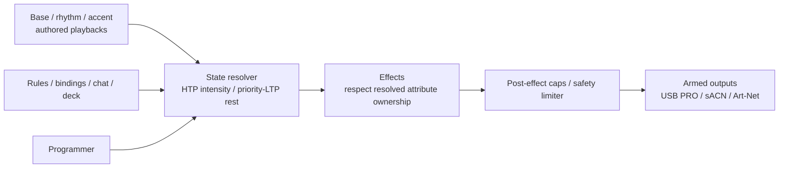

# Lights (DMX) — operator and authoring guide

The lights subsystem (`se-dmx`) drives DMX fixtures from the same state tree as the rest of the
engine: every fixture attribute is an address, so presets, rules, bindings, timelines, chat, MIDI,
the Stream Deck and voice control lights with no special path. Cue lists, palettes and effects are
plain TOML files under `lights/` in the project; they hot-reload when saved (a broken file is logged
and the last good version keeps running).

Lighting programming is opt-in: a blank project has no patched fixtures, looks, cue lists or
effects. The app's **Lights → Set up lights** button opens `lights/rig.toml` in your editor;
add the fixtures and outputs you actually use (§2.2). Create looks under `lights/palettes/`
and cue lists under `lights/cuelists/` when wanted. Nothing starts merely because a file exists.
The Lights page exposes base/rhythm/accent layers, their independent musical controls, overall
brightness/blackout and authored palette knobs (§2.7–2.8). Go / Back / Stop remains an explicitly
advanced manual cue console. The stage picture is a rendered preview, not physical confirmation.
If any patched fixture has unverified layout, **Fixture / pixel test** instead shows labeled
fixture rows with separate cell swatches in logical patch order. It does not change the rig's
coordinates or unlock spatial effects; a fully surveyed rig retains the stage floorplan.
Detailed patching and programmer controls remain available through files and `streamctl`;
safety controls work without any authored show.

```
lights/
  rig.toml              patch, groups, stage layout, outputs, safety, RDM
  fixtures/<id>.toml    fixture profiles (the library; rig refers to them by file stem)
  palettes/<name>.toml  named colour / position / beam / intensity values
  effects/<name>.toml   waveform effects (chases, pulses, circles, sparkle)
  cuelists/<name>.toml  tracked cue lists, selected through the shared layer contract
```

The output chain, every frame (default 44 Hz):



---

## 1. Concepts

### Fixtures and heads
A **fixture** is one patched device (`[fixtures.<id>]` in `rig.toml`). A **head** is one independently
controllable light: usually the fixture itself (head id = fixture id), but multi-cell fixtures such
as LED bars become one head per cell, named `<fixture>_<n>` (1-based, cell 1 nearest DMX in).

### Attributes are addresses
Each head exposes its attributes in the state tree:

| Address | Type | Merge |
|---|---|---|
| `lights.<head>.intensity` | 0..1 | HTP |
| `lights.<head>.color` | `[r, g, b, a]` 0..1 | LTP |
| `lights.<head>.{white, amber, uv, lime, cto}` | 0..1 | LTP |
| `lights.<head>.{pan, tilt}` | 0..1, 0.5 = centre | LTP |
| `lights.<head>.{zoom, focus, iris, frost, prism, gobo_rotate}` | 0..1 | LTP |
| `lights.<head>.gobo` | slot index (int) | LTP |
| `lights.<head>.strobe` | 0..1, 0 = open (no strobe) | LTP |
| `lights.<head>.<raw name>` | 0..255 (int) | LTP |

Only attributes the head's profile actually has are declared. **Group addresses**
`lights.group.<g>.<attr>` control every head of group `<g>` (and `all`):

- `lights.group.<g>.intensity` (default 0) is HTP with the heads' own intensity: raising it lifts
  the members, it never dims them.
- Every other group attribute is *unset* (null) by default and then has no effect. Once set, it
  competes LTP with the head's own address: whichever of the two changed most recently wins, and
  when the group value is released (or a chat value expires) the head's own value shows again.
- `lights.group.<g>.master` (default 1) is a submaster that scales the members' intensity.

A multi-cell fixture's own addresses (`lights.bar1.color`) work the same way over its cells
(`lights.bar1_3.color`). `lights.master` is the grand master (default 1) and `lights.blackout`
(bool) forces all intensity to 0.

### Merge: HTP and LTP
- **Intensity is HTP** (highest takes precedence): every source (each playback × its master, effects,
  group and head addresses) contributes, the highest wins. A cue can therefore never *lower*
  another cue's intensity — use `lights.master`, a group master, `lights.blackout` or release the
  other playback.
- **Everything else is LTP** (latest takes precedence) with **playback priority**: the higher
  `priority` playback wins; on equal priority the most recently fired one wins.
- Within one cue, when several targets name the same head, the most specific wins:
  fixture > smaller group > larger group > `all`.
- The **programmer** (priority 300) takes precedence over lower-priority LTP values and effect
  modulation of its owned attributes. HTP intensity still takes the highest contribution;
  lowering it requires a master, blackout or release. Only explicit advanced lists can request
  priorities ≥300; musical layers are capped at 299.
- Intensity is then scaled by masters, bounded by fixture/rig and core safety caps, and passed
  through the safety limiter. Chat-owned intensity effects cannot exceed the applicable chat cap.

### Advanced manual playbacks
A playback runs one cue list. Its values are core overrides keyed `cuelist:<cl>` at the playback's
**priority**, so the normal resolver merges them (HTP intensity, LTP by priority) and
`streamctl explain lights.<head>.<attr>` shows which list holds a value. Fades are core animations.

- **Priority:** the caller's `priority` argument (presets pass their priority, timelines theirs),
  otherwise the list's own `priority` (default 200). A `priority` in the list file is a floor.
  Requests that originate from chat always run at chat priority (100): the core applies the
  project's `[safety] chat_caps` to them and they expire after `chat_ttl`.
- **Master** `lights.cuelist.<cl>.master` (0..1) scales the intensities (and effect sizes) the
  playback contributes, also during a fade; bind it to a fader.
- **Fader start** (`fader_start = true`, default): moving the master up from 0 while the list is
  stopped starts it.
- Status: `lights.cuelist.<cl>.{cue, next, playing}`. A running advanced operator cue list
  survives a restart as an **intention** (list name, cue ID, caller origin and priority), rebuilt
  through normal playback after declarations land. Eligible callers are UI, CLI, API, Deck,
  MIDI, Voice, OSC and Mixer at manual **command** priority (≥300), with playback priority
  above chat (100); a list's default playback priority of 200 is eligible for these callers.
  Preset commands inherited from an operator remain ineligible at preset command priority.
  The resolved cue-list master remains the ordinary persistent operator control, not a
  second saved playback value.
- Only a currently running, still-declared list and cue are retained. Release removes its
  intention immediately, even while its fade is finishing. Hot reload follows cue IDs across
  reorderings and drops deleted cues/lists. A later automation navigation transfers ownership
  and removes operator restart eligibility, even at the same priority. Changes persist
  immediately; a once-per-second sweep retries failed writes.
- Foundation color/motion/accent layers, held looks, programmer, flash, preset/rule/timeline/
  scene/chat playback and system fader-start playback are transient. Legacy serialized
  playback maps, raw override generations and standalone effect-active flags are not rebuilt.
  No valid intention means ordinary idle behavior. Operator master, blackout, automation
  preference and unrelated persistent controls remain intact. The explicit panic latch
  persists, discards playback intentions and rebuilds its safety look instead.

---

## 2. File formats

### 2.1 Fixture profile — `lights/fixtures/<id>.toml`
The file stem is the profile id (`profile = "<id>"` in the rig).

```toml
name = "Generic RGB PAR"
manufacturer = "Generic"
kind = "par"          # visualizer: par | wash | spot | beam | bar | strobe | dimmer | other
beam = 25.0           # beam angle, degrees (visualizer)

[modes.3ch]           # the first mode in the file is the default
channels = ["red", "green", "blue"]

[modes.7ch]
channels = [
  "dimmer", "red", "green", "blue",
  { role = "strobe", range = [10, 255], hz = [1.0, 20.0], open = 0 },
  { role = "raw", name = "program", default = 0 },
]
```

A channel entry is a role string, or a table
`{ role, name?, label?, restriction?, default? (0-255), invert?, range? [lo, hi], hz? [min, max], open?, closed?, slots?, deg? }`.
Channels are listed in DMX order starting at the fixture's start address.

| Role | Attribute | Notes |
|---|---|---|
| `dimmer`, `dimmer_fine` | intensity | 16-bit when `dimmer_fine` follows `dimmer` |
| `red`, `green`, `blue` | color | additive |
| `cyan`, `magenta`, `yellow` | color | subtractive (CMY) |
| `color_wheel` | color | `slots = [{ value = 0, color = "#ffffff", name = "open" }, …]`; the nearest slot to the requested colour is sent |
| `white`, `amber`, `uv`, `lime`, `cto` | same name | |
| `pan`, `pan_fine`, `tilt`, `tilt_fine` | pan / tilt | 0..1, 0.5 = centre; `deg = 540` on `pan`/`tilt` = full travel |
| `zoom` | zoom | `deg = [min, max]` beam angle at 0 and 1 |
| `focus`, `iris`, `frost`, `prism`, `gobo_rotate` | same name | 0..1 |
| `gobo` | gobo (index) | `slots = [{ value = 0, name = "open" }, …]` |
| `strobe`, `shutter` | strobe | `range` = DMX sub-range slow → fast, `hz` = flash rates at its ends, `open` = no-strobe value; attribute 0 = open |
| `raw` | `<name>` | 0..255 integer, e.g. program/speed/control channels; `default` is sent when nothing sets it |
| `fixed` | — | always sends `value` |

`closed` is an optional documented shutter byte sent for zero intensity/blackout. It is never
inferred from `open`; an unknown shutter blackout requires hardware commissioning.

`invert = true` flips a channel (255 − value). **Multi-cell** fixtures (LED bars):

```toml
[modes.26ch]
cells = 8
cell_channels = ["red", "green", "blue"]
channels = ["dimmer", { role = "strobe", range = [10, 255], hz = [1.0, 20.0], open = 0 }]
# master channels come first; `cells_first = true` puts the cells first
```

Heads without a dimmer channel get a **virtual dimmer** (intensity scales the emitters), so
`intensity` works on every head. `white_mix = "extract"` on a mode derives the white emitter from
min(r, g, b).

The built-in library (`project-example/lights/fixtures/`, copy into your project):

| Profile | Modes |
|---|---|
| `generic_dimmer` | `1ch` dimmer · `2ch` 16-bit dimmer |
| `generic_rgb` | `3ch` RGB · `4ch` dimmer+RGB · `7ch` dimmer, RGB, strobe, program, speed |
| `generic_rgbw` | `4ch` RGBW · `5ch` dimmer+RGBW · `8ch` dimmer, RGBW, strobe, program, speed |
| `generic_rgbawuv` | `6ch` R G B A W UV · `7ch` dimmer + 6 · `10ch` dimmer + 6 + strobe, program, speed |
| `generic_moving_head` | `14ch` 16-bit pan 540° / tilt 270°, speed, dimmer, shutter, colour wheel (8 colours), gobo wheel (6 + open), gobo rotate, prism, focus, zoom 12–30°, control · `10ch` 8-bit basic |
| `generic_led_bar` | `8x3` 8 RGB cells · `26ch` dimmer + strobe + 8 RGB cells · `3ch` whole-bar RGB |
| `generic_strobe` | `2ch` dimmer + strobe rate (1–25 Hz) · `1ch` strobe rate only |
| `generic_cmy_wash` | `6ch` dimmer, C, M, Y, CTO, zoom 10–50° |

Manual-backed profiles also ship for original `chauvet_colorstrip` (4CH direct RGB),
`chauvet_freedom_par_tri6` (9CH), original `chauvet_freedom_stick` (50CH),
`adj_inno_pocket_scan` (6CH combined color/gobo wheel) and `chauvet_circus_20_irc` (4CH raw
program selectors). Their comments/notes retain model and source ambiguities. Circus is not a
direct RGB wash; a profile's existence does not establish safe hardware behavior.

The actual stream project additionally uses `adj_mega_pixel_led` / `7ch` for the
owner-identified American DJ bars: RGB on 1–3, fixed program/RGB-mix gates on 4–5
at zero, blocked strobe on 6, and master dimmer on 7. The screenshot's COLORstrip
model label was incorrect; neither the original COLORstrip map nor `generic_rgb`
seven-channel order matches Mega Pixel LED. The existing `colorstrips` logical
target remains connected to authored looks and default controls.

**Complete capability discovery.** `lights.rig.fixtures[].channel_map` reports every physical
byte in address order, including all 48 pixel bytes of each original 50CH Stick, its strobe
and managed master, and fixed Par program/mode bytes. Each entry contains 1-based `channel`
and absolute `address`, owning `head`, `role`, `label`, `state_address` (or null),
`control` (`operator`, `fixed`, `managed`, `blocked`), `restriction`, `default`, optional
`range`, `strobe_available`, `steady_open`, `blackout`, and `slots`.
The Lights capability card exposes the same map; metadata does not grant unsafe raw control.

Discrete slot entries contain `index`, `name`, and physical DMX `value`. The normalized
gobo control takes the zero-based **index**, not the label or raw byte: scanner index 1
selects the static yellow gobo at byte 8. Color requests choose the nearest documented
wheel color; both controls address the same combined wheel. Shake/scroll ranges are
not interpolation destinations.

Cue-owned wheel indices snap directly to the selected slot; they never numerically fade
through intermediate slots. Movers hide authored pan/tilt/gobo changes with zero intensity
and the profile's closed shutter, wait 750 ms after the authored target stops changing,
then reveal over a 750 ms smoothstep. Continuous effect circles do not restart this gate.
A higher-priority operator intensity overrides lower-priority staging. These timings are
presentation staging, not a calibrated safe aiming range or mechanical travel guarantee.

Four Sticks expose 64 independently targetable RGB leaf heads (`stick1_1` … `stick4_16`),
not four whole-fixture RGB lamps. Whole-fixture targets expand to their cells; cell targets
remain independent. Their common master gates output while software scales each pixel.
The two bars labeled COLORstrip in the old screenshot are owner-identified Mega Pixel
LEDs. They retain shared start address 1 and necessarily mirror. No software layer
can separate shared addresses; physically repatch one bar and migrate both targets
only after commissioning.

### 2.2 Rig — `lights/rig.toml`

```toml
[fixtures.par1]
profile = "generic_rgb"   # required: a file stem in lights/fixtures/
mode = "3ch"              # optional, default = first mode of the profile
universe = 1              # default 1
address = 1               # 1-based DMX start address (required)
label = "Centre PAR"
position = [0.5, 0.1]     # stage layout: x 0 = stage left … 1 = stage right; y 0 = downstage … 1 = upstage
layout_verified = true    # explicitly surveyed layout; default false blocks x/y/radial effect ordering
rotation = 0.0            # degrees: facing direction at pan centre (visualizer)
length = 0.3              # bars: layout length along x over which the cells are spread
max_intensity = 1.0       # per-fixture brightness cap
invert_pan = false
invert_tilt = false

[groups]                  # `all` is implicit (every fixture) unless defined here
front = ["par1"]

[output]
rate_hz = 44.0            # DMX frame rate
rt_priority = 40          # SCHED_FIFO priority of the output thread (falls back to normal if not permitted)
armed = false             # hard transport interlock, default false; set true only after commissioning

[outputs.usb]
kind = "enttec_pro"       # enttec_pro | sacn | artnet
enabled = true
port = "auto"             # auto = first /dev/serial/by-id/*ENTTEC*DMX_USB_PRO*, or a device path
universe = 1
channels = 512
widget_rate = 0           # optional: set the widget's stored output rate on connect (0 = fastest, 1..40/s)

[outputs.sacn]
kind = "sacn"
enabled = false
universes = [1]
priority = 100
destination = "multicast" # or a unicast IP
# port = 5568             # optional UDP port override (E1.31 uses 5568)

[outputs.artnet]
kind = "artnet"
enabled = false
destination = "2.255.255.255"
universes = [1]           # port-address = (net << 8) | (subnet << 4) | (universe - 1)
net = 0
subnet = 0
# port = 6454             # optional UDP port override
# rehearsal = true        # keep sending the live show in rehearsal (test node / visualizer); see §8

[safety]
max_flash_hz = 3.0
flash_threshold = 0.2
max_intensity = 1.0
strobe = "limit"          # limit | block
safe_look = { intensity = 0.6, color = "#ffe6cc" }

[rdm]
discover_on_start = true
```

Group members may be fixture ids (all their heads), cell head ids (e.g. `bar1_3`) or other group
names (cycles are rejected).
Patch errors (unknown profile/mode, overlapping addresses, address beyond 512) are reported in the
Lights view and the `lights.rig` query `errors`; the rest of the rig keeps running.

Outputs require **both** `[output] armed = true` and their own `enabled = true`. Disarmed rigs
still compute preview frames and expose queries, but do not open serial devices or UDP sockets.
Disarming a running transport closes it; it is not a physical-blackout promise (USB widgets and
receivers may hold their last frame). Send and observe a verified blackout before disconnecting.
Spatial effects (`order = "x"`, `"y"`, `"radial"`) require every target fixture to have
`layout_verified = true`; `order = "index"` uses logical order without claiming physical placement.

#### Main-light handoff

An optional identity-pinned TP-Link legacy plug can relinquish the room to DMX:

```toml
[main_light]
enabled = true           # default false; omit the table to leave plugs alone
host = "10.0.0.208"       # actual project's EP10 "Main"; reserve its DHCP address
port = 9999
mac = "B4:B0:24:69:F2:7B"
idle_on = true           # optional, default false; restore Main on verified idle output
```

This native adapter supports the photographed setup's separately discovered EP10 legacy
local protocol; it needs no cloud credentials or Python helper. It reads identity on the
same TCP connection before a relay write, refuses a mismatched MAC, checks acknowledgement,
and verifies actual relay state afterward. XOR is protocol obfuscation, not secure transport;
keep the plug on a trusted LAN.

The main light switches **off only after an armed, enabled DMX sink successfully writes
intended lighting**. Disarmed previews, disabled sinks, unsent universes and failed writes
cannot take over. Intended brightness before dimmer modulation keeps ownership through
waveform troughs, sparkle gaps and deliberate palette-black moments; the main light must
not flash along with a chase. Successful writes are local transport evidence, not proof that
a remote fixture is attached or glowing.

After takeover, global blackout, zero intended levels/brightness, disarm, transport failure
or shutdown restore the main light **on**. Rehearsal follows the last successfully committed
hardware look, not the changing preview. Global blackout, zero grand master, zero safety cap
and panic bypass the rehearsal hold; clearing them does not automatically relight a held safe
frame. Panic also clears direct/manual lighting overrides before applying its safe look,
so HTP cannot keep a manually raised fixture above the safe level. A configured nonzero safe
look still owns the room; the actual project's safe look is zero intensity.

The control task checks activity every 100ms; plug networking is outside the real-time DMX
thread and each operation is bounded to five seconds. This is not frame-synchronous switching.
Initial idle leaves the plug alone unless `idle_on = true`; that option restores Main ON
only after successful armed output and supports recovery when the plug starts off.
Changing/disabling the target releases the old takeover first; graceful engine shutdown
waits for restoration. Failed requested switches retry every second while running.
A hard kill, power loss or unreachable plug cannot guarantee restoration: errors remain
visible and a manual way to turn the room light on is still required.

`lights.main_light.state` and `streamctl query lights.main_light` expose configuration,
phase, `in_use`, `output_sent`, last verified `on` (null when unknown), identity and detail.
The Lights page shows the same handoff status. `lights.output.frames` counts rendered
previews; actual transport frame counts are `lights.rig.outputs[].frames`.

#### Idle room lighting

An optional ambient fallback is configured independently of authored lighting:

```toml
[idle]
target = "colorstrips"    # existing RGB-capable fixture, cell, or group target
color = "#ff69b4"
intensity = 0.30
```

When no authored/manual attribute ownership or active effect remains, the selected
heads receive this static color/intensity; other heads stay dark. Ambient output does
not claim Main-light takeover. Normal masters, caps and flash/strobe safety still apply;
explicit blackout and panic suppress the fallback rather than being bypassed.
An explicit manually owned dark value also suppresses it. With `main_light.idle_on`,
the actual room returns to Main ON and pink overhead bars after a show look releases.


### 2.3 Cue list — `lights/cuelists/<name>.toml`

```toml
label = "Main"
priority = 200
loop = false
autorelease = false       # release after the last cue completes
release = "1s"            # fade-out time on release
fader_start = true        # master fader up from 0 starts the list
tags = ["heavy", "high", "hit"]   # optional free labels for lights.layer.pick (§2.9)

[[cue]]
id = "1"                  # default: 1-based position
label = "Warm"
fade = "2s"               # in-fade (all attributes)
fade_out = "1s"           # intensity decreases (default = fade)
delay = "0s"
follow = "2s"             # auto-go this long after this cue completes
wait = "4s"               # auto-go this long after this cue started (wins over follow)
# wait_beats = 16         # instead of wait/follow: four bars, follows variable BPM
ease = "linear"
block = false             # true = hard values, no tracking from earlier cues
release = ["front"]       # targets released from this playback in this cue
effects = { chase = { size = 1.0 } }   # start effects (optional size/rate)
stop_effects = ["rainbow"]            # or ["all"]

[cue.set]                 # target (fixture | head | group | "all") → attributes
all = { intensity = 1.0, color = "palette:warm" }
front = { intensity = { value = 0.8, fade = "4s", delay = "1s" }, palette = "center" }

[cue.addresses]           # any state address, held by this playback (released with it)
"lights.master" = 1.0
```

Durations are strings: `"150ms"`, `"0.3s"`, `"2s"`, `"1m"`. An attribute value may be a table
`{ value, fade?, delay? }` to override the cue's timing for that attribute only
(per-attribute timing).

### 2.4 Palette — `lights/palettes/<name>.toml`

```toml
kind = "color"            # color | position | beam | intensity | any
label = "Warm"
tags = ["warm", "chill", "low"]   # optional free labels for lights.layer.pick (§2.9)

[set]
all = { color = "#ffb070" }
par1 = { color = "#ff9050" }   # precedence: fixture > smaller group > larger group > all
```

Cues **reference** palettes, so editing a palette changes every cue that uses it (the
`lights.palettes` query lists `used_by`). Example palettes: `warm`, `cool`, `accent`
(= `stream:accent`), `red`, `blue`, `white`, `full`, `half`, `center`.

### 2.5 Effect — `lights/effects/<name>.toml`

```toml
label = "Beat chase"
tags = ["hype", "rhythm"]  # optional free labels, listed by lights.tags (§2.9)
kind = "color_chase"      # dimmer_sine | dimmer_triangle | dimmer_saw | dimmer_square | color_chase | color_wave | rainbow | circle | sparkle | follow | follow_color
targets = ["all"]
unit = "beats"            # hz = cycles per second | beats = beats per cycle
rate = 4.0
size = 1.0                # depth 0..1 (circle: 1 = ±25 % of pan/tilt travel)
spread = 1.0              # phase offset spread across targets (cycles)
order = "x"               # x | y | index | radial
colors = ["stream:accent", "stream:background", "#0044ff"]   # color_chase / color_wave
duty = 0.5                # dimmer_square
decay = "150ms"           # sparkle
```

Color sequences accept hex colors and the same `stream:<slot>` / `@<address>` live color
references as cue values. Fixture-specific `palette:<name>` look expansion belongs in
the underlying solid state, not in an effect's color sequence.

Signal-driven intensity and color envelopes:

```toml
kind = "follow"           # or follow_color
signal = "band.kick"
targets = ["all"]
order = "index"
size = 0.7
gain = 1.0
gate = 0.05
attack = "35ms"
release = "300ms"
invert = false
# colors = ["@lx.color.c"]  # required by follow_color; its first entry is the hit color
```

`signal` is required; it names a live signal such as `band.kick`, `music.level` or
`context.song`. `gain` defaults to 1 (finite, nonnegative), `gate` to 0 (0 inclusive,
1 exclusive), `attack` to 0 ms, `release` to 150 ms, and `invert` to false. Envelope
durations accept strings or numeric milliseconds and must be finite/nonnegative.
`rate`, `unit`, and `spread` do not change signal-envelope timing.
`band.kick` / `music.kick` and snare/hat counterparts are accepted, normalized onset
envelopes, not raw sound samples. Keep their gain modest; continuous level/bass signals
have a different amplitude domain and need separate tuning. Gate weak input, choose
specific fixture subsets, and shape a hit with attack/release instead of linking raw
level to every fixture's brightness. A steady supporting wash plus beat-based spatial
choreography keeps the show readable while those selected hits provide accents.


### 2.6 Value references
Anywhere a cue or palette takes a value:

| Form | Meaning |
|---|---|
| `0.8`, `[1.0, 0.5, 0.0]`, `"#ff8800"` | literal number / RGB / hex colour |
| `"palette:<name>"` | that attribute from lights palette `<name>` (live: editing the palette updates the cue) |
| `"stream:<slot>"` | live stream palette `palette.<slot>`: `accent background foreground red yellow green cyan magenta` — follows the Omarchy theme / scene colours |
| `"@<address>"` | live value of any state address, e.g. `"@lights.group.front.intensity"` |

The six show-color addresses `lx.color.a` through `lx.color.f` are declared color slots.
Color-only base cues can set all six to `"#RRGGBB"` values; running motions reference them
as `@lx.color.a` etc., independently of fixture intensity and movement.

At target level, `palette = "warm"` or `palettes = ["warm", "center"]` applies every attribute of
those palettes.

Live references (`stream:`, `@`, and palettes containing them) follow their source: when it
changes, running cues crossfade to the new value in 300 ms. A live source that has no value yet
(e.g. the renderer hasn't published the stream palette) is held and applied as soon as it appears.

### 2.7 Knobs — `[[knob]]` in a palette or cue list

A look (palette) or cue list can expose a few premade controls — its colour, brightness, chase
speed — that the Lights page shows and the operator can move. They use the shared knob shape
(`se_core::knob`, also used by quick effects); `target` says which value of *this file* the knob
changes:

```toml
# lights/palettes/warm.toml
[set]
all = { color = "#ffb070", intensity = 0.8 }

[[knob]]
label = "Color"              # plain words shown in the app
target = "set.all.color"     # set.<fixture | group | all>.<attribute>
kind = "color"               # value "#rrggbb"
default = "#ffb070"          # optional: "Reset knobs" goes back to it

[[knob]]
label = "Brightness"
target = "set.all.intensity"
min = 0.0
max = 1.0
step = 0.05                  # optional
unit = "%"                   # optional, plain words; "%" shows 0–1 as 0–100%

# lights/cuelists/chase_fast.toml
[[knob]]
label = "Speed"
target = "cue.1.effects.chase_fast.rate"   # cue.<id>.effects.<effect>.rate | .size
min = 0.5
max = 6.0
unit = "rounds a second"

[[knob]]
label = "Brightness"
target = "cue.1.set.all.intensity"         # cue.<id>.set.<fixture | group | all>.<attribute>
min = 0.0
max = 1.0
unit = "%"

# a choice: kind = "choice", options = [{ label = "Every beat", value = 1.0 }, …]
```

Rules (checked on load; a broken knob is a config error for that file, which keeps its last good
version):
- The target must be a **plain value** that is in the file: a look's `[set]` entry, a value a cue
  sets (for a timed value `{ value, fade, delay }` the knob changes `value`), or the `rate` /
  `size` of an effect that cue starts. `palette:`, `stream:` and `@` references can't have knobs.
  An effect rate the cue doesn't set yet reads as the effect's own rate; moving the knob writes it.
- Colours need `kind = "color"`; numbers need `min < max` (or a `choice` with number values).
  Brightness and other 0–1 attributes stay within 0–1 (reported against the rig); effect sizes
  within 0–1; effect rates above 0. No two knobs of a file may share a target.
- `lights.knob {look | cuelist, target, value, save?}` moves a knob (§6): the value is fitted
  (clamped, snapped to `step`, colours normalised), the loaded look / cue list changes at once —
  a running look or cue list crossfades to it (300 ms), including a running effect's rate — and
  with `save` (default `true`) it is written into the file with comments and layout kept, so the
  next firing and every reload use it. The app sends `save = false` while a slider is dragged and
  saves when it's released (or, for colours, once the picker is still for 0.6 s).

No looks or cue lists are installed by default. Knobs are configured only on looks and
cue lists you explicitly create after patching the real fixtures.

---

### 2.8 Shared musical look layers

`lights.layer.select` is the common authored-lighting entrypoint used by palette buttons, preset
`LightsRef`, scenes and guided lighting rule steps. MIDI, song events, chat and other triggers
can call the same action. It composes existing palettes, cue lists and effects; **it creates no
show content**. An empty library is valid.

| Field | Contract |
|---|---|
| `layer` | `base`, `rhythm` or temporary `accent` |
| `palette`, `cuelist`, `effects` | At least one existing authored reference; may compose. `effects` is a name or list |
| `cue` | Optional cue id; requires `cuelist` |
| `vibe` | Transparent operator/library metadata, not automatic visual classification |
| `energy` | 0–1; scales owned effect depth/size, independent of brightness and BPM |
| `rhythm` | 0.125–8; multiplies authored **beats per cycle**. 2 doubles the period; Hz effects and BPM are unchanged |
| `brightness` | 0–1; scales owned fixture intensities |
| `coverage` | Fixture/cell/group name or list; union of participating heads. `[]` deliberately mutes participation |
| `fade`, `release`, `duration` | Milliseconds or duration strings. Accent requires positive duration; other slots may also be finite |
| `quantize` | Next strictly-future beat-grid boundary, 0.125–64 beats |
| `owner` | Optional caller lifetime token; guards later set/release against a replacement |
| `priority` | Optional priority, always capped below programmer 300 |

`lights.layer.set {layer, vibe?, energy?, rhythm?, brightness?, coverage?, fade?, owner?}`
reapplies the current authored cue without restarting its progression or lifespan. If only
a queued selection exists, it updates that queued selection.

Writable `lights.layer.<base|rhythm|accent>.{energy,brightness,rhythm}` addresses expose
the same numeric controls for bindings, faders and `set`. They update the current owner
without restarting its authored progression or finite lifetime. Authored selection/set
values supply the baseline; bindings modulate that baseline, not their previous output.
As with `lights.layer.set`, they do not create an inactive layer.

```toml
target = "lights.layer.rhythm.energy"
signal = "context.song"
mode = "replace"
range = [0.4, 1.0]
scope = "lights.auto"
```

`lights.auto` itself is an operator-only writable switch: generic `set`/deck toggle and
`lights.auto.on|off|toggle` share the same path. Off fades only `owner = "context"` layers;
operator replacements survive. The preference persists without a hidden manual override.

`lights.layer.release {layer, fade?, owner?}` releases that slot's ownership; it does not clear
other slots or reset panic. `lights.layer.status` emits current status; `lights.layers` queries it.

`lights.layer.pick {layer, tags, any?, kind?, avoid_repeat?, …}` chooses a tagged palette or
cue list instead of naming one, then runs it exactly as `lights.layer.select` with every other
field above (§2.9).

Ownership and transitions:

- Replacement receives `layer:<slot>:<generation>`. Old addresses crossfade out and release
  only that generation; old expiry/release/start timers cannot clear its replacement.
- Accent expiry reveals unchanged lower layers. Duration begins at actual start, not queue time.
- Invalid selection leaves running and queued content unchanged. Conditional owner mismatch
  is an idempotent no-op and preserves a nonmatching active/queued replacement.
- Presets use unique per-runtime-instance source tokens; scene transitions share the ordered
  `scene` lifetime token. An old preset's expiry cannot release a newer preset, scene or UI base.
- An accepted non-chat base replacement turns off superseded lighting-only preset indicators.
  Mixed presets retain their other content but relinquish lighting ownership. A failed or
  pending selection does not supersede an active preset.
- UI set/release uses the queried generation owner, preventing stale tiles/controls from
  changing a newer selection.
- Default priorities are automation 200/201/202, manual operator 297/298/299, chat 98/99/100
  for base/rhythm/accent. Lower-priority or different chat owners cannot replace another owner.
  Chat retains actor-scoped keys, normal TTL and caps.
- Incoming inactive effects fade their depth from zero using the cue's normal fade.
  Outgoing active/rate/coverage controls remain owned until depth reaches zero; immediate
  `fade = 0` hits remain immediate. Same-effect replacements share one oscillator and
  transfer its controls without an outgoing fade overwriting the new contribution.
  Release defaults to the selected cue list's authored release, otherwise zero.
- Each effect name has **one oscillator**. Distinct slots cannot reserve the same effect name,
  including future cues, queued selections and outgoing fades. Same-slot retrigger is allowed.
  Use distinct authored effects for independently controlled simultaneous modulation.
- Fixture/group `cue.addresses` normalize to ordinary fixture-set expansion for coverage and
  brightness. Global lighting controls and direct effect-address mutation are not layer content;
  use explicit global/manual controls and owned `cue.effects`.

Quantization follows published `beat.position`/phase/BPM/confidence through the shared clock
adapter. Frozen samples do not refresh 250ms confidence freshness. Without audio publication,
it freewheels at the last trusted BPM or initial 120, so a queued start does not wait forever.
The audio clock also supports live-confidence hysteresis and manual BPM/tap override; see
`audio.md`. Cached local-file grids remain editor timing data, not a claimed playback-locked
clock without synchronized file identity and transport position.

The Lights **Musical layers** card shows content/vibe, current/queued state, accent remaining
time, energy, beat-period multiplier, brightness, coverage and release. Empty, pending,
disconnected or panic-latched slots disable ordinary controls. On-air base selection keeps the
existing confirmation gate. Arming and surveyed-layout status are shown separately from preview.

### 2.9 Tags and `lights.layer.pick`

Palettes, cue lists and effects may carry `tags = ["…"]`: free labels saying what the look is
for, so automation (rules reacting to `context.mood`, `context.peak`, …) can ask for "something
heavy and red" instead of naming files. Tags are stored trimmed and lowercase; duplicates are
dropped; an empty tag is a load error. Unknown tags are fine. `lights.tags` lists which names
carry each tag, and the `lights.palettes` / `lights.cuelists` / `lights.effects` rows include
their `tags`.

Vocabulary (use these so rules and presets share words; add your own freely):

| Group | Tags | Meaning |
|---|---|---|
| Mood | `chill` `groove` `bright` `heavy` `hype` `dark` | The `context.mood` values plus `dark` (moody, little light) |
| Energy | `low` `mid` `high` | How busy/bright the look is |
| Role | `base` `rhythm` `accent` `hit` `build` | Which layer it suits; `hit` = short punch, `build` = rising tension |
| Temperature | `warm` `cool` `neutral` | Overall colour temperature |
| Colour | free words: `red`, `amber`, `blue`, `purple`, `white`, … | Dominant colours |

`lights.layer.pick` takes every `lights.layer.select` field except `palette`, `cuelist` and `cue`
(it picks those; giving one is an error), plus:

| Field | Contract |
|---|---|
| `tags` | Required tags (name or list): a candidate must carry **all** of them. Empty = everything |
| `any` | Preferred tags (name or list): the candidate carrying the most of them wins |
| `kind` | `palette`, `cuelist` or `any` (default) |
| `avoid_repeat` | 0–32, default 2: skip this layer's last N distinct picks while another candidate remains |

Only content that composes on the current rig with the given `coverage`/`effects` is a candidate.
Recent picks are skipped first; among the rest, the highest `any` score wins and ties are broken
at random. If every candidate was picked recently, the top-scoring one picked longest ago is
reused. The pick then goes through `lights.layer.select` unchanged: same owner tokens,
priorities, ownership refusals, quantize, fades, duration and release. No candidate is **not**
an error: the layer is left unchanged and an `info` log line says so, so a rule chain continues.
Each successful pick is logged (`lights.layer.pick <layer>: palette `<name>` …`) and remembered
per layer (in memory) for `avoid_repeat`.

```text
lights.layer.pick layer=base tags=heavy any='["red", "high"]' fade=2s quantize=4 owner=context
lights.layer.pick layer=accent tags=hit kind=cuelist duration=4s owner=context
```


## 3. Cue list semantics

- **Tracking.** A cue stores only what it changes; every other value carries forward from the
  previous cues of the list. `block = true` makes a cue hard: only its own values apply.
- **Go** (`lights.go {cuelist}`) runs the next cue (starting the list if it is not playing).
  After the last cue a `loop = true` list returns to cue 1; otherwise it holds the last cue, or
  releases if `autorelease = true`.
- **Timing.** `delay` waits, then attributes fade over `fade`; intensity *decreases* use
  `fade_out`. A cue is *complete* when its longest delay + fade has finished.
  `follow` auto-goes that long after completion; `wait` auto-goes that long after the cue
  *started* (and wins when both are set).
  `wait_beats = 16` instead holds a cue for four bars in 4/4 against continuous
  `beat.position`, not a one-time BPM-to-ms conversion. It cannot combine with `wait` or
  `follow`. Musical loop deadlines carry forward their exact authored boundary, so late
  control polls do not accumulate phase drift; terminal autorelease also honors this wait.
- **Back** (`lights.back {cuelist}`) steps to the previous cue with that cue's own timing.
- **Goto** (`lights.goto {cuelist, cue, fade?}`) jumps to any cue, recomputing the tracked state
  as if the list had run to it; `fade` overrides the cue timing. Follow/wait timers run from there.
- **Locate** (`lights.locate {cuelist, cue}`) is a goto with fade 0 and no follow/wait timers —
  used by timelines to land exactly on a cue when scrubbing or seeking.
- **Release** fades the playback's contribution out over `release` and drops its held addresses.
- Firing a list that is already playing restarts it from cue 1.


---

## 4. Effects

- **Units.** `unit = "hz"`: `rate` cycles per second. `unit = "beats"`: `rate` beats per cycle,
  locked to shared `beat.position` / `beat.phase` / `beat.bpm` timing with confidence-aware
  freewheel, so `rate = 4` is one cycle per bar in 4/4. Both units integrate rate changes
  from their current phase, without restarting the oscillator. Beat effects initially
  align to the shared beat position; independently named effects retain independent rates.
- **Spread and order.** Target leaf heads (including each independent Stick cell) receive
  phase offsets by `order`: `x` stage left → right, `y` front → back, `index` target expansion
  order, or `radial` stage centre outwards. Spatial order uses surveyed positions and requires
  `layout_verified = true`; `index` also works before a physical survey. Offsets cover
  `0..spread × (N−1)/N` cycles: `spread = 0` is synchronized, `1` cascades across the targets
  without duplicating the first phase at the last head. A fixture target expands to all its
  leaf cells; explicit cell/group targets and layer `coverage` select individual participants.
- **Kinds.** `dimmer_sine`/`dimmer_triangle`/`dimmer_saw`/`dimmer_square` attenuate intensity
  (depth = `size`; `duty` for square). Triangle rises linearly from zero at phase 0 to one at
  phase 0.5 and returns to zero at phase 1. `color_chase` steps through `colors`;
  `color_wave` eases between adjacent authored RGB colors using smoothstep, including the
  final-to-first transition. Both require at least two colors, and `rate` is the duration of
  the entire sequence (in beats) or its frequency (in Hz), not the rate of each color step.
  `size` blends RGB modulation against the underlying solid color without changing intensity.
  `rainbow` rotates hue; `circle` moves pan/tilt (size 1 = ±25 % travel; heads without pan/tilt
  ignore it); `sparkle` random flashes decay over `decay`.
- **Signal followers.** Gain/clamp the signal to 0–1, gate/rescale it as
  `max(0, (input - gate) / (1 - gate))`, optionally invert, then smooth with separate
  exponential attack/release time constants. `follow` multiplies intensity by
  `1 - size + size * m`; `follow_color` blends underlying RGB toward `colors[0]` by
  `size * m`, without changing intensity. A shared full-bright RGB channel between
  underlying and hit colors prevents blend-induced luminance dips. Missing signals use
  zero input; unavailable hit colors leave underlying RGB intact. Signal IDs are cached,
  envelopes/buffers preallocated, and the flash limiter remains the final output stage.
- **Shared live colors.** Sequence entries may mix hex colors, `stream:<slot>` and live
  `@<address>` color references. Stream slots are `accent background foreground red yellow
  green cyan magenta`, resolved from the same `palette.<slot>` state used by video. Updates
  recolor the running sequence on the next frame without changing its clock or phase.
  Missing endpoints leave the underlying RGB state intact for that step/interpolation until
  the source publishes again. Address IDs and color buffers are compiled/preallocated, so
  evaluation does not allocate or parse references per frame.
  Video-FX Color parameters use the same authored references; see
  [shared palette colors](render.md#shared-palette-colors). Palette changes do not restart
  an oscillator, enable video slots, or author a show automatically.
- **Addressable.** `lights.effect.<e>.active` (bool), `lights.effect.<e>.rate` and
  `lights.effect.<e>.size` are state addresses: bind them to audio signals, faders or MIDI
  encoders (e.g. drive `lights.effect.pulse.size` from `band.kick`).
  `replace` bindings remain beneath overrides: cue/manual values win. `add` and `multiply`
  bindings apply **after** the winning override, then clamp to the address range. To scale
  a cue-owned effect depth, use `mode = "multiply"` (and an active-effect scope). A cue's
  omitted rate remains replace-bindable at neutral layer rhythm; explicit rates or a
  non-neutral rhythm lever own the rate, so multiply is appropriate for modulation there.
  Rule `if` expressions read the same live signals (`context.song > 0.7 && band.level > 0.2`)
  and event payload fields (`event.strength`, `event.section`). Event names are matched by
  `when`, including `music.drop`, `music.section`, `beat`, queue, context and Twitch events.
- Start/stop from cues (`effects`, `stop_effects`) or actions (`lights.effect.start {name, size?, rate?}`,
  `lights.effect.stop {name}`). Effects started by a cue stop when that playback is released.
- Lower-priority effects skip higher-priority owned attributes (including programmer values).
  Pan and tilt protection are independent; protected/uncovered sparkle envelopes clear before
  reentry. Intensity effects only attenuate resolved levels, so existing core/global and chat
  intensity ceilings remain intact without repeating policy matching on the DMX thread.
- **Composition, not canned shows.** Use an authored look/cue's intensity and color for a
  solid state, then optionally layer dim-only triangle/sine waves or a color sequence over it.
  Existing cuelist `wait`, fades and `effects`/`stop_effects` compose timed changes; existing
  base/rhythm/accent selection supplies quantization, brightness, energy, rhythm and coverage.
  Use distinct effect names for concurrent independent rates. No automatic looks, effects or
  cuelists are generated.


---

## 5. Programmer

1. **Select** heads or groups: `lights.programmer.select {targets: ["front", "par1"], add?}`.
2. **Set / nudge** attributes: `lights.programmer.set {attr, value}`,
   `lights.programmer.nudge {attr, delta}` (X-TOUCH encoders nudge).
3. **Highlight** (`lights.programmer.highlight {on?}`): selection at full open white so you can
   find the fixture. **Locate** (`lights.programmer.locate`): selection to home
   (full, white, pan/tilt centre, open beam).
4. **Store**: `lights.programmer.store {palette?, kind?, cuelist?, cue?, preset?}` writes the
   programmer values into a palette file (with `kind = color|position|beam|intensity` only that
   kind of attributes is stored), a cue of a cue list (replaces that cue's `[cue.set]`, or appends
   a new cue — other cue settings stay), or a preset (`set = { address = value }`). Files are
   edited in place with comments preserved and hot-reload; a stored palette immediately updates
   every running cue that uses it.
5. **Release** (`lights.programmer.release`) hands control back to the playbacks;
   **Clear** (`lights.programmer.clear`) empties selection and values.

Programmer values override every playback below priority 300 until released. `lights.programmer.{selection,
highlight, active}` show its state.

---

## 6. Actions, events, queries

### Actions (prefix `lights`)

| Action | Arguments |
|---|---|
| `lights.layer.select` | Shared authored content/control contract (§2.8); accent requires duration |
| `lights.layer.pick` | `layer`, `tags` (all required), `any?` (preferred), `kind?` (`palette`\|`cuelist`\|`any`), `avoid_repeat?` (default 2) plus every `lights.layer.select` field except `palette`/`cuelist`/`cue` — pick tagged content, then select it (§2.9). No candidate = logged no-op |
| `lights.layer.set` / `.release` / `.status` | Update controls / release owned slot / emit status (§2.8) |
| `lights.cue` | `cue` (list name) — start that list at its first cue (restarts a running list); or `cuelist` + `cue` — go to that cue id with its full tracked state; or `look` (palette name) — hold that look (see below). `priority?`, `fade?` (ms or `"500ms"`, overrides all fade/delay times) |
| `lights.release` | `cue?` \| `cuelist?` \| `look?`, `fade?` — release one playback or look; none (or `all`) = every playback and look |
| `lights.default` | none — operator-only restore configured idle lighting; stop authored/direct lighting, clear blackout/panic and restore master; leave automation off |
| `lights.panic` | release active/queued/outgoing layers and manual playbacks, stop effects, clear programmer, latch safe look |
| `lights.go` / `lights.back` | `cuelist` |
| `lights.goto` | `cuelist`, `cue`, `fade?`, `priority?` |
| `lights.locate` | `cuelist`, `cue`, `priority?` |
| `lights.flash` | `color?`, `ms?`, `target?`, `intensity?` — one-shot flash (also the `lights.flash` event) |
| `lights.effect.start` / `.stop` | `name`, `size?`, `rate?` |
| `lights.programmer.select` | `targets`, `add?` |
| `lights.programmer.set` / `.nudge` | `attr`, `value` / `delta` (or `address` + `value` for one address; values may be `palette:`/`stream:`/`@` references) |
| `lights.programmer.highlight` | `on?` |
| `lights.programmer.locate` / `.release` / `.clear` | — |
| `lights.programmer.store` | `palette?`, `kind?`, `cuelist?`, `cue?`, `preset?` |
| `lights.knob` | `look` \| `cuelist`, `target` (the knob's), `value`, `save?` (default `true`) — move a knob (§2.7); not from chat |
| `lights.rdm.discover` | run RDM discovery now |

Positional forms work: `streamctl do "lights.go main"`, `streamctl do "lights.goto main 3"`,
`streamctl do "lights.cue warm_duo"`. Cue ids match by text (`3` = `"3"`).
In command *text*, a bare `<something>.release` is the core's release op — write
`lights.release all` / `lights.release cuelist=main` and `lights.programmer.release all`
(the UI and the deck send these actions directly, so this only matters when typing them).
Chat may fire cue lists and flashes (chat priority, capped) but never the programmer.

**Default room lighting:** `streamctl do "lights.default"` (the Lights UI and deck button use
the same action) is an explicit, immediate operator handoff to `[idle]`, not a new playback
or a hardcoded colour. It stops cue lists, held looks, active/queued/outgoing layers and
release tails, effects and flashes; clears the programmer/highlight/selection and direct
fixture/group overrides; restores `lights.master = 1` and `lights.blackout = false`; and
unlatches the lighting panic safe look. It also switches `lights.auto` **off**, durably,
so automation does not immediately replace the room lighting. Choose `lights.auto.on`
explicitly to resume automation. Repeated default presses are safe.

Lighting-only preset buttons are retired (including queued firings), without running their
release commands. Mixed presets retain their nonlighting content and active indication;
their old lighting ownership, delayed lighting commands and lighting release commands are
retired, so they cannot reapply a pre-default look. New explicit operator lighting choices
remain available. Nonoperators are refused before any lighting or automation state changes.

Default does **not** arm outputs, change the rig/output configuration, rehearsal or safety
caps, or reset audio/video/scene controls. Main is not directly toggled by this action:
the existing verified physical-output handoff restores its configured `idle_on` state only
after the renderer has returned to idle. A disarmed rig remains a preview.


**Advanced held looks:** `lights.cue {look}` is the manual console's one-step palette playback
under `look:<name>`, separate from shared musical layers. Manual cue/look controls retain their
existing priority, palette following and release behavior. The Lights page's look buttons and
authored preset/scene references instead select the base slot (§2.8); they are not aliases to
the advanced console. Saved transient playback is discarded after daemon restart rather than
reconstructing orphaned generation overrides or relighting a stale effect.

### Events
- `lights.cue.go {cuelist, cue}` — a cue started.
- `lights.cue.released {cuelist}` — a playback released.
- `lights.layer.selected {layer, generation, priority, source_owner}` — accepted layer start.

### State (besides head/group attributes)
`lights.master`, `lights.blackout`, `lights.group.<g>.master`,
`lights.cuelist.<cl>.{cue, next, playing, master}`, `lights.effect.<e>.{active, rate, size}`,
`lights.programmer.{selection, highlight, active}`,
`lights.layer.<slot>.state` (readonly), `lights.layer.<slot>.{energy,brightness,rhythm}` (writable),
`lights.auto` (operator-only switch), `lights.panic_latched` (readonly),
`lights.main_light.state` (readonly handoff status),
`lights.output.{fps, jitter_ms, frames, limited, alloc_violations}` (heap allocations on the output thread after its first second; debug builds count them, 0 is expected), `health.dmx`.

### Queries (`streamctl query <name>`)
- `lights.rig` — fixtures (`layout_verified`, `notes`, complete physical `channel_map`), heads, groups, profiles, `output_armed`, outputs (`armed`, status + detail), patch errors and safety.
- `lights.cuelists` — every list with `tags`, playing state, current/next cue, progress, cue timing, and `knobs`.
- `lights.palettes` — values, `tags`, `used_by`, `look_active`, `active_layers` and knobs.
- `lights.effects` — effects with kind, `tags`, targets, unit, rate, size, spread, order, colors,
  duty, decay_s, signal, gain, gate, attack_s, release_s, invert and active.
- `lights.tags` — `{tag: [names…]}`: palettes, cue lists and effects carrying each tag (sorted, §2.9).
- `lights.programmer` — selection, heads, values, highlight.
- `lights.output` — fps, frame count, timing (`jitter.{p50_ms, p99_ms, p999_ms, max_ms}` of the
  frame interval since start, wake lateness, frame computation and write time, overruns),
  scheduling, the raw 512 values of every universe (the **DMX monitor**), per-head output
  (intensity, colour, pan/tilt, zoom, strobe, limited) and limiter counters.
- `lights.rdm` — discovery status, widget firmware/serial, discovered devices.
- `lights.main_light` — identity-pinned plug configuration, handoff phase, committed activity, last verified relay state and errors.
- `lights.layers` — `{base, rhythm, accent, panic_latched, releasing}`. Slot state has `active`,
  `pending` (null or generation/owner/boundary/selection/controls/source_owner); active state also
  has generation owner, source_owner, priority, origin, selection, controls, cue and remaining_ms
  (null for indefinite). Selection names palette/cuelist/cue/effects; controls name the five
  independent dimensions. `releasing` lists outgoing ownership keys.

`knobs` = `[{label, target, kind, min, max, step, unit, default, options: [{label, value}], value}]`
(`value` = the current one: `"#rrggbb"` or a number).

---

## 7. Safety limiter

The limiter runs after resolved attributes and effect modulation. It constrains normalized direct
brightness and documented strobe mappings, **not autonomous fixture programs selected by raw
channels**. Internal macro behavior requires separate hardware verification.

- **What a flash is:** the limiter tracks each head's output luminance (intensity × colour
  brightness) and its running low. A flash onset is a rise of at least `flash_threshold`
  (default 0.2) above that low while the low is below 0.8 of full. Small wiggles and changes near
  full output are not flashes.
- **Rate cap:** at most `max_flash_hz` (default 3) flash onsets in any 1 s window **per head**.
  Rig-wide, at most `max_flash_hz` frames per second may start a **fast** flash on any head
  (heads that flash together count once), so a chase of snaps across many heads cannot add up to
  a strobe. An onset is fast when the head climbed by `flash_threshold` within 250 ms (measured
  from a recent low that follows slower rises). Slow rises — smooth waves travelling across Stick
  pixels, slow color waves — still count against their own head's cap but not the rig-wide gate:
  a moving gradient is not a flash. When a cap is reached, further rises are clamped to just
  under the threshold above the low — the head stays near its previous dark level — until the
  window allows the next onset. The window is counted over 1 s plus a 50 ms guard band, so the
  per-head cap still holds at the fixtures when frames arrive with transport jitter.
  `lights.output.limited` and the `lights.output` query `limiter` counters show when it acts.
  Authoring: smooth spread waves at full depth need a cycle of about 4 beats or longer at
  140 BPM; hard edges (squares, chases, sparkle) spread across heads are rig-wide gated, so
  keep them synchronized at one beat or slower.
- **Hardware strobe:** strobe/shutter channels are capped through the profile's `hz` mapping —
  the engine never sends a DMX value whose mapped rate exceeds `max_flash_hz`
  (`strobe = "limit"`), or forces the channel to its `open` value (`strobe = "block"`).
  Without a calibrated `hz` mapping, requested strobe is forced open; a documented `closed`
  shutter byte still takes precedence at zero intensity/blackout.
- **Brightness caps:** core `[safety.caps]` ceilings bound resolved levels; effects only dim them. Fixture/rig maximums also apply after effects.
- **Chat caps** (project `[safety] chat_caps`): applicable head/group intensity ceilings survive
  chat-owned modulation; chat cannot strobe or change global master/blackout.
- **Panic** (`lights.panic`, the global panic) releases every playback, clears the programmer and
  runs the `safe` cue list (or, without one, `[safety] safe_look`: every head at the safe intensity
  and colour) above everything. The safe look is **latched**: automation (a preset ending, a rule,
  a timeline) cannot release it; an operator can (`lights.release cuelist=safe` from the UI, deck
  or CLI, `lights.release all`, or `lights.default` to explicitly return to idle with automation off).
  Layer selection/set is rejected while latched; layer.release cannot unlatch it. The renderer
  suppresses effect modulation while latched, including a later advanced effect start.


---

## 8. Outputs

- **ENTTEC DMX USB PRO** (`kind = "enttec_pro"`, the day-one output): `port = "auto"` finds
  `/dev/serial/by-id/usb-ENTTEC_DMX_USB_PRO_*`, or give a path. The user must be in group
  `uucp`. Frames are sent with label 6 at `rate_hz`; `channels` (24..512) trims the frame. The
  widget re-transmits the latest frame at its own stored output rate (label 3/4 parameter; it
  shipped at 40 packets/s): `widget_rate = 0` sets it to "as fast as possible" (~44 Hz at 512
  channels) once on connect. The output thread runs `SCHED_FIFO` (`rt_priority`) when the user
  may (member of `realtime` after a re-login), otherwise at nice −10 or normal priority; the
  scheduling actually applied is in the `lights.output` query and `health.dmx` detail. On a
  normal shutdown the widget keeps showing the last frame.
  Only one process can open the widget; if the port is busy or unplugged the output reports
  `fail` and retries opening it every 2 s.
- **sACN / E1.31** (`kind = "sacn"`): UDP port 5568, multicast `239.255.<hi>.<lo>` per universe or a
  unicast IP in `destination`; `priority` 0..200 (default 100). On shutdown the engine sends
  stream-terminated packets.
- **Art-Net 4** (`kind = "artnet"`): ArtDmx to UDP port 6454 at `destination` (broadcast such as
  `2.255.255.255` / `10.255.255.255`, or a node's IP); port-address =
  `(net << 8) | (subnet << 4) | (universe - 1)`.

Several outputs may be enabled at once (e.g. USB PRO for universe 1 and sACN for a network node).

**Rehearsal** (show mode `rehearsal`, §17.2): outputs keep sending, but each one holds the look it
had when rehearsal started, so the room doesn't flash through the practice run; the Lights page's
stage picture (and the `lights.output` query) shows what the rehearsal does. An output with `rehearsal = true` (for
example an Art-Net output to a test node or a visualizer program) gets the live rehearsal frames
instead. Leaving rehearsal puts every output back on the live show. While held, the `lights.rig`
query marks the output `held` and `health.dmx` says so.

### RDM discovery
With `[rdm] discover_on_start = true` (or `lights.rdm.discover`), the engine runs RDM discovery
through the USB PRO once the widget is connected: every RDM-capable fixture on the line reports
its UID, manufacturer, model, DMX footprint, personality (mode) and current start address.
Results appear in the `lights.rdm` query (`streamctl query lights.rdm`). Many budget fixtures do not
implement RDM; they simply do not appear and are patched from the fixture list by hand.

RDM needs the widget's **RDM firmware** (major version 2). ENTTEC ships the DMX USB PRO with the
DMX firmware (1.xx), which has no RDM messages; the engine reads the firmware version first and
reports `RDM unavailable: … firmware 1.44 (DMX firmware)` instead of sending anything. The
widget on this machine (serial 02405589) runs firmware 1.44. DMX output pauses for the duration
of a discovery.

### Health checks
`health.dmx` (listed by `preflight`):
- `pass` — every enabled output is open and sending at the configured rate;
- `warn` — sending but degraded (frame jitter p99 > 2 ms, rig/config errors present, or no outputs
  enabled);
- `fail` — an enabled output cannot be opened or written (widget unplugged, permission denied).

The detail string says which. Per-output status is also in the `lights.rig` query.

---

## 9. Physical commissioning

The starter template contains profiles and disabled transport configuration, not placeholder
fixtures or authored presets. The actual `/home/dabsanddrums/stream-project` has a manual-backed
rig: mirrored Mega Pixel LED bars are one target, with four Pars, four 16-cell Sticks,
and the scanner; Circus is excluded. Physical USB output is enabled/armed and the
`lx_*` show library is authored. Red → blue bar response was observed on camera after
correcting the bar profile; Default Lights restored pink output and Main ON.
Installed geometry remains unverified. Start with `lights/reference/README.md` and
`commissioning.md` in that project.

Confirm physical labels, personality/start addresses, universe, real serial path and D-Fi link
before arming. The misidentified COLORstrip profile was replaced with the owner-identified
Mega Pixel LED map. Original Stick dimmer behavior, scanner aim/travel, pixel direction
and Circus darkness/program behavior still require physical commissioning.
Do not infer an electrical installation or safe blackout from source-document arithmetic.
RDM can supply evidence only for attached responding fixtures; absence is not verification.

### Adding a profile when the library lacks one
1. Find the fixture's DMX chart in its manual (channel order per mode, value ranges).
2. Copy the closest `generic_*` profile to `lights/fixtures/<maker>_<model>.toml`, set `name`,
   `manufacturer`, `kind`, `beam`.
3. Write one `[modes.<id>]` per mode you use, listing channels in order with the roles from §2.1:
   - strobe/shutter: `range` = the "strobe slow → fast" DMX range, `hz` = the rates the manual
     gives for its ends (measure with a phone slow-motion video if missing), `open` = a value in
     the "open / no strobe" range. The limiter needs `hz` to cap hardware strobe.
   - colour wheels and gobo wheels: one `slots` entry per slot with a DMX value inside its range.
   - program / macro / auto / sound-active channels: use documented safe fixed mode bytes for
     direct operation. Zero is not a universal manual-mode or blackout value.
   - pan/tilt: `deg` = total travel; 16-bit fixtures list `pan_fine` / `tilt_fine` right after.
4. Save: the rig reloads and the `lights.rig` query shows the mode's footprint — check it matches
   the manual.

### Verifying with the DMX monitor
1. Watch `streamctl query lights.output` → `universes` (the raw DMX values).
2. Select a fixture and **highlight** it (`streamctl do "lights.programmer.select par1"`, then
   `lights.programmer.highlight`): exactly its channels, starting at its start address, should
   change — and the physical fixture should light up open white.
3. Step through attributes with `lights.programmer.set` (colour, pan, tilt, gobo…) and confirm the fixture
   follows. Wrong colours or channels mean a wrong mode (on the fixture or in the rig) or a wrong
   profile channel order; a fixture reacting to another's values means overlapping addresses.
4. Verify blackout and non-strobing direct behavior at low brightness before arming normal output.
