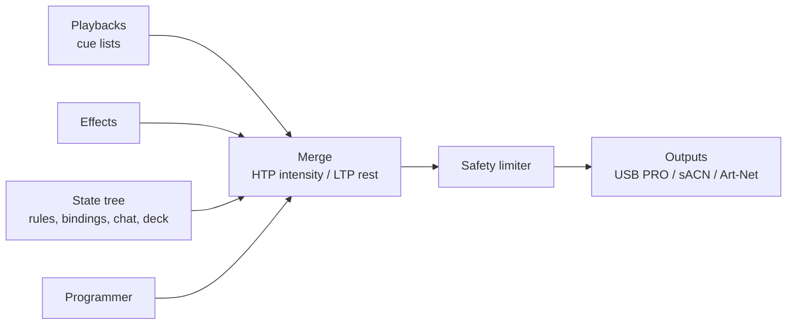

# Lights (DMX) — operator and authoring guide

The lights subsystem (`se-dmx`) drives DMX fixtures from the same state tree as the rest of the
engine: every fixture attribute is an address, so presets, rules, bindings, timelines, chat, MIDI,
the Stream Deck and voice control lights with no special path. Cue lists, palettes and effects are
plain TOML files under `lights/` in the project; they hot-reload when saved (a broken file is logged
and the last good version keeps running).

```
lights/
  rig.toml              patch, groups, stage layout, outputs, safety, RDM
  fixtures/<id>.toml    fixture profiles (the library; rig refers to them by file stem)
  palettes/<name>.toml  named colour / position / beam / intensity values
  effects/<name>.toml   waveform effects (chases, pulses, circles, sparkle)
  cuelists/<name>.toml  cue lists, fired with `lights.cue {cue = "<name>"}`
```

The output chain, every frame (default 44 Hz):



---

## 1. Concepts

### Fixtures and heads
A **fixture** is one patched device (`[fixtures.<id>]` in `rig.toml`). A **head** is one independently
controllable light: usually the fixture itself (head id = fixture id), but multi-cell fixtures such
as LED bars become one head per cell, named `<fixture>_<n>` (1-based, cell 1 nearest DMX in).

### Attributes are addresses
Each head exposes its attributes in the state tree:

| Address | Type | Merge |
|---|---|---|
| `lights.<head>.intensity` | 0..1 | HTP |
| `lights.<head>.color` | `[r, g, b, a]` 0..1 | LTP |
| `lights.<head>.{white, amber, uv, lime, cto}` | 0..1 | LTP |
| `lights.<head>.{pan, tilt}` | 0..1, 0.5 = centre | LTP |
| `lights.<head>.{zoom, focus, iris, frost, prism, gobo_rotate}` | 0..1 | LTP |
| `lights.<head>.gobo` | slot index (int) | LTP |
| `lights.<head>.strobe` | 0..1, 0 = open (no strobe) | LTP |
| `lights.<head>.<raw name>` | 0..255 (int) | LTP |

Only attributes the head's profile actually has are declared. **Group addresses**
`lights.group.<g>.<attr>` control every head of group `<g>` (and `all`):

- `lights.group.<g>.intensity` (default 0) is HTP with the heads' own intensity: raising it lifts
  the members, it never dims them.
- Every other group attribute is *unset* (null) by default and then has no effect. Once set, it
  competes LTP with the head's own address: whichever of the two changed most recently wins, and
  when the group value is released (or a chat value expires) the head's own value shows again.
- `lights.group.<g>.master` (default 1) is a submaster that scales the members' intensity.

A multi-cell fixture's own addresses (`lights.bar1.color`) work the same way over its cells
(`lights.bar1_3.color`). `lights.master` is the grand master (default 1) and `lights.blackout`
(bool) forces all intensity to 0.

### Merge: HTP and LTP
- **Intensity is HTP** (highest takes precedence): every source (each playback × its master, effects,
  group and head addresses) contributes, the highest wins. A cue can therefore never *lower*
  another cue's intensity — use `lights.master`, a group master, `lights.blackout` or release the
  other playback.
- **Everything else is LTP** (latest takes precedence) with **playback priority**: the higher
  `priority` playback wins; on equal priority the most recently fired one wins.
- Within one cue, when several targets name the same head, the most specific wins:
  fixture > smaller group > larger group > `all`.
- The **programmer** (priority 300) overrides every playback until it is released — except lists
  that deliberately run above it (`priority` ≥ 300 in the file, like the example `safe` and
  `blackout`).
- Intensity is then scaled by the group masters, `lights.master` and the fixture's
  `max_intensity`, and passed through the safety limiter.

### Playbacks
A playback runs one cue list. Its values are core overrides keyed `cuelist:<cl>` at the playback's
**priority**, so the normal resolver merges them (HTP intensity, LTP by priority) and
`streamctl explain lights.<head>.<attr>` shows which list holds a value. Fades are core animations.

- **Priority:** the caller's `priority` argument (presets pass their priority, timelines theirs),
  otherwise the list's own `priority` (default 200). A `priority` in the list file is a floor.
  Requests that originate from chat always run at chat priority (100): the core applies the
  project's `[safety] chat_caps` to them and they expire after `chat_ttl`.
- **Master** `lights.cuelist.<cl>.master` (0..1) scales the intensities (and effect sizes) the
  playback contributes, also during a fade; bind it to a fader.
- **Fader start** (`fader_start = true`, default): moving the master up from 0 while the list is
  stopped starts it.
- Status: `lights.cuelist.<cl>.{cue, next, playing}`; running playbacks are restored after an
  engine restart.

---

## 2. File formats

### 2.1 Fixture profile — `lights/fixtures/<id>.toml`
The file stem is the profile id (`profile = "<id>"` in the rig).

```toml
name = "Generic RGB PAR"
manufacturer = "Generic"
kind = "par"          # visualizer: par | wash | spot | beam | bar | strobe | dimmer | other
beam = 25.0           # beam angle, degrees (visualizer)

[modes.3ch]           # the first mode in the file is the default
channels = ["red", "green", "blue"]

[modes.7ch]
channels = [
  "dimmer", "red", "green", "blue",
  { role = "strobe", range = [10, 255], hz = [1.0, 20.0], open = 0 },
  { role = "raw", name = "program", default = 0 },
]
```

A channel entry is a role string, or a table
`{ role, name?, default? (0-255), invert?, range? [lo, hi], hz? [min, max], open?, slots?, deg? }`.
Channels are listed in DMX order starting at the fixture's start address.

| Role | Attribute | Notes |
|---|---|---|
| `dimmer`, `dimmer_fine` | intensity | 16-bit when `dimmer_fine` follows `dimmer` |
| `red`, `green`, `blue` | color | additive |
| `cyan`, `magenta`, `yellow` | color | subtractive (CMY) |
| `color_wheel` | color | `slots = [{ value = 0, color = "#ffffff", name = "open" }, …]`; the nearest slot to the requested colour is sent |
| `white`, `amber`, `uv`, `lime`, `cto` | same name | |
| `pan`, `pan_fine`, `tilt`, `tilt_fine` | pan / tilt | 0..1, 0.5 = centre; `deg = 540` on `pan`/`tilt` = full travel |
| `zoom` | zoom | `deg = [min, max]` beam angle at 0 and 1 |
| `focus`, `iris`, `frost`, `prism`, `gobo_rotate` | same name | 0..1 |
| `gobo` | gobo (index) | `slots = [{ value = 0, name = "open" }, …]` |
| `strobe`, `shutter` | strobe | `range` = DMX sub-range slow → fast, `hz` = flash rates at its ends, `open` = no-strobe value; attribute 0 = open |
| `raw` | `<name>` | 0..255 integer, e.g. program/speed/control channels; `default` is sent when nothing sets it |
| `fixed` | — | always sends `value` |

`invert = true` flips a channel (255 − value). **Multi-cell** fixtures (LED bars):

```toml
[modes.26ch]
cells = 8
cell_channels = ["red", "green", "blue"]
channels = ["dimmer", { role = "strobe", range = [10, 255], hz = [1.0, 20.0], open = 0 }]
# master channels come first; `cells_first = true` puts the cells first
```

Heads without a dimmer channel get a **virtual dimmer** (intensity scales the emitters), so
`intensity` works on every head. `white_mix = "extract"` on a mode derives the white emitter from
min(r, g, b).

The built-in library (`project-example/lights/fixtures/`, copy into your project):

| Profile | Modes |
|---|---|
| `generic_dimmer` | `1ch` dimmer · `2ch` 16-bit dimmer |
| `generic_rgb` | `3ch` RGB · `4ch` dimmer+RGB · `7ch` dimmer, RGB, strobe, program, speed |
| `generic_rgbw` | `4ch` RGBW · `5ch` dimmer+RGBW · `8ch` dimmer, RGBW, strobe, program, speed |
| `generic_rgbawuv` | `6ch` R G B A W UV · `7ch` dimmer + 6 · `10ch` dimmer + 6 + strobe, program, speed |
| `generic_moving_head` | `14ch` 16-bit pan 540° / tilt 270°, speed, dimmer, shutter, colour wheel (8 colours), gobo wheel (6 + open), gobo rotate, prism, focus, zoom 12–30°, control · `10ch` 8-bit basic |
| `generic_led_bar` | `8x3` 8 RGB cells · `26ch` dimmer + strobe + 8 RGB cells · `3ch` whole-bar RGB |
| `generic_strobe` | `2ch` dimmer + strobe rate (1–25 Hz) · `1ch` strobe rate only |
| `generic_cmy_wash` | `6ch` dimmer, C, M, Y, CTO, zoom 10–50° |

### 2.2 Rig — `lights/rig.toml`

```toml
[fixtures.par1]
profile = "generic_rgb"   # required: a file stem in lights/fixtures/
mode = "3ch"              # optional, default = first mode of the profile
universe = 1              # default 1
address = 1               # 1-based DMX start address (required)
label = "Centre PAR"
position = [0.5, 0.1]     # stage layout: x 0 = stage left … 1 = stage right; y 0 = downstage … 1 = upstage
rotation = 0.0            # degrees: facing direction at pan centre (visualizer)
length = 0.3              # bars: layout length along x over which the cells are spread
max_intensity = 1.0       # per-fixture brightness cap
invert_pan = false
invert_tilt = false

[groups]                  # `all` is implicit (every fixture) unless defined here
front = ["par1"]

[output]
rate_hz = 44.0            # DMX frame rate
rt_priority = 40          # SCHED_FIFO priority of the output thread (falls back to normal if not permitted)

[outputs.usb]
kind = "enttec_pro"       # enttec_pro | sacn | artnet
enabled = true
port = "auto"             # auto = first /dev/serial/by-id/*ENTTEC*DMX_USB_PRO*, or a device path
universe = 1
channels = 512
widget_rate = 0           # optional: set the widget's stored output rate on connect (0 = fastest, 1..40/s)

[outputs.sacn]
kind = "sacn"
enabled = false
universes = [1]
priority = 100
destination = "multicast" # or a unicast IP
# port = 5568             # optional UDP port override (E1.31 uses 5568)

[outputs.artnet]
kind = "artnet"
enabled = false
destination = "2.255.255.255"
universes = [1]           # port-address = (net << 8) | (subnet << 4) | (universe - 1)
net = 0
subnet = 0
# port = 6454             # optional UDP port override
# rehearsal = true        # keep sending the live show in rehearsal (test node / visualizer); see §8

[safety]
max_flash_hz = 3.0
flash_threshold = 0.2
max_intensity = 1.0
strobe = "limit"          # limit | block
safe_look = { intensity = 0.6, color = "#ffe6cc" }

[rdm]
discover_on_start = true
```

Group members may be fixture ids (all their heads), cell head ids (e.g. `bar1_3`) or other group
names (cycles are rejected).
Patch errors (unknown profile/mode, overlapping addresses, address beyond 512) are reported in the
Lights view and the `lights.rig` query `errors`; the rest of the rig keeps running.

### 2.3 Cue list — `lights/cuelists/<name>.toml`

```toml
label = "Main"
priority = 200
loop = false
autorelease = false       # release after the last cue completes
release = "1s"            # fade-out time on release
fader_start = true        # master fader up from 0 starts the list

[[cue]]
id = "1"                  # default: 1-based position
label = "Warm"
fade = "2s"               # in-fade (all attributes)
fade_out = "1s"           # intensity decreases (default = fade)
delay = "0s"
follow = "2s"             # auto-go this long after this cue completes
wait = "4s"               # auto-go this long after this cue started (wins over follow)
ease = "linear"
block = false             # true = hard values, no tracking from earlier cues
release = ["front"]       # targets released from this playback in this cue
effects = { chase = { size = 1.0 } }   # start effects (optional size/rate)
stop_effects = ["rainbow"]            # or ["all"]

[cue.set]                 # target (fixture | head | group | "all") → attributes
all = { intensity = 1.0, color = "palette:warm" }
front = { intensity = { value = 0.8, fade = "4s", delay = "1s" }, palette = "center" }

[cue.addresses]           # any state address, held by this playback (released with it)
"lights.master" = 1.0
```

Durations are strings: `"150ms"`, `"0.3s"`, `"2s"`, `"1m"`. An attribute value may be a table
`{ value, fade?, delay? }` to override the cue's timing for that attribute only
(per-attribute timing).

### 2.4 Palette — `lights/palettes/<name>.toml`

```toml
kind = "color"            # color | position | beam | intensity | any
label = "Warm"

[set]
all = { color = "#ffb070" }
par1 = { color = "#ff9050" }   # precedence: fixture > smaller group > larger group > all
```

Cues **reference** palettes, so editing a palette changes every cue that uses it (the
`lights.palettes` query lists `used_by`). Example palettes: `warm`, `cool`, `accent`
(= `stream:accent`), `red`, `blue`, `white`, `full`, `half`, `center`.

### 2.5 Effect — `lights/effects/<name>.toml`

```toml
label = "Beat chase"
kind = "color_chase"      # dimmer_sine | dimmer_saw | dimmer_square | color_chase | rainbow | circle | sparkle
targets = ["all"]
unit = "beats"            # hz = cycles per second | beats = beats per cycle
rate = 4.0
size = 1.0                # depth 0..1 (circle: 1 = ±25 % of pan/tilt travel)
spread = 1.0              # phase offset spread across targets (cycles)
order = "x"               # x | y | index | radial
colors = ["#ff0000", "#ffaa00", "#00ffaa", "#0044ff"]   # color_chase
duty = 0.5                # dimmer_square
decay = "150ms"           # sparkle
```

### 2.6 Value references
Anywhere a cue or palette takes a value:

| Form | Meaning |
|---|---|
| `0.8`, `[1.0, 0.5, 0.0]`, `"#ff8800"` | literal number / RGB / hex colour |
| `"palette:<name>"` | that attribute from lights palette `<name>` (live: editing the palette updates the cue) |
| `"stream:<slot>"` | live stream palette `palette.<slot>`: `accent background foreground red yellow green cyan magenta` — follows the Omarchy theme / scene colours |
| `"@<address>"` | live value of any state address, e.g. `"@lights.group.front.intensity"` |

At target level, `palette = "warm"` or `palettes = ["warm", "center"]` applies every attribute of
those palettes.

Live references (`stream:`, `@`, and palettes containing them) follow their source: when it
changes, running cues crossfade to the new value in 300 ms. A live source that has no value yet
(e.g. the renderer hasn't published the stream palette) is held and applied as soon as it appears.

---

## 3. Cue list semantics

- **Tracking.** A cue stores only what it changes; every other value carries forward from the
  previous cues of the list. `block = true` makes a cue hard: only its own values apply.
- **Go** (`lights.go {cuelist}`) runs the next cue (starting the list if it is not playing).
  After the last cue a `loop = true` list returns to cue 1; otherwise it holds the last cue, or
  releases if `autorelease = true`.
- **Timing.** `delay` waits, then attributes fade over `fade`; intensity *decreases* use
  `fade_out`. A cue is *complete* when its longest delay + fade has finished.
  `follow` auto-goes that long after completion; `wait` auto-goes that long after the cue
  *started* (and wins when both are set).
- **Back** (`lights.back {cuelist}`) steps to the previous cue with that cue's own timing.
- **Goto** (`lights.goto {cuelist, cue, fade?}`) jumps to any cue, recomputing the tracked state
  as if the list had run to it; `fade` overrides the cue timing. Follow/wait timers run from there.
- **Locate** (`lights.locate {cuelist, cue}`) is a goto with fade 0 and no follow/wait timers —
  used by timelines to land exactly on a cue when scrubbing or seeking.
- **Release** fades the playback's contribution out over `release` and drops its held addresses.
- Firing a list that is already playing restarts it from cue 1.

The example `main` list walks through all of this: cue 1 (warm, `block`), 2 (cool with
`fade_out`), 3 (stream accent, `follow = "2s"`), 4 (intensity-only tracked change with
per-attribute timing — the accent colour carries forward), 5 (beat pulse, `wait = "4s"` → back
to 1 because `loop = true`).

Example lists: `blackout`, `safe`, `chase`, `chase_fast`, `strobe`, `flash_accent`,
`warm_duo`, `theme`, `main`. Presets fire them with `lights = { cue = "<name>" }`.

---

## 4. Effects

- **Units.** `unit = "hz"`: `rate` cycles per second. `unit = "beats"`: `rate` beats per cycle,
  locked to the beat clock (`beat.phase` / `beat.bpm`), so `rate = 4` is one cycle per bar in 4/4
  and the effect stays on the beat when the tempo changes.
- **Spread and order.** Targets are sorted by `order` (`x` stage left → right, `y` front → back,
  `index` patch order, `radial` from stage centre outwards) and phase-offset evenly over `spread`
  cycles: `spread = 0` all together, `1` one full cycle across the rig (a travelling chase).
- **Kinds.** `dimmer_sine`/`dimmer_saw`/`dimmer_square` modulate intensity (depth = `size`;
  `duty` for square); `color_chase` steps through `colors`; `rainbow` rotates hue; `circle` moves
  pan/tilt (size 1 = ±25 % travel; heads without pan/tilt ignore it); `sparkle` random flashes
  decaying over `decay`.
- **Addressable.** `lights.effect.<e>.active` (bool), `lights.effect.<e>.rate` and
  `lights.effect.<e>.size` are state addresses: bind them to audio signals, faders or MIDI
  encoders (e.g. drive `lights.effect.pulse.size` from `band.kick`).
- Start/stop from cues (`effects`, `stop_effects`) or actions (`lights.effect.start {name, size?, rate?}`,
  `lights.effect.stop {name}`). Effects started by a cue stop when that playback is released.

Example effects: `chase` (beats), `chase_fast` (2 Hz), `rainbow`, `pulse`, `strobe` (2.5 Hz,
below the 3 Hz limiter cap), `sparkle`, `circle`.

---

## 5. Programmer

1. **Select** heads or groups: `lights.programmer.select {targets: ["front", "par1"], add?}`
   (or click in the Lights view stage).
2. **Set / nudge** attributes: `lights.programmer.set {attr, value}`,
   `lights.programmer.nudge {attr, delta}` (X-TOUCH encoders nudge).
3. **Highlight** (`lights.programmer.highlight {on?}`): selection at full open white so you can
   find the fixture. **Locate** (`lights.programmer.locate`): selection to home
   (full, white, pan/tilt centre, open beam).
4. **Store**: `lights.programmer.store {palette?, kind?, cuelist?, cue?, preset?}` writes the
   programmer values into a palette file (with `kind = color|position|beam|intensity` only that
   kind of attributes is stored), a cue of a cue list (replaces that cue's `[cue.set]`, or appends
   a new cue — other cue settings stay), or a preset (`set = { address = value }`). Files are
   edited in place with comments preserved and hot-reload; a stored palette immediately updates
   every running cue that uses it.
5. **Release** (`lights.programmer.release`) hands control back to the playbacks;
   **Clear** (`lights.programmer.clear`) empties selection and values.

Programmer values override every playback below priority 300 until released. `lights.programmer.{selection,
highlight, active}` show its state.

---

## 6. Actions, events, queries

### Actions (prefix `lights`)

| Action | Arguments |
|---|---|
| `lights.cue` | `cue` (list name) — start that list at its first cue (restarts a running list); or `cuelist` + `cue` — go to that cue id with its full tracked state. `priority?`, `fade?` (ms or `"500ms"`, overrides all fade/delay times) |
| `lights.release` | `cue?` \| `cuelist?`, `fade?` — release one playback; none (or `all`) = every playback |
| `lights.panic` | release everything, stop effects, clear the programmer, set the safe look |
| `lights.go` / `lights.back` | `cuelist` |
| `lights.goto` | `cuelist`, `cue`, `fade?`, `priority?` |
| `lights.locate` | `cuelist`, `cue`, `priority?` |
| `lights.flash` | `color?`, `ms?`, `target?`, `intensity?` — one-shot flash (also the `lights.flash` event) |
| `lights.effect.start` / `.stop` | `name`, `size?`, `rate?` |
| `lights.programmer.select` | `targets`, `add?` |
| `lights.programmer.set` / `.nudge` | `attr`, `value` / `delta` (or `address` + `value` for one address; values may be `palette:`/`stream:`/`@` references) |
| `lights.programmer.highlight` | `on?` |
| `lights.programmer.locate` / `.release` / `.clear` | — |
| `lights.programmer.store` | `palette?`, `kind?`, `cuelist?`, `cue?`, `preset?` |
| `lights.rdm.discover` | run RDM discovery now |

Positional forms work: `streamctl do "lights.go main"`, `streamctl do "lights.goto main 3"`,
`streamctl do "lights.cue warm_duo"`. Cue ids match by text (`3` = `"3"`).
In command *text*, a bare `<something>.release` is the core's release op — write
`lights.release all` / `lights.release cuelist=main` and `lights.programmer.release all`
(the UI and the deck send these actions directly, so this only matters when typing them).
Chat may fire cue lists and flashes (chat priority, capped) but never the programmer.

### Events
- `lights.cue.go {cuelist, cue}` — a cue started.
- `lights.cue.released {cuelist}` — a playback released.

### State (besides head/group attributes)
`lights.master`, `lights.blackout`, `lights.group.<g>.master`,
`lights.cuelist.<cl>.{cue, next, playing, master}`, `lights.effect.<e>.{active, rate, size}`,
`lights.programmer.{selection, highlight, active}`,
`lights.output.{fps, jitter_ms, frames, limited, alloc_violations}` (heap allocations on the output thread after its first second; debug builds count them, 0 is expected), `health.dmx`.

### Queries (`streamctl query <name>`)
- `lights.rig` — fixtures, heads, groups, profiles, outputs (status `ok|warn|fail|off` + detail), patch errors.
- `lights.cuelists` — every list with playing state, current/next cue, progress, cue timing.
- `lights.palettes` — palettes with their values and `used_by`.
- `lights.effects` — effects with kind, targets, unit, rate, size, spread, active.
- `lights.programmer` — selection, heads, values, highlight.
- `lights.output` — fps, frame count, timing (`jitter.{p50_ms, p99_ms, p999_ms, max_ms}` of the
  frame interval since start, wake lateness, frame computation and write time, overruns),
  scheduling, the raw 512 values of every universe (the **DMX monitor**), per-head output
  (intensity, colour, pan/tilt, zoom, strobe, limited) and limiter counters.
- `lights.rdm` — discovery status, widget firmware/serial, discovered devices.

---

## 7. Safety limiter

The limiter runs at the output stage, after playbacks, effects, the programmer, bindings and chat —
nothing can bypass it.

- **What a flash is:** the limiter tracks each head's output luminance (intensity × colour
  brightness) and its running low. A flash onset is a rise of at least `flash_threshold`
  (default 0.2) above that low while the low is below 0.8 of full. Small wiggles and changes near
  full output are not flashes.
- **Rate cap:** at most `max_flash_hz` (default 3) flash onsets in any 1 s window **per head**,
  and rig-wide at most `max_flash_hz` frames per second may start a flash on any head (heads that
  flash together count once), so a chase across many heads cannot add up to a strobe. When the
  cap is reached, further rises are clamped to just under the threshold above the low — the head
  stays near its previous dark level — until the window allows the next onset. The window is
  counted over 1 s plus a 50 ms guard band, so the cap still holds at the fixtures when frames
  arrive with transport jitter: any 1 s window has at most floor(`max_flash_hz`) onsets on the
  wire. `lights.output.limited` and the `lights.output` query `limiter` counters show when it acts.
- **Hardware strobe:** strobe/shutter channels are capped through the profile's `hz` mapping —
  the engine never sends a DMX value whose mapped rate exceeds `max_flash_hz`
  (`strobe = "limit"`), or forces the channel to its `open` value (`strobe = "block"`).
  A strobe channel without an `hz` mapping cannot be rate-checked and is always forced open.
- **Brightness caps:** `[safety] max_intensity` for the whole rig and `max_intensity` per fixture.
- **Chat caps** (project `[safety] chat_caps`): chat may set head/group intensity to at most 0.5,
  never strobe, and never change `lights.master` or `lights.blackout`.
- **Panic** (`lights.panic`, the global panic) releases every playback, clears the programmer and
  runs the `safe` cue list (or, without one, `[safety] safe_look`: every head at the safe intensity
  and colour) above everything. The safe look is **latched**: automation (a preset ending, a rule,
  a timeline) cannot release it; an operator can (`lights.release cuelist=safe` from the UI, deck
  or CLI, or `lights.release all`).

The example `strobe` effect runs at 2.5 Hz; raising its rate above 3 Hz only makes the limiter
clamp the extra onsets — the output never exceeds 3 flashes/s.

---

## 8. Outputs

- **ENTTEC DMX USB PRO** (`kind = "enttec_pro"`, the day-one output): `port = "auto"` finds
  `/dev/serial/by-id/usb-ENTTEC_DMX_USB_PRO_*`, or give a path. The user must be in group
  `uucp`. Frames are sent with label 6 at `rate_hz`; `channels` (24..512) trims the frame. The
  widget re-transmits the latest frame at its own stored output rate (label 3/4 parameter; it
  shipped at 40 packets/s): `widget_rate = 0` sets it to "as fast as possible" (~44 Hz at 512
  channels) once on connect. The output thread runs `SCHED_FIFO` (`rt_priority`) when the user
  may (member of `realtime` after a re-login), otherwise at nice −10 or normal priority; the
  scheduling actually applied is in the `lights.output` query and `health.dmx` detail. On a
  normal shutdown the widget keeps showing the last frame.
  Only one process can open the widget; if the port is busy or unplugged the output reports
  `fail` and retries opening it every 2 s.
- **sACN / E1.31** (`kind = "sacn"`): UDP port 5568, multicast `239.255.<hi>.<lo>` per universe or a
  unicast IP in `destination`; `priority` 0..200 (default 100). On shutdown the engine sends
  stream-terminated packets.
- **Art-Net 4** (`kind = "artnet"`): ArtDmx to UDP port 6454 at `destination` (broadcast such as
  `2.255.255.255` / `10.255.255.255`, or a node's IP); port-address =
  `(net << 8) | (subnet << 4) | (universe - 1)`.

Several outputs may be enabled at once (e.g. USB PRO for universe 1 and sACN for a network node).

**Rehearsal** (show mode `rehearsal`, §17.2): outputs keep sending, but each one holds the look it
had when rehearsal started, so the room doesn't flash through the practice run; the Lights view
(visualizer, DMX monitor) shows what the rehearsal does. An output with `rehearsal = true` (for
example an Art-Net output to a test node or a visualizer program) gets the live rehearsal frames
instead. Leaving rehearsal puts every output back on the live show. While held, the `lights.rig`
query marks the output `held` and `health.dmx` says so.

### RDM discovery
With `[rdm] discover_on_start = true` (or `lights.rdm.discover`), the engine runs RDM discovery
through the USB PRO once the widget is connected: every RDM-capable fixture on the line reports
its UID, manufacturer, model, DMX footprint, personality (mode) and current start address.
Results appear in the Lights view and the `lights.rdm` query. Many budget fixtures do not
implement RDM; they simply do not appear and are patched from the fixture list by hand.

RDM needs the widget's **RDM firmware** (major version 2). ENTTEC ships the DMX USB PRO with the
DMX firmware (1.xx), which has no RDM messages; the engine reads the firmware version first and
reports `RDM unavailable: … firmware 1.44 (DMX firmware)` instead of sending anything. The
widget on this machine (serial 02405589) runs firmware 1.44. DMX output pauses for the duration
of a discovery.

### Health checks
`health.dmx` (listed by `preflight`):
- `pass` — every enabled output is open and sending at the configured rate;
- `warn` — sending but degraded (frame jitter p99 > 2 ms, rig/config errors present, or no outputs
  enabled);
- `fail` — an enabled output cannot be opened or written (widget unplugged, permission denied).

The detail string says which. Per-output status is also in the `lights.rig` query.

---

## 9. Owner must supply

The example rig patches a single **placeholder** fixture (`par1`, `generic_rgb` 3ch at universe
1 address 1) because the real fixture list is not known yet (PLAN §28.3).

### Fixture list
For every fixture: **model** (manufacturer + name), **DMX mode** (personality / channel count as
set on the fixture) and **start address** (and universe if more than one). Also roughly where it
hangs (for `position`) and which ones belong together (groups: front, back, floor, …).

1. Plug in the ENTTEC and start the engine: RDM discovery fills the Lights view with every fixture
   that answers — note their footprint, personality and start address.
2. For each fixture add `[fixtures.<id>]` to `lights/rig.toml` with `profile`, `mode`,
   `universe`, `address`, `position` (and `length` for bars, `rotation` for movers).
3. Add the groups, remove `par1`.

### Adding a profile when the library lacks one
1. Find the fixture's DMX chart in its manual (channel order per mode, value ranges).
2. Copy the closest `generic_*` profile to `lights/fixtures/<maker>_<model>.toml`, set `name`,
   `manufacturer`, `kind`, `beam`.
3. Write one `[modes.<id>]` per mode you use, listing channels in order with the roles from §2.1:
   - strobe/shutter: `range` = the "strobe slow → fast" DMX range, `hz` = the rates the manual
     gives for its ends (measure with a phone slow-motion video if missing), `open` = a value in
     the "open / no strobe" range. The limiter needs `hz` to cap hardware strobe.
   - colour wheels and gobo wheels: one `slots` entry per slot with a DMX value inside its range.
   - program / macro / auto / sound-active channels: `{ role = "raw", name = "program", default = 0 }`
     so they stay in manual DMX mode.
   - pan/tilt: `deg` = total travel; 16-bit fixtures list `pan_fine` / `tilt_fine` right after.
4. Save: the rig reloads and the `lights.rig` query shows the mode's footprint — check it matches
   the manual.

### Verifying with the DMX monitor
1. Open the Lights view → DMX monitor (or `streamctl query lights.output` → `universes`).
2. Select a fixture and **highlight** it: exactly its channels, starting at its start address,
   should change — and the physical fixture should light up open white.
3. Step through attributes in the programmer (colour, pan, tilt, gobo…) and confirm the fixture
   follows. Wrong colours or channels mean a wrong mode (on the fixture or in the rig) or a wrong
   profile channel order; a fixture reacting to another's values means overlapping addresses.
4. Run the `safe` and `blackout` cue lists and a chase to confirm the whole rig responds.
