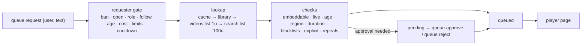

# Song requests (operator notes)

`se-songs` implements PLAN §13: YouTube lookup with a cache/library and a quota ledger, the
request queue with a UI-editable policy, and control of the player page.
**Overview → Songs** is the live controller: open/close requests, pause/resume, skip,
approve/reject, and hover an upcoming song to move it up/down or remove it.
**Community → Song requests** adds manual requests, policy, library, history, and
**YouTube & web** setup. Both surfaces control the same queue; no separate localhost
controller or StreamElements account is needed.

## Setup

1. Complete broadcaster sign-in in **Settings → Accounts & app → Twitch** so real chat
   messages reach the bot. YouTube setup does not connect Twitch.
2. Google Cloud project → enable **YouTube Data API v3** → create an **API key**
   (no YouTube OAuth required). Restrict the key to the YouTube Data API.
3. Paste the key into **Song requests → YouTube & web**. The engine checks it with one
   `videos.list` call (1 unit) and stores it in the keyring (`youtube.api_key`).
   `streamctl do youtube.key.set <key>` also works, but prefer the UI to avoid shell
   history. Engine session logs and the audit table redact the command.
   `youtube.key.clear` removes the stored key.
4. Add a `!sr` command to the project (example below). Commands hot-reload; no restart.
5. Place the built-in `youtube` source in the desired scene; it loads `/web/player.html`.
   Sign in to the approved Brand channel in the **engine's own** browser and configure
   its exact channel/delegate pair below. The API key and regular Chrome sign-in do not
   establish playback identity. Premium sign-in is separate from the API key.
6. Confirm `song.account.verified` before opening requests or resuming playback.
7. Optional: host the read-only public queue on this machine and expose it through a
   tunnel while the engine runs. No Worker or StreamElements account is required.
   An off-machine relay with Ko-fi support is a separate option — see `docs/relay.md`.

Without a key, requests still work for songs already in the library; `queue.lookup` = `off`
and preflight shows `health.youtube` = warn.

### Covers-only account lock

Queue playback is fail-closed. Configure the approved Brand channel in `project.toml`:

```toml
[songs]
youtube_channel = "UCz7OyuTD7kJJ6nJHko6r7ZQ"
youtube_delegate = "102722501858912752217"
```

These values identify **Dabs & Drum Covers** (`@dabsdrumcovers4610`) for this deployment.
Other deployments must obtain their own exact channel ID and delegated-session ID from
their approved signed-in Brand channel. They are identifiers, not API keys or cookies.
Do not use the personal **Dabs & Drums** channel for queue videos, previews, tests, or
muted/hidden preloads. Do not inspect or change its history as part of queue setup.

The native CEF host injects a metadata-only bridge into each actual YouTube iframe.
It authenticates the account-menu request in that iframe's session, checks the active
channel's exact `UC…` ID and delegate, and returns source/origin/nonce-bound proof.
Both idle slots must pass. Each load, cue, preload, play, seek, resume, and handover
requires a fresh check; periodic checks renew identity every 20 seconds.
Native YouTube API bodies and watch-time request headers are pinned to the configured
delegate, conflicting delegates are cancelled, and direct watch/nonempty embed
navigations are forbidden in the queue browser. No personal-account fallback exists.
YouTube gzips its `youtubei` request bodies (`Content-Encoding: gzip`). The host inflates
them (up to 1 MiB), pins the delegate, and re-compresses them. Any other encoding is
cancelled. A body the host can't read cancels the request. Symptom: the account verifies,
but songs stay `loading` with no video stream.

Missing configuration, signed-out/mismatched/unknown identity, bridge failure, reconnect,
configuration change, or expired proof holds both desired slots at blank IDs with
`cmd = "stop"` and `auto = false`. New requests and open/resume commands are refused,
including operator commands. Stored queue entries are retained. The hold lifts by
itself: the page re-checks every 20 seconds, and playback resumes after a successful
check unless an operator or mod paused the queue (see *Crash recovery*). Only
playing/buffering without proof blocks the page; the "cued" event that `stopVideo()`
emits at every song end does not.

Inspect `streamctl get song.account`, `streamctl query youtube.status`, or
`streamctl get health.player`. Account state includes `verified`, observed and required
`channel`/`delegate`, and a non-secret error; the player's title tooltip also explains
an account hold. A connected player, valid API key, or Premium indicator alone is not
permission to play. If YouTube changes its account metadata, verification fails closed
until the integration is updated. This lock verifies playback identity; it does not
claim that a video-free check proves YouTube's eventual history attribution.

### Chat wiring

New projects deliberately have no chat commands. The essential wiring in
`commands/songs.toml` is:

```toml
[[command]]
name = "!sr"
aliases = ["!songrequest"]
role = "everyone"
action = "queue.request"
args = { user = "{user}", text = "{args}" }
min_args = 1
usage = "Usage: !sr <YouTube link or song name>"
```

The queue owns validation and success/error replies; do not add an unconditional
“queued” reply to the command. Operator actions from the app bypass chat role gates.
Chat controls such as `!skip`, `!pause`, `!play`, and `!queue open`/`!queue close`
must use `role = "mod"`. A viewer's `!wrongsong` can use `queue.remove` with
`args = { user = "{user}", last = true }` to remove only their last waiting request.

Once public hosting is configured, add the chat link separately from mod queue controls:

```toml
[[command]]
name = "!songlist"
aliases = ["!songqueue"]
role = "everyone"
cooldown = { global = "10s" }
reply = "Song queue: {queue.url}"
```

On this workstation, `!songlist` and `!songqueue` return
**https://queue.dabsanddrums.com/queue**. The named tunnel keeps that address stable
across restarts. GoDaddy remains the registrar; Cloudflare Free handles DNS and the
tunnel, while the queue stays on this machine. The root domain's Twitch redirect
is preserved. Deployment and credential details are in `docs/relay.md`.

The page shows current/upcoming requests and pause/open status; it cannot modify the
queue or play videos. Its availability follows engine lifetime, not an OBS stream toggle.
Quick Tunnel deployments instead use a generated address that the runner republishes
to `queue.url` on restart. A custom domain requires authorized tunnel/DNS setup;
registration alone is not hosting.

Check `streamctl query bot.commands`, `streamctl query youtube.status`,
`streamctl get health.player`, and `streamctl get song.account`. The embedded account
must be verified, and `key_set` should be true before trying a new link. With a verified
account but no key and an empty library, `!sr` is refused with “song lookup isn't set up
yet”; it does not start playback.

## How a request is handled



- **Links** (`youtube.com/watch?v=`, `youtu.be/`, `shorts/`, `embed/`, `live/`, music/mobile
  hosts, or a bare id) cost 1 unit unless the video is cached (metadata younger than
  `cache_days`).
- **Text** is normalized (case, punctuation, width, diacritics) into a cache key. A cached query
  costs 0; otherwise `search.list` (100 units) returns up to `search_results` candidates, their
  metadata comes from one `videos.list` call, and the first candidate that passes every check is
  queued. A duplicate/recently played top result is refused instead of substituting another song.
- **Quota ledger** (runtime DB `yt_quota`): units per Pacific day, reset at midnight
  America/Los_Angeles (DST-aware). Text search stops when it would dip into `link_reserve`
  (`queue.lookup` = `links`); when nothing is left — or Google answers `quotaExceeded` — only
  library songs work (`library`). Each change is announced once in chat and shown in the UI;
  search comes back automatically after the reset.
- **Player errors** 100/101/150 (removed/private, embedding disabled) skip the song, post a chat
  notice, emit `queue.song_error`, and mark the video unplayable in the library so it's refused
  at request time from then on (`queue.library.reset` clears the marks). Ads count as
  buffering (`song.state` = `ad`) and never skip.
- **Page origin:** YouTube answers error 150 for *every* video when the embedding page's origin
  is an IP literal (`http://127.0.0.1:7870`); from `http://localhost:7870` the same videos play
  (verified 2026-09-25). `player.js` therefore reloads itself under `localhost`.
- **Paid requests**: a request carrying `redemption_id` (the `rewards/song_request.toml`
  reward) is fulfilled when the song actually starts and refunded (`twitch.refund`) if it is
  rejected, removed, banned or fails before playing. With `paid_skip_line` on, paid requests go
  ahead of free ones (in arrival order).

## Policy (§13.2)

Edited in the UI (or `queue.policy.set {field: value, …}`), stored in the runtime DB.

For this stream, ordinary viewers (including followers, subscribers, and VIPs) may have
**one waiting request each**:

```sh
streamctl do queue.policy.set max_per_user=1
```

The saved limit survives engine restarts. Upcoming songs, pending approvals, and lookups
in progress share the same per-user allowance; Twitch login matching is case-insensitive.
Moderators and the broadcaster bypass the per-user and queue-length limits. Playback
identity and platform checks still apply to them. A song that starts playing leaves the
waiting queue, releasing its requester's slot; removal/rejection also releases it.

Ordinary viewers (including followers, subscribers, and VIPs) may request songs up to
**6 minutes (360 seconds)** long. Only moderators and the broadcaster bypass this
duration limit; songs exactly 6 minutes long are allowed.

```sh
streamctl do queue.policy.set max_duration_s=360
```

This setting is saved in the runtime DB and applies without an engine restart.

| Group | Fields |
|---|---|
| Access | `open`, `min_role`, `min_follow_days` (below sub; uses `twitch.follow_age`), `cost_bits`, `cost_points` |
| Limits | `max_queue`, `max_per_user`, `user_cooldown_s`, `max_duration_s`, `no_repeat_min` |
| Content | `blocked_videos`, `blocked_channels` (id or name), `blocked_artists`, `blocked_keywords` (whole words; homoglyph/leetspeak-proof), `explicit_filter`, `library_only` |
| Flow | `approval` (`off`/`all`/`role`) + `approval_below`, `paid_skip_line`, `voteskip_votes` (0 = off) |
| Actions | `banned_users` |

Mods (and the operator) bypass access and limit rules but not platform checks; the operator
(UI/CLI/deck) also bypasses content rules. The explicit filter uses rating boards (MPAA R/NC-17,
TV-MA) and "explicit/uncensored/dirty version" markers in titles and tags — YouTube has no
explicit-lyrics flag.

## Control surface

Actions (chat commands in `commands/songs.toml` map onto these; mod-only ones require a mod
actor when they come from chat):

| Action | Args |
|---|---|
| `queue.request` | `text` (or positional), `user`; optional `bits`, `points`, `redemption_id`, `reward_id`, `follow_age_s` |
| `queue.skip` · `queue.pause` · `queue.resume` · `queue.open` · `queue.close` · `queue.clear` | — |
| `queue.remove` | `id` \| `index` (1-based upcoming) \| `user` [+ `last=true`]; requesters may remove their own |
| `queue.approve` · `queue.reject` | `id` (`12` or `"#12"`), `reason?` |
| `queue.reorder` | `id`, `to` (1-based) |
| `queue.ban_user` · `queue.unban_user` | `user` |
| `queue.ban_song` | `id?` (entry id or video id/link; default: current) · `queue.unban_song {video}` |
| `queue.library.reset` | `video?` — forget "can't be played here" marks (one video, or all) |
| `queue.voteskip` | `user` (one vote per viewer per song) |
| `queue.seek` | `t` (seconds or `1:23`) |
| `queue.policy.set` · `queue.policy.reset` | fields as above |
| `queue.theme.set` | `theme=win31` (Windows 3.1) or `theme=modern`; mod/operator only, saved across restarts, no playback changes |
| `youtube.key.set` · `youtube.key.clear` · `relay.secret.set` · `relay.secret.clear` · `relay.reconnect` | |

State: `queue.{open,paused,playing,length,pending,url,theme,lookup}`, `queue.now.{title,user,id,entry,channel,duration}`,
`queue.next.{title,user}`, `queue.quota.{used,remaining}`, `song.{state,duration,media,player,account}`,
`song.current.{title,artist,genres,year}` ([song metadata](#song-metadata-musicbrainz)),
`song.volume` (settable, 0–1). Signals: `queue.position` (0 … 1 through the current request, e.g. for a progress bar) and `song.position` (s, 30 Hz, extrapolated between player
reports, frozen while paused/buffering/ads). Events: `queue.song_requested`,
`queue.song_started` (first real playback), `queue.song_ended {reason}`, `queue.song_error {code}`.
Queries: `queue` (theme/now/upcoming/pending/history/quota), `queue.policy`, `queue.library {q, limit}`,
`queue.history {n}`, `youtube.status`, `relay.status`. Health: `health.youtube`,
`health.player`, `health.relay`, `health.queue_page` (public page reachable through the tunnel;
[relay.md](relay.md#public-page-health-healthqueue_page)).

## Song metadata (MusicBrainz)

Each requested song gets an artist, genres and first-release year from
[MusicBrainz](https://musicbrainz.org/doc/MusicBrainz_API) — free, no account or key. It is
metadata only: the lookup reads the video **title and channel name** the YouTube lookup already
returned. It never plays, cues, preloads or opens a video, and never changes the queue (order,
status, playback). Turn it off with:

```toml
[songs]
metadata = false   # default true
```

**When:** at request time (after the song is queued) and when a song becomes current (also for
songs restored after a restart). Lookups run in one background worker, so they never delay a
request or playback.

**Reading the video title** (`title.rs`): video noise is removed — `(Official Video)`,
`[Lyrics]`, `(4K Remaster)`, `[HD]`, `(Live 1972)`, `#shorts`, `| Official Video`,
`- Remastered 2011`, `feat./ft./featuring …`. Artist and title are split at
`Artist - Title` (any dash), `Artist "Title"` / `'Title'`, or `Artist: Title`. `Title | Artist` and
glued `Artist-Title` count only when the channel names a side. Channels named
`Artist - Topic` (YouTube auto-generated) or `ArtistVEVO` name the artist; other channel names
are only a guess. Up to three (artist, title) guesses are tried in order. The reversed
`Title - Artist` is always tried second.

**Matching:** one recording search per guess:
`recording:"<title without brackets>" AND artist:"<main artist>"`. A result is accepted only
when it is confident:

- MusicBrainz score ≥ 90;
- the normalized title is equal. Case, punctuation, width, Latin accents, `&`/`and`, and a
  leading “the” are ignored. Titles also match when equal after removing bracketed parts:
  `Don't You` = `Don't You (Forget About Me)`;
- the artist credit, or one credited artist, equals the wanted main artist. Containment is not
  enough: `Queen Tribute Orchestra` is not `Queen`.

Among accepted recordings, the earliest first release wins: the original, not a remaster,
live take, compilation copy or DJ mix. Same-year ties go to the most-tagged recording.
Popular songs have dozens of equally scored copies. When the search has more results than one
page (25), it is repeated with `firstreleasedate:[* TO <year−1>-12-31]`, at most three
times, to reach the original.

**Genres** (lowercase, most votes first, at most 5): from the recording, else its official studio
album/single/EP release group (compilations and soundtracks describe the collection, not the
song), else the artist. Each level uses MusicBrainz `genres`; without genres, it uses up to
three top `tags`, skipping non-genre tags such as `seen live`, nationalities and decades.
**Year** is the recording's first-release year (else the release group's).

**Publishing:**

| Where | Fields |
|---|---|
| Queue entries (events `queue.song_requested/started/ended/error`, queries `queue`, `queue.history`) | `artist` (string or null), `genres` (list, may be empty), `year` (int or null) |
| State | `song.current.title`, `song.current.artist` (strings; `""` when unknown), `song.current.genres` (list), `song.current.year` (int or null) |

`song.current.*` follows the current entry (like `queue.now.*`) and clears when no song is
current. Before a match, or without one, `title`/`artist` come from the video title (the artist
only from a clear `Artist - Title`-style title or a Topic/VEVO channel). `genres` is then empty
and `year` null. On first request the entry usually has no genres yet; they appear once the
lookup finishes, typically 1–4 s later. `song.current.*` updates then. Rules can read
`song.current.genres` (the context layer's `context.mood` uses it).

**Cache:** runtime DB table `song_meta`, keyed by YouTube video id. A match is reused for 180
days. “No confident match” is cached too and retried after 14 days. A network/HTTP failure
keeps any earlier match and retries after 1 hour. Rows from an older matcher version are
looked up again. With `metadata = false`, cached results are still shown, but nothing new is
fetched.

**Etiquette:** `User-Agent: stream-engine/<version> ( https://github.com/DABSandDRUMS/stream-engine )`.
Requests are spaced at least 1.1 s apart across all lookups (MusicBrainz allows 1/s). Timeouts
are 4 s to connect and 8 s total. One retry after a 503 honors `Retry-After` (2–10 s). Failures
are logged as warnings only. Typical cost is 2–4 requests per new song.

## Player page and audio routing

`web/player.html` + `web/player.js` use the official IFrame Player API with two players:
the visible one plays, the hidden one preloads the next song (muted, buffered, paused at the
start). When the current song ends the page rechecks identity before starting the preloaded
one and crossfades the two (`[songs] crossfade`); metadata-check latency can create a gap.
Nothing is ever drawn over the player.

Both slots sit inside one persistent Windows 3.1 Media Player window: silver sizing border,
navy title bar, bundled Fixedsys text, and decorative system/minimize/maximize glyphs. The
frame is built into the shared player page, so every scene using `youtube` gets it, including
while idle, paused, buffering, or crossfading. Only the video slots fade; the window stays put.

- engine → page: state `song.player` (required channel/delegate, account status, and
  desired per-slot `{entry, id, cmd, start, seek, seek_t, auto}`) and `song.volume`,
  via `engine.js` state subscriptions;
- page → engine: named query `song.player` with
  `hello | account | state | progress | ended | error | heartbeat`
  (works with the page's `Patch("youtube")` token). Reports are bound to the current page.
  `hello` revokes previous proof and returns blank stopped slots until both embedded
  identities are reverified; saved position is retained for permitted recovery.

The built-in CEF player's audio enters the `youtube` slot, then the engine's `music` bus;
`song.volume` acts before that bus. Configure `[audio.playback]` (or `[playback]` in
`audio/*.toml`) with the output and post-fader buses appropriate to your wiring. If that output
feeds an external mixer, exclude its captured return from playback to prevent feedback.
Choose streaming audio separately in OBS. For app recordings, select the intended feeds in
**Settings → Accounts & app → Recording**. A feed containing performance and backing music is retained
whole in song and talk clips; separate stems exist only if you actually select separate feeds.

### On screen: the player and the now playing card

The scene's `youtube` rectangle includes the whole window. Its title bar and border reserve
space outside the IFrames rather than covering or cropping the video; YouTube handles the
video's aspect ratio inside the remaining area. No separate framing patch is needed.

YouTube's player terms (§13.3): nothing may cover the player, and the "now playing" overlay goes
beside the framed window. The example `duo` scene follows that:

```toml
{ src = "youtube",          rect = [0.755, 0.065, 0.225, 0.225], when = "queue.now.id" },  # top right, 16:9
{ src = "patch.nowplaying", rect = [0.578, 0.19, 0.172, 0.10],  when = "queue.now.id" },  # just left of it
```

Project overlays are drawn over every scene, so keep their `rect`s clear of the player too: in
the example the chat box starts below it (`[overlays.chatbox] rect.wide` from y = 0.34) and the
alert box ends left of it (x ≤ 0.75). Moving the player means checking `[overlays.*]` again.

The `nowplaying` web patch (scene source) shows `queue.now.title`, the requester
(`queue.now.user`), and a progress bar from `queue.position`; it fades out between songs.
Params: `label` ("Now playing"), `show_requester`, `align` (`right` lines the text up toward a
player on its right, `left` for a player on its left), `accent`, `text_color`, `card_bg`,
`font`. The page renders at its node's size, so give it any shape that fits beside the player.

## Crash recovery

The queue (current, upcoming, pending, history) is in the runtime DB; the playing song's
position is saved every 5 s. After a restart the current entry and its position are retained,
but the new player must verify both embedded accounts before any video can load.
While identity is unverified, both player slots stay stopped and `queue.paused` reads
true, but no pause is saved. Once the approved channel verifies again, playback resumes
automatically unless an operator or mod paused the queue. Only `queue.pause` (or a
`[songs]` configuration error) saves a pause that requires `queue.resume`.
