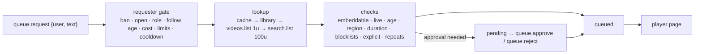

# Song requests (operator notes)

`se-songs` implements PLAN §13: YouTube lookup with a cache/library and a quota ledger, the
request queue with a UI-editable policy, and control of the player page. The UI lives in
**Views → Song requests** (queue, approvals, policy editor, library, quota, key, relay).

## Setup

1. Google Cloud project → enable **YouTube Data API v3** → create an **API key** (no billing,
   no OAuth). Restrict it to the YouTube Data API if you like.
2. `streamctl do youtube.key.set <key>` (or the UI's *YouTube & relay* tab). The engine checks it
   with one `videos.list` call (1 unit) and stores it in the keyring (`youtube.api_key`); the
   command is redacted from session logs and the audit table. `youtube.key.clear` removes it.
3. The `youtube` web source (scene `duo`) loads `/web/player.html`. Sign the CEF profile into
   the YouTube account (Premium = no ads in the player, §13.3).
4. Optional: the public queue page and Ko-fi tips through the relay — see `docs/relay.md`.

Without a key, requests still work for songs already in the library; `queue.lookup` = `off`
and preflight shows `health.youtube` = warn.

## How a request is handled

- **Links** (`youtube.com/watch?v=`, `youtu.be/`, `shorts/`, `embed/`, `live/`, music/mobile
  hosts, or a bare id) cost 1 unit unless the video is cached (metadata younger than
  `cache_days`).
- **Text** is normalized (case, punctuation, width, diacritics) into a cache key. A cached query
  costs 0; otherwise `search.list` (100 units) returns up to `search_results` candidates, their
  metadata comes from one `videos.list` call, and the first candidate that passes every check is
  queued. A duplicate/recently played top result is refused instead of substituting another song.
- **Quota ledger** (runtime DB `yt_quota`): units per Pacific day, reset at midnight
  America/Los_Angeles (DST-aware). Text search stops when it would dip into `link_reserve`
  (`queue.lookup` = `links`); when nothing is left — or Google answers `quotaExceeded` — only
  library songs work (`library`). Each change is announced once in chat and shown in the UI;
  search comes back automatically after the reset.
- **Player errors** 100/101/150 (removed/private, embedding disabled) skip the song, post a chat
  notice, emit `queue.song_error`, and mark the video unplayable in the library so it's refused
  at request time from then on (`queue.library.reset` clears the marks). Ads count as
  buffering (`song.state` = `ad`) and never skip.
- **Page origin:** YouTube answers error 150 for *every* video when the embedding page's origin
  is an IP literal (`http://127.0.0.1:7870`); from `http://localhost:7870` the same videos play
  (verified 2026-09-25). `player.js` therefore reloads itself under `localhost`.
- **Paid requests**: a request carrying `redemption_id` (the `rewards/song_request.toml`
  reward) is fulfilled when the song actually starts and refunded (`twitch.refund`) if it is
  rejected, removed, banned or fails before playing. With `paid_skip_line` on, paid requests go
  ahead of free ones (in arrival order).

## Policy (§13.2)

Edited in the UI (or `queue.policy.set {field: value, …}`), stored in the runtime DB.

| Group | Fields |
|---|---|
| Access | `open`, `min_role`, `min_follow_days` (below sub; uses `twitch.follow_age`), `cost_bits`, `cost_points` |
| Limits | `max_queue`, `max_per_user`, `user_cooldown_s`, `max_duration_s`, `no_repeat_min` |
| Content | `blocked_videos`, `blocked_channels` (id or name), `blocked_artists`, `blocked_keywords` (whole words; homoglyph/leetspeak-proof), `explicit_filter`, `library_only` |
| Flow | `approval` (`off`/`all`/`role`) + `approval_below`, `paid_skip_line`, `voteskip_votes` (0 = off) |
| Actions | `banned_users` |

Mods (and the operator) bypass access and limit rules but not platform checks; the operator
(UI/CLI/deck) also bypasses content rules. The explicit filter uses rating boards (MPAA R/NC-17,
TV-MA) and "explicit/uncensored/dirty version" markers in titles and tags — YouTube has no
explicit-lyrics flag.

## Control surface

Actions (chat commands in `commands/songs.toml` map onto these; mod-only ones require a mod
actor when they come from chat):

| Action | Args |
|---|---|
| `queue.request` | `text` (or positional), `user`; optional `bits`, `points`, `redemption_id`, `reward_id`, `follow_age_s` |
| `queue.skip` · `queue.pause` · `queue.resume` · `queue.open` · `queue.close` · `queue.clear` | — |
| `queue.remove` | `id` \| `index` (1-based upcoming) \| `user` [+ `last=true`]; requesters may remove their own |
| `queue.approve` · `queue.reject` | `id` (`12` or `"#12"`), `reason?` |
| `queue.reorder` | `id`, `to` (1-based) |
| `queue.ban_user` · `queue.unban_user` | `user` |
| `queue.ban_song` | `id?` (entry id or video id/link; default: current) · `queue.unban_song {video}` |
| `queue.library.reset` | `video?` — forget "can't be played here" marks (one video, or all) |
| `queue.voteskip` | `user` (one vote per viewer per song) |
| `queue.seek` | `t` (seconds or `1:23`) |
| `queue.policy.set` · `queue.policy.reset` | fields as above |
| `youtube.key.set` · `youtube.key.clear` · `relay.secret.set` · `relay.secret.clear` · `relay.reconnect` | |

State: `queue.{open,paused,playing,length,pending,url,lookup}`, `queue.now.{title,user,id,entry,channel,duration}`,
`queue.next.{title,user}`, `queue.quota.{used,remaining}`, `song.{state,duration,media,player}`,
`song.volume` (settable, 0–1). Signal: `song.position` (s, 30 Hz, extrapolated between player
reports, frozen while paused/buffering/ads). Events: `queue.song_requested`,
`queue.song_started` (first real playback), `queue.song_ended {reason}`, `queue.song_error {code}`.
Queries: `queue` (now/upcoming/pending/history/quota), `queue.policy`, `queue.library {q, limit}`,
`queue.history {n}`, `youtube.status`, `relay.status`. Health: `health.youtube`,
`health.player`, `health.relay`.

## Player page and audio routing

`web/player.html` + `web/player.js` use the official IFrame Player API with two players:
the visible one plays, the hidden one preloads the next song (muted, buffered, paused at the
start). When the current song ends the page starts the preloaded one immediately (gapless) and
crossfades the two (`[songs] crossfade`); nothing is ever drawn over the player.

- engine → page: state `song.player` (desired per-slot `{entry, id, cmd, start, seek, seek_t, auto}`)
  and `song.volume`, via `engine.js` state subscriptions;
- page → engine: named query `song.player` with `hello | state | progress | ended | error | heartbeat`
  (works with the page's `Patch("youtube")` token). `hello` returns the desired state with the
  active song's current position, so a reloaded page resumes where it was.

Audio path: CEF renders the page (Patches slice, CPU paint path) and delivers its audio to
`hub.audio` slot **`youtube`** (stereo f32 @ 48 kHz) → the Audio slice routes slot `youtube`
to the **`music`** bus (`audio/graph.toml`) → ducking, analysis (`music.*` signals), effects →
PipeWire node `se-music` → OBS. The player's own volume (`song.volume`) sits before the bus
fader.

## Crash recovery

The queue (current, upcoming, pending, history) is in the runtime DB; the playing song's
position is saved every 5 s. After a restart the current song resumes at that position (paused
if the queue was paused), and a reconnecting player page continues seamlessly.
